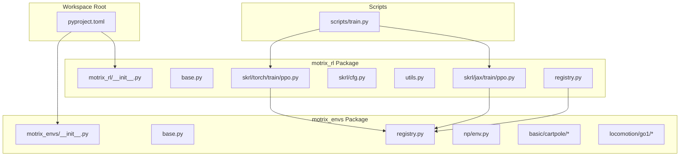
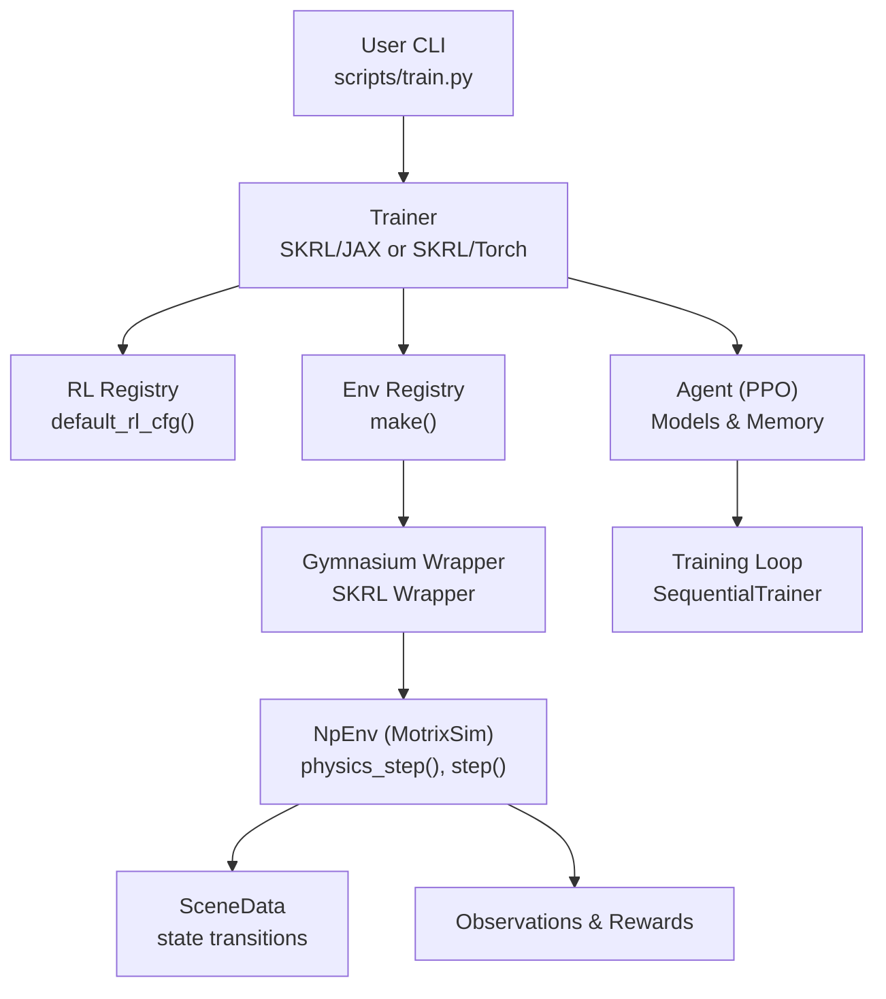
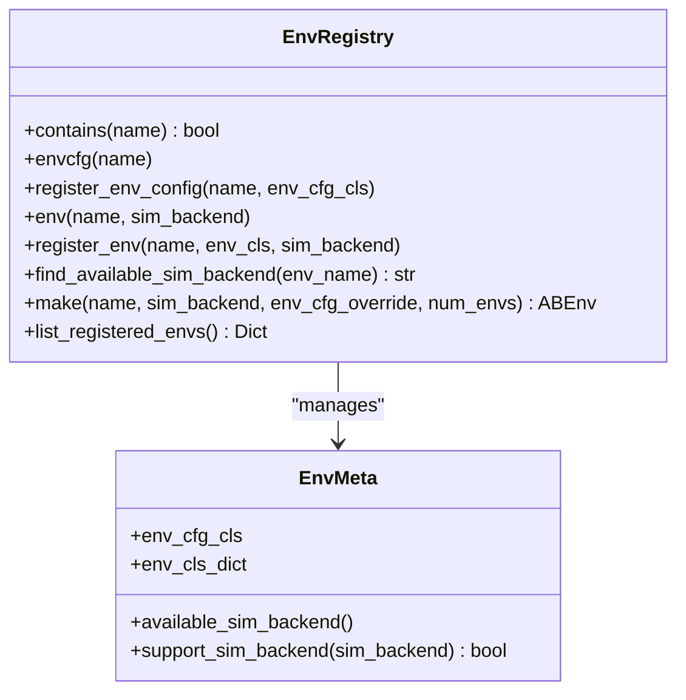
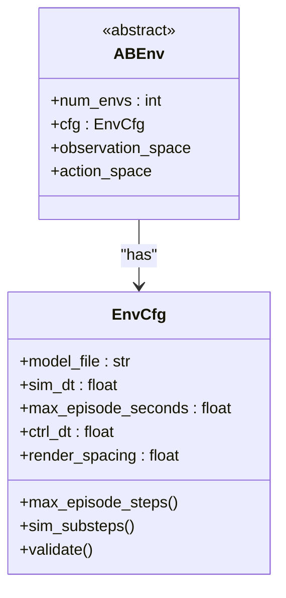
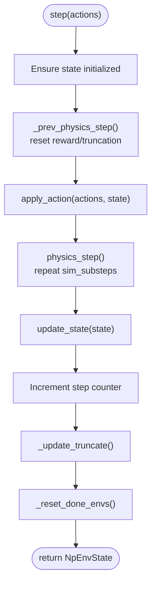
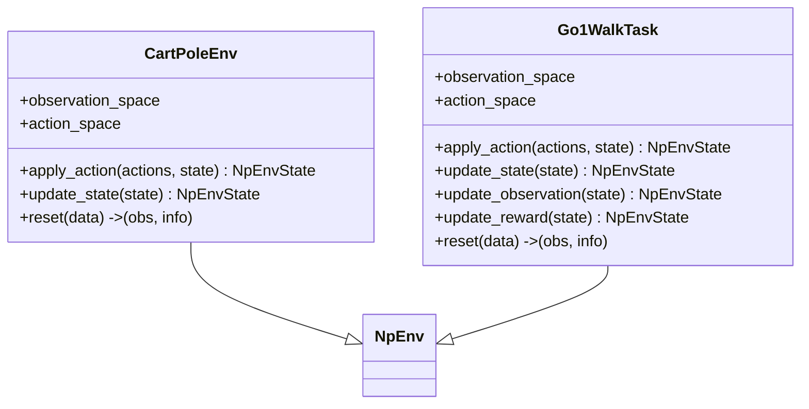
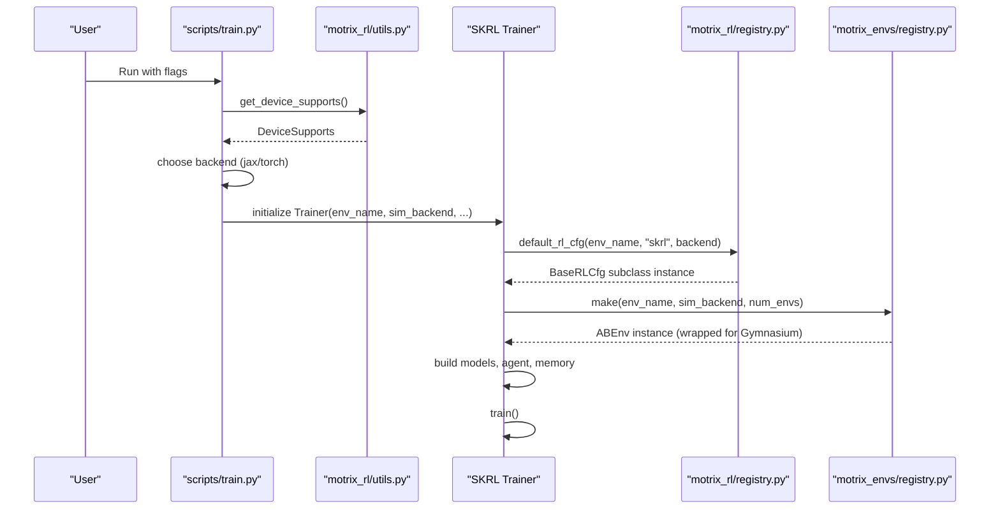
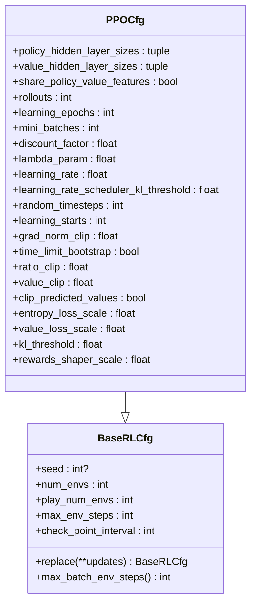
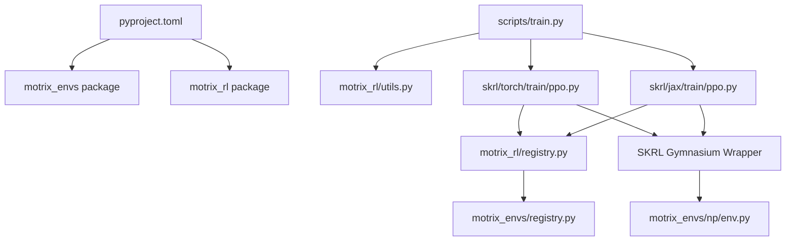

# Architecture Overview

<cite>
**Referenced Files in This Document**
- [pyproject.toml](file://pyproject.toml)
- [motrix_envs/src/motrix_envs/__init__.py](file://motrix_envs/src/motrix_envs/__init__.py)
- [motrix_envs/src/motrix_envs/base.py](file://motrix_envs/src/motrix_envs/base.py)
- [motrix_envs/src/motrix_envs/registry.py](file://motrix_envs/src/motrix_envs/registry.py)
- [motrix_envs/src/motrix_envs/np/env.py](file://motrix_envs/src/motrix_envs/np/env.py)
- [motrix_envs/src/motrix_envs/basic/cartpole/cartpole_np.py](file://motrix_envs/src/motrix_envs/basic/cartpole/cartpole_np.py)
- [motrix_envs/src/motrix_envs/basic/cartpole/cfg.py](file://motrix_envs/src/motrix_envs/basic/cartpole/cfg.py)
- [motrix_envs/src/motrix_envs/locomotion/go1/walk_np.py](file://motrix_envs/src/motrix_envs/locomotion/go1/walk_np.py)
- [motrix_envs/src/motrix_envs/locomotion/go1/cfg.py](file://motrix_envs/src/motrix_envs/locomotion/go1/cfg.py)
- [motrix_rl/src/motrix_rl/__init__.py](file://motrix_rl/src/motrix_rl/__init__.py)
- [motrix_rl/src/motrix_rl/base.py](file://motrix_rl/src/motrix_rl/base.py)
- [motrix_rl/src/motrix_rl/registry.py](file://motrix_rl/src/motrix_rl/registry.py)
- [motrix_rl/src/motrix_rl/skrl/cfg.py](file://motrix_rl/src/motrix_rl/skrl/cfg.py)
- [motrix_rl/src/motrix_rl/utils.py](file://motrix_rl/src/motrix_rl/utils.py)
- [motrix_rl/src/motrix_rl/skrl/torch/train/ppo.py](file://motrix_rl/src/motrix_rl/skrl/torch/train/ppo.py)
- [motrix_rl/src/motrix_rl/skrl/jax/train/ppo.py](file://motrix_rl/src/motrix_rl/skrl/jax/train/ppo.py)
- [scripts/train.py](file://scripts/train.py)
</cite>

## Table of Contents
1. [Introduction](#introduction)
2. [Project Structure](#project-structure)
3. [Core Components](#core-components)
4. [Architecture Overview](#architecture-overview)
5. [Detailed Component Analysis](#detailed-component-analysis)
6. [Dependency Analysis](#dependency-analysis)
7. [Performance Considerations](#performance-considerations)
8. [Troubleshooting Guide](#troubleshooting-guide)
9. [Conclusion](#conclusion)

## Introduction
This document describes the overall system design of MotrixLab-S1, a modular monorepo that separates environment systems from training frameworks. It focuses on:
- Clear separation of concerns between physics environments and reinforcement learning training backends
- Centralized environment and configuration management via a registry pattern
- Dynamic environment instantiation through a factory-like interface
- Pluggable training backends orchestrated by a strategy-like selection mechanism
- End-to-end data flow from user input to environment creation, physics simulation, state updates, and observation generation
- Integration boundaries among MotrixSim physics engine, Gymnasium-compatible interfaces, and SKRL training framework

## Project Structure
MotrixLab-S1 is organized as a Python monorepo with two primary packages:
- motrix_envs: Physics environments and Gymnasium-compatible wrappers backed by MotrixSim
- motrix_rl: Training framework integrations (SKRL) with pluggable backends (JAX/Torch)

The workspace uses a shared toolchain configuration and defines both packages as members of the workspace.

**Diagram sources**
- [pyproject.toml](file://pyproject.toml#L21-L22)
- [motrix_envs/src/motrix_envs/__init__.py](file://motrix_envs/src/motrix_envs/__init__.py#L16-L17)
- [motrix_rl/src/motrix_rl/__init__.py](file://motrix_rl/src/motrix_rl/__init__.py#L16-L17)
- [scripts/train.py](file://scripts/train.py#L76-L87)

**Section sources**
- [pyproject.toml](file://pyproject.toml#L21-L22)

## Core Components
- Environment Registry Pattern: Centralized registration and lookup of environment configurations and implementations, enabling decoupled discovery and instantiation.
- Factory Pattern: The environment factory constructs instances by name and backend, applying configuration overrides safely.
- Strategy Pattern: Training backends (JAX/Torch) are selected dynamically at runtime based on device availability and user preferences, while keeping the training orchestration consistent.

Key building blocks:
- Environment base classes and configuration model
- Numpy-backed environment implementation using MotrixSim
- Gymnasium-compatible wrappers for SKRL
- RL configuration classes and registry for SKRL backends
- Training entrypoints and device-aware backend selection

**Section sources**
- [motrix_envs/src/motrix_envs/base.py](file://motrix_envs/src/motrix_envs/base.py#L23-L85)
- [motrix_envs/src/motrix_envs/np/env.py](file://motrix_envs/src/motrix_envs/np/env.py#L52-L209)
- [motrix_rl/src/motrix_rl/base.py](file://motrix_rl/src/motrix_rl/base.py#L20-L43)
- [motrix_rl/src/motrix_rl/skrl/cfg.py](file://motrix_rl/src/motrix_rl/skrl/cfg.py#L28-L74)
- [motrix_rl/src/motrix_rl/utils.py](file://motrix_rl/src/motrix_rl/utils.py#L19-L62)

## Architecture Overview
The system follows a layered architecture:
- User input drives training scripts
- Training scripts select a backend (JAX/Torch) and construct a Trainer
- Trainer resolves RL configuration via the RL registry
- Trainer requests an environment from the environment registry
- The environment registry constructs a Gymnasium-compatible wrapper around a MotrixSim-backed Numpy environment
- The environment performs physics steps and generates observations and rewards
- The Trainer orchestrates agent training using SKRL

**Diagram sources**
- [scripts/train.py](file://scripts/train.py#L52-L91)
- [motrix_rl/src/motrix_rl/registry.py](file://motrix_rl/src/motrix_rl/registry.py#L81-L115)
- [motrix_envs/src/motrix_envs/registry.py](file://motrix_envs/src/motrix_envs/registry.py#L114-L161)
- [motrix_envs/src/motrix_envs/np/env.py](file://motrix_envs/src/motrix_envs/np/env.py#L186-L209)
- [motrix_rl/src/motrix_rl/skrl/torch/train/ppo.py](file://motrix_rl/src/motrix_rl/skrl/torch/train/ppo.py#L145-L184)
- [motrix_rl/src/motrix_rl/skrl/jax/train/ppo.py](file://motrix_rl/src/motrix_rl/skrl/jax/train/ppo.py#L145-L184)

## Detailed Component Analysis

### Environment Registry and Factory
The environment registry centralizes:
- Registration of environment configurations and implementations
- Backend-aware selection and instantiation
- Validation of configuration overrides and backend compatibility

**Diagram sources**
- [motrix_envs/src/motrix_envs/registry.py](file://motrix_envs/src/motrix_envs/registry.py#L24-L172)

**Section sources**
- [motrix_envs/src/motrix_envs/registry.py](file://motrix_envs/src/motrix_envs/registry.py#L41-L172)

### Gymnasium-Compatible Environment Base
The environment base defines:
- Configuration model with validation and derived properties
- Abstract base environment contract for Gymnasium spaces and vectorization

**Diagram sources**
- [motrix_envs/src/motrix_envs/base.py](file://motrix_envs/src/motrix_envs/base.py#L23-L85)

**Section sources**
- [motrix_envs/src/motrix_envs/base.py](file://motrix_envs/src/motrix_envs/base.py#L23-L85)

### Numpy Environment Implementation (MotrixSim)
The Numpy-backed environment integrates MotrixSim:
- Scene model loading and timestep configuration
- Physics stepping loop aligned with control frequency
- State lifecycle: initialization, action application, physics step, state update, truncation, and reset handling
- Observation and reward computation per environment

**Diagram sources**
- [motrix_envs/src/motrix_envs/np/env.py](file://motrix_envs/src/motrix_envs/np/env.py#L196-L209)

**Section sources**
- [motrix_envs/src/motrix_envs/np/env.py](file://motrix_envs/src/motrix_envs/np/env.py#L52-L209)

### Environment Implementations (Examples)
- CartPole environment demonstrates minimal Gymnasium spaces, action application, observation concatenation, reward shaping, and termination conditions.
- Go1 walking environment showcases complex observation composition, PD control, contact queries, reward composition, and terrain-specific configurations.

**Diagram sources**
- [motrix_envs/src/motrix_envs/basic/cartpole/cartpole_np.py](file://motrix_envs/src/motrix_envs/basic/cartpole/cartpole_np.py#L26-L98)
- [motrix_envs/src/motrix_envs/locomotion/go1/walk_np.py](file://motrix_envs/src/motrix_envs/locomotion/go1/walk_np.py#L26-L387)

**Section sources**
- [motrix_envs/src/motrix_envs/basic/cartpole/cartpole_np.py](file://motrix_envs/src/motrix_envs/basic/cartpole/cartpole_np.py#L26-L98)
- [motrix_envs/src/motrix_envs/locomotion/go1/walk_np.py](file://motrix_envs/src/motrix_envs/locomotion/go1/walk_np.py#L26-L387)

### RL Registry and Strategy Selection
The RL registry maps environment names to framework/backend-specific configuration classes. The Trainer selects a backend (JAX/Torch) and constructs the agent accordingly.

**Diagram sources**
- [scripts/train.py](file://scripts/train.py#L52-L91)
- [motrix_rl/src/motrix_rl/utils.py](file://motrix_rl/src/motrix_rl/utils.py#L39-L62)
- [motrix_rl/src/motrix_rl/registry.py](file://motrix_rl/src/motrix_rl/registry.py#L81-L115)
- [motrix_envs/src/motrix_envs/registry.py](file://motrix_envs/src/motrix_envs/registry.py#L114-L161)
- [motrix_rl/src/motrix_rl/skrl/torch/train/ppo.py](file://motrix_rl/src/motrix_rl/skrl/torch/train/ppo.py#L145-L184)
- [motrix_rl/src/motrix_rl/skrl/jax/train/ppo.py](file://motrix_rl/src/motrix_rl/skrl/jax/train/ppo.py#L145-L184)

**Section sources**
- [motrix_rl/src/motrix_rl/registry.py](file://motrix_rl/src/motrix_rl/registry.py#L42-L115)
- [motrix_rl/src/motrix_rl/skrl/torch/train/ppo.py](file://motrix_rl/src/motrix_rl/skrl/torch/train/ppo.py#L145-L184)
- [motrix_rl/src/motrix_rl/skrl/jax/train/ppo.py](file://motrix_rl/src/motrix_rl/skrl/jax/train/ppo.py#L145-L184)

### Configuration Classes and Overrides
- Base RL configuration defines training hyperparameters and derived metrics
- SKRL PPO configuration extends the base with agent-specific parameters
- Environment configurations encapsulate model paths, episode durations, and rendering spacing

**Diagram sources**
- [motrix_rl/src/motrix_rl/base.py](file://motrix_rl/src/motrix_rl/base.py#L20-L43)
- [motrix_rl/src/motrix_rl/skrl/cfg.py](file://motrix_rl/src/motrix_rl/skrl/cfg.py#L28-L74)

**Section sources**
- [motrix_rl/src/motrix_rl/base.py](file://motrix_rl/src/motrix_rl/base.py#L20-L43)
- [motrix_rl/src/motrix_rl/skrl/cfg.py](file://motrix_rl/src/motrix_rl/skrl/cfg.py#L28-L74)

### Environment Configuration Examples
- CartPole configuration sets model file, reset noise, episode duration, and rendering spacing
- Go1 configurations define noise, control, reward, initialization, commands, normalization, assets, sensors, and simulation timesteps

**Section sources**
- [motrix_envs/src/motrix_envs/basic/cartpole/cfg.py](file://motrix_envs/src/motrix_envs/basic/cartpole/cfg.py#L25-L32)
- [motrix_envs/src/motrix_envs/locomotion/go1/cfg.py](file://motrix_envs/src/motrix_envs/locomotion/go1/cfg.py#L122-L137)

## Dependency Analysis
- Workspace membership ties both packages together and enables shared tooling
- Training scripts depend on device detection utilities and backend-specific trainers
- RL registry depends on environment registry for existence checks
- SKRL trainers depend on environment registry for instantiation and on Gymnasium wrappers for compatibility

**Diagram sources**
- [pyproject.toml](file://pyproject.toml#L21-L22)
- [scripts/train.py](file://scripts/train.py#L76-L87)
- [motrix_rl/src/motrix_rl/utils.py](file://motrix_rl/src/motrix_rl/utils.py#L39-L62)
- [motrix_rl/src/motrix_rl/registry.py](file://motrix_rl/src/motrix_rl/registry.py#L52-L53)
- [motrix_envs/src/motrix_envs/registry.py](file://motrix_envs/src/motrix_envs/registry.py#L41-L43)
- [motrix_rl/src/motrix_rl/skrl/torch/train/ppo.py](file://motrix_rl/src/motrix_rl/skrl/torch/train/ppo.py#L145-L184)
- [motrix_rl/src/motrix_rl/skrl/jax/train/ppo.py](file://motrix_rl/src/motrix_rl/skrl/jax/train/ppo.py#L145-L184)

**Section sources**
- [pyproject.toml](file://pyproject.toml#L21-L22)
- [scripts/train.py](file://scripts/train.py#L52-L91)
- [motrix_rl/src/motrix_rl/registry.py](file://motrix_rl/src/motrix_rl/registry.py#L42-L115)
- [motrix_envs/src/motrix_envs/registry.py](file://motrix_envs/src/motrix_envs/registry.py#L41-L172)

## Performance Considerations
- Vectorized environments: The environment base and Numpy implementation support multiple environments in batch, controlled by configuration and factory parameters
- Simulation fidelity vs speed: Simulation substeps and control timestep influence accuracy and throughput; tune sim_dt and ctrl_dt appropriately
- Backend selection: Automatic detection of GPU availability for JAX/Torch can improve training throughput; fallback to CPU is handled gracefully
- Logging and checkpointing: RL configuration exposes intervals for experiment writes and checkpoints to balance performance and observability

[No sources needed since this section provides general guidance]

## Troubleshooting Guide
Common issues and resolutions:
- Environment not registered: Ensure environment configuration and implementation are decorated and imported so they register during package initialization
- Unsupported simulation backend: Only the "np" backend is supported in the current registry; verify environment registration and backend selection
- Missing RL configuration: Verify that RL configuration classes are registered for the chosen environment and backend
- Device backend mismatch: If neither JAX nor Torch is available, the training script raises an explicit error; install compatible libraries and drivers

**Section sources**
- [motrix_envs/src/motrix_envs/registry.py](file://motrix_envs/src/motrix_envs/registry.py#L71-L83)
- [motrix_rl/src/motrix_rl/registry.py](file://motrix_rl/src/motrix_rl/registry.py#L52-L53)
- [scripts/train.py](file://scripts/train.py#L39-L50)

## Conclusion
MotrixLab-S1 employs a clean separation of concerns:
- Environment registry and factory provide centralized, validated instantiation of Gymnasium-compatible environments backed by MotrixSim
- RL registry and Trainer orchestrate SKRL training with pluggable JAX/Torch backends
- The design supports extensibility: new environments and training configurations can be added without changing core orchestration logic
- The modular monorepo structure simplifies development, testing, and deployment across related domains (classic control, locomotion, manipulation)