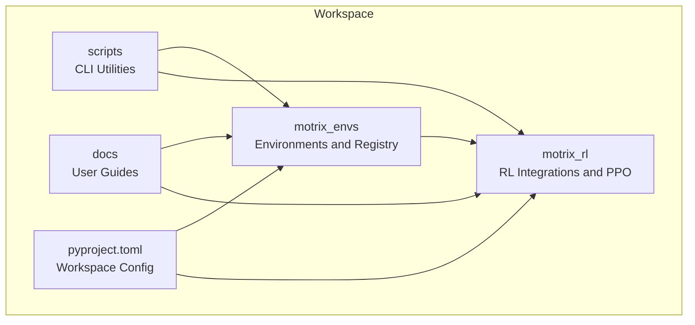
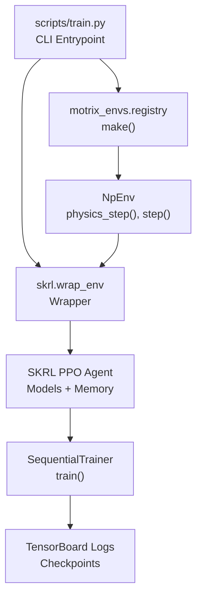
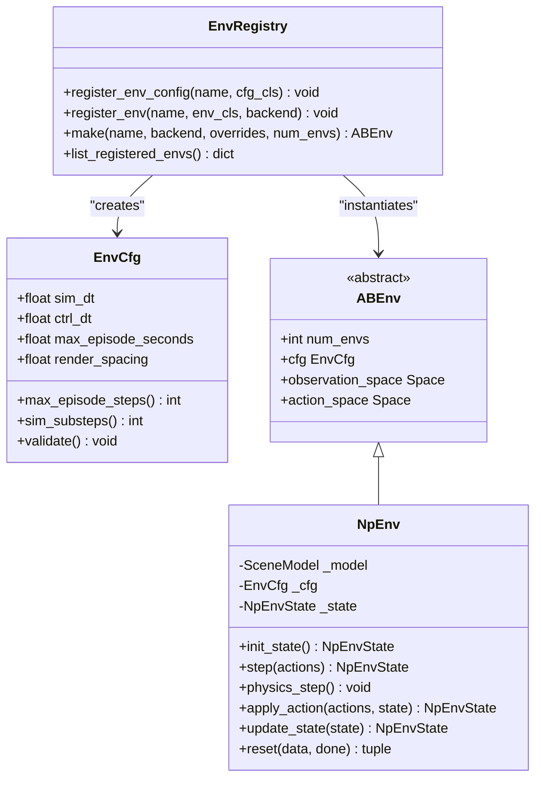
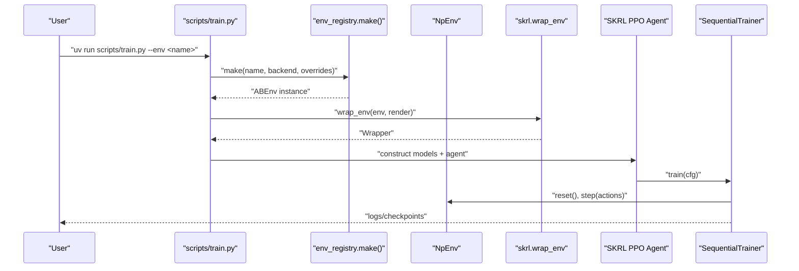
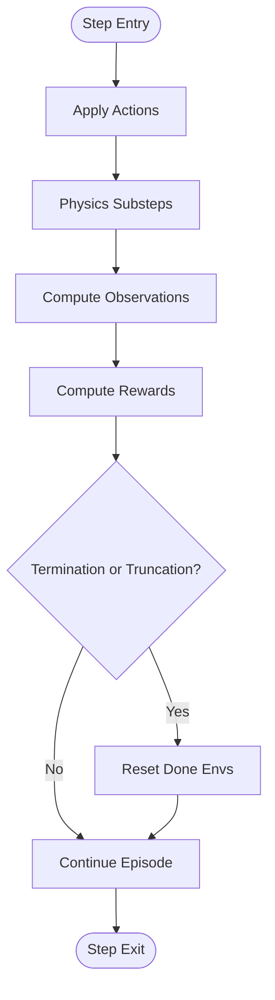
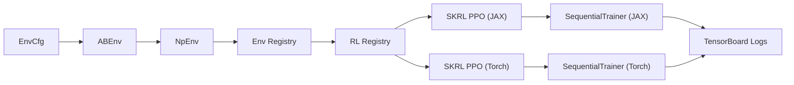

# Introduction and Purpose

<cite>
**Referenced Files in This Document**
- [README.md](file://README.md)
- [README.zh-CN.md](file://README.zh-CN.md)
- [pyproject.toml](file://pyproject.toml)
- [docs/source/en/index.md](file://docs/source/en/index.md)
- [docs/source/zh_CN/index.md](file://docs/source/zh_CN/index.md)
- [motrix_envs/README.md](file://motrix_envs/README.md)
- [motrix_rl/README.md](file://motrix_rl/README.md)
- [motrix_envs/src/motrix_envs/base.py](file://motrix_envs/src/motrix_envs/base.py)
- [motrix_envs/src/motrix_envs/registry.py](file://motrix_envs/src/motrix_envs/registry.py)
- [motrix_envs/src/motrix_envs/np/env.py](file://motrix_envs/src/motrix_envs/np/env.py)
- [motrix_envs/src/motrix_envs/basic/cartpole/cartpole_np.py](file://motrix_envs/src/motrix_envs/basic/cartpole/cartpole_np.py)
- [motrix_envs/src/motrix_envs/locomotion/go1/walk_np.py](file://motrix_envs/src/motrix_envs/locomotion/go1/walk_np.py)
- [motrix_rl/src/motrix_rl/base.py](file://motrix_rl/src/motrix_rl/base.py)
- [motrix_rl/src/motrix_rl/registry.py](file://motrix_rl/src/motrix_rl/registry.py)
- [motrix_rl/src/motrix_rl/skrl/jax/train/ppo.py](file://motrix_rl/src/motrix_rl/skrl/jax/train/ppo.py)
- [motrix_rl/src/motrix_rl/skrl/torch/train/ppo.py](file://motrix_rl/src/motrix_rl/skrl/torch/train/ppo.py)
- [scripts/train.py](file://scripts/train.py)
</cite>

## Table of Contents
1. [Introduction](#introduction)
2. [Project Structure](#project-structure)
3. [Core Components](#core-components)
4. [Architecture Overview](#architecture-overview)
5. [Detailed Component Analysis](#detailed-component-analysis)
6. [Dependency Analysis](#dependency-analysis)
7. [Performance Considerations](#performance-considerations)
8. [Troubleshooting Guide](#troubleshooting-guide)
9. [Conclusion](#conclusion)

## Introduction
MotrixLab is a reinforcement learning framework specifically designed for robot simulation and training, built upon the MotrixSim physics simulation engine. Its fundamental purpose is to bridge the gap between high-fidelity physics simulation and machine learning research by providing a unified, extensible platform that enables rapid prototyping, scalable training, and reproducible experimentation across diverse robotic tasks.

Key aspects of MotrixLab’s mission:
- Unified Interface: Offer a concise and consistent reinforcement learning training and evaluation interface that abstracts away simulation-backend specifics.
- Multi-backend Support: Enable flexible selection between JAX and PyTorch training backends, adapting to diverse hardware environments.
- Rich Environment Libraries: Deliver a comprehensive suite of robot simulation environments spanning basic control, locomotion, manipulation, and navigation tasks.
- High-performance Simulation: Leverage MotrixSim’s efficient physics engine to accelerate training and reduce computational overhead.
- Visual Training: Support real-time rendering and training process visualization for intuitive debugging and monitoring.

Target audience:
- Robotics researchers exploring locomotion, manipulation, and navigation policies.
- AI practitioners building and evaluating reinforcement learning agents for robotic systems.
- Academic institutions conducting experiments in robot learning, curriculum design, and benchmarking.

Positioning within the robotics and reinforcement learning ecosystem:
MotrixLab positions itself as a practical, standards-aligned platform that combines high-performance simulation with flexible training frameworks. It emphasizes standardized interfaces, modular environment design, and reproducible workflows—enabling seamless integration with modern RL ecosystems while maintaining accessibility for both newcomers and advanced users.

**Section sources**
- [README.md](file://README.md#L16-L34)
- [docs/source/en/index.md](file://docs/source/en/index.md#L1-L193)

## Project Structure
MotrixLab is organized as a multi-package workspace with two primary modules:
- motrix_envs: A framework-agnostic library of RL environments built on MotrixSim, defining observation, action, and reward spaces. It currently targets MotrixSim’s NumPy backend and exposes a registration system for environment configurations and implementations.
- motrix_rl: An integration layer for RL frameworks, currently supporting SKRL’s PPO algorithm with both JAX and PyTorch backends. It provides default training configurations per environment and orchestrates training and inference workflows.

Additional components:
- scripts: Command-line utilities for environment visualization, training, and inference.
- docs: User documentation and tutorials in English and Chinese.
- pyproject.toml: Workspace configuration enabling cross-package development and ReadtheDocs packaging.

**Diagram sources**
- [pyproject.toml](file://pyproject.toml#L21-L29)
- [motrix_envs/README.md](file://motrix_envs/README.md#L1-L173)
- [motrix_rl/README.md](file://motrix_rl/README.md#L1-L4)

**Section sources**
- [pyproject.toml](file://pyproject.toml#L21-L29)
- [motrix_envs/README.md](file://motrix_envs/README.md#L1-L173)
- [motrix_rl/README.md](file://motrix_rl/README.md#L1-L4)

## Core Components
MotrixLab’s core components are designed around modularity and interoperability:

- Environment Abstractions and Registry
  - EnvCfg defines simulation timing, episode limits, and backend options.
  - ABEnv and NpEnv provide the base environment interface and NumPy-backed implementation, encapsulating physics stepping, action application, and state updates.
  - Registry centralizes environment configuration and implementation registration, enabling dynamic instantiation via environment names and backends.

- RL Configuration and Registry
  - BaseRLCfg standardizes training hyperparameters such as seeds, environment counts, and checkpoint intervals.
  - RL registry maps environment names to framework/backend-specific training configurations, ensuring consistent defaults and extensibility.

- Training Orchestration
  - Scripts expose CLI entry points for training and inference, selecting appropriate RL backends based on device capabilities and user preferences.
  - SKRL-based trainers (JAX and PyTorch) integrate environment wrappers, agent models, and memory to execute PPO training with standardized logging and checkpointing.

**Section sources**
- [motrix_envs/src/motrix_envs/base.py](file://motrix_envs/src/motrix_envs/base.py#L23-L85)
- [motrix_envs/src/motrix_envs/np/env.py](file://motrix_envs/src/motrix_envs/np/env.py#L26-L209)
- [motrix_envs/src/motrix_envs/registry.py](file://motrix_envs/src/motrix_envs/registry.py#L24-L172)
- [motrix_rl/src/motrix_rl/base.py](file://motrix_rl/src/motrix_rl/base.py#L20-L43)
- [motrix_rl/src/motrix_rl/registry.py](file://motrix_rl/src/motrix_rl/registry.py#L28-L115)
- [scripts/train.py](file://scripts/train.py#L39-L95)

## Architecture Overview
The system architecture couples environment definitions with RL training engines through a clean separation of concerns:

- Environment Layer
  - Defines observation/action/reward semantics and integrates with MotrixSim for physics simulation.
  - Supports vectorized environments and configurable simulation parameters.

- RL Integration Layer
  - Provides framework-agnostic RL configuration and environment wrappers for SKRL.
  - Implements PPO agents with shared or separated policy/value networks, pre-processing, and adaptive schedulers.

- Control Flow
  - CLI scripts select backends and environments, construct training configurations, and launch trainers.
  - Trainers orchestrate environment resets, action application, physics steps, reward computation, and logging.

**Diagram sources**
- [scripts/train.py](file://scripts/train.py#L52-L95)
- [motrix_envs/src/motrix_envs/registry.py](file://motrix_envs/src/motrix_envs/registry.py#L114-L161)
- [motrix_envs/src/motrix_envs/np/env.py](file://motrix_envs/src/motrix_envs/np/env.py#L186-L209)
- [motrix_rl/src/motrix_rl/skrl/jax/train/ppo.py](file://motrix_rl/src/motrix_rl/skrl/jax/train/ppo.py#L145-L185)
- [motrix_rl/src/motrix_rl/skrl/torch/train/ppo.py](file://motrix_rl/src/motrix_rl/skrl/torch/train/ppo.py#L145-L184)

**Section sources**
- [scripts/train.py](file://scripts/train.py#L52-L95)
- [motrix_envs/src/motrix_envs/registry.py](file://motrix_envs/src/motrix_envs/registry.py#L114-L161)
- [motrix_envs/src/motrix_envs/np/env.py](file://motrix_envs/src/motrix_envs/np/env.py#L186-L209)
- [motrix_rl/src/motrix_rl/skrl/jax/train/ppo.py](file://motrix_rl/src/motrix_rl/skrl/jax/train/ppo.py#L145-L185)
- [motrix_rl/src/motrix_rl/skrl/torch/train/ppo.py](file://motrix_rl/src/motrix_rl/skrl/torch/train/ppo.py#L145-L184)

## Detailed Component Analysis

### Environment Design and Registration
MotrixLab’s environment layer establishes a consistent contract for RL tasks:
- EnvCfg controls simulation timestep, control timestep, episode duration, and rendering cadence.
- ABEnv and NpEnv define the lifecycle of environment interactions: initialization, action application, physics stepping, state updates, truncation checks, and reset-on-done logic.
- Registry supports environment configuration and implementation registration, enabling dynamic creation of environments with optional backend selection.

**Diagram sources**
- [motrix_envs/src/motrix_envs/base.py](file://motrix_envs/src/motrix_envs/base.py#L23-L85)
- [motrix_envs/src/motrix_envs/np/env.py](file://motrix_envs/src/motrix_envs/np/env.py#L52-L209)
- [motrix_envs/src/motrix_envs/registry.py](file://motrix_envs/src/motrix_envs/registry.py#L24-L172)

**Section sources**
- [motrix_envs/src/motrix_envs/base.py](file://motrix_envs/src/motrix_envs/base.py#L23-L85)
- [motrix_envs/src/motrix_envs/np/env.py](file://motrix_envs/src/motrix_envs/np/env.py#L52-L209)
- [motrix_envs/src/motrix_envs/registry.py](file://motrix_envs/src/motrix_envs/registry.py#L24-L172)

### RL Configuration and Training Orchestration
The RL layer provides a structured approach to training:
- BaseRLCfg defines core training parameters and derived metrics such as maximum batched environment steps.
- RL registry maps environment names to framework/backend-specific configurations, enabling default selection and override mechanisms.
- SKRL-based trainers (JAX and PyTorch) encapsulate agent construction, memory, preprocessing, and trainer configuration, integrating with the environment wrapper and logging facilities.

**Diagram sources**
- [scripts/train.py](file://scripts/train.py#L52-L95)
- [motrix_envs/src/motrix_envs/registry.py](file://motrix_envs/src/motrix_envs/registry.py#L114-L161)
- [motrix_rl/src/motrix_rl/skrl/jax/train/ppo.py](file://motrix_rl/src/motrix_rl/skrl/jax/train/ppo.py#L145-L185)
- [motrix_rl/src/motrix_rl/skrl/torch/train/ppo.py](file://motrix_rl/src/motrix_rl/skrl/torch/train/ppo.py#L145-L184)

**Section sources**
- [motrix_rl/src/motrix_rl/base.py](file://motrix_rl/src/motrix_rl/base.py#L20-L43)
- [motrix_rl/src/motrix_rl/registry.py](file://motrix_rl/src/motrix_rl/registry.py#L28-L115)
- [motrix_rl/src/motrix_rl/skrl/jax/train/ppo.py](file://motrix_rl/src/motrix_rl/skrl/jax/train/ppo.py#L145-L185)
- [motrix_rl/src/motrix_rl/skrl/torch/train/ppo.py](file://motrix_rl/src/motrix_rl/skrl/torch/train/ppo.py#L145-L184)

### Example Environments: CartPole and GO1 Walking
Two canonical environments illustrate MotrixLab’s design:

- CartPole (Basic Control)
  - Observation space: 4-D (cart position/velocity, pole angle/velocity).
  - Action space: 1-D (applied force).
  - Reward: constant per step; termination on bounds or unstable angle.
  - Implementation: Inherits NpEnv, defines action application and observation/reward computation, and reset logic.

- GO1 Flat Terrain Walking (Locomotion)
  - Observation space: 48-D (joint angles/velocities, IMU, normalized commands, last actions).
  - Action space: 12-D (joint torque targets via PD control).
  - Reward: composed from multiple components (tracking, air time, collision, action rate).
  - Implementation: Extensive sensor access, PD torque computation, contact queries, reward composition, and terrain-aware termination.

**Diagram sources**
- [motrix_envs/src/motrix_envs/np/env.py](file://motrix_envs/src/motrix_envs/np/env.py#L196-L209)
- [motrix_envs/src/motrix_envs/basic/cartpole/cartpole_np.py](file://motrix_envs/src/motrix_envs/basic/cartpole/cartpole_np.py#L50-L75)
- [motrix_envs/src/motrix_envs/locomotion/go1/walk_np.py](file://motrix_envs/src/motrix_envs/locomotion/go1/walk_np.py#L160-L186)

**Section sources**
- [motrix_envs/src/motrix_envs/basic/cartpole/cartpole_np.py](file://motrix_envs/src/motrix_envs/basic/cartpole/cartpole_np.py#L26-L98)
- [motrix_envs/src/motrix_envs/locomotion/go1/walk_np.py](file://motrix_envs/src/motrix_envs/locomotion/go1/walk_np.py#L26-L387)

## Dependency Analysis
MotrixLab’s dependency relationships emphasize loose coupling and clear boundaries:

- Environment Registry depends on environment configuration classes and environment implementations, enabling dynamic instantiation.
- RL Registry depends on environment registration to ensure only registered environments receive training configurations.
- Training scripts depend on device capabilities to select JAX or PyTorch backends and delegate to framework-specific trainers.
- Environment implementations depend on MotrixSim for physics simulation and Gymnasium spaces for action/observation definitions.

**Diagram sources**
- [motrix_envs/src/motrix_envs/base.py](file://motrix_envs/src/motrix_envs/base.py#L23-L85)
- [motrix_envs/src/motrix_envs/np/env.py](file://motrix_envs/src/motrix_envs/np/env.py#L52-L209)
- [motrix_envs/src/motrix_envs/registry.py](file://motrix_envs/src/motrix_envs/registry.py#L114-L161)
- [motrix_rl/src/motrix_rl/registry.py](file://motrix_rl/src/motrix_rl/registry.py#L81-L115)
- [motrix_rl/src/motrix_rl/skrl/jax/train/ppo.py](file://motrix_rl/src/motrix_rl/skrl/jax/train/ppo.py#L145-L185)
- [motrix_rl/src/motrix_rl/skrl/torch/train/ppo.py](file://motrix_rl/src/motrix_rl/skrl/torch/train/ppo.py#L145-L184)

**Section sources**
- [motrix_envs/src/motrix_envs/registry.py](file://motrix_envs/src/motrix_envs/registry.py#L114-L161)
- [motrix_rl/src/motrix_rl/registry.py](file://motrix_rl/src/motrix_rl/registry.py#L81-L115)
- [scripts/train.py](file://scripts/train.py#L39-L95)

## Performance Considerations
- Simulation Efficiency: MotrixLab leverages MotrixSim’s optimized physics engine, enabling high-throughput simulations on CPU and reducing reliance on GPU resources for many tasks.
- Vectorization: Environments support vectorized execution to increase sample efficiency during training.
- Backend Selection: Automatic backend selection based on device capabilities ensures optimal utilization of available hardware (JAX on compatible GPUs, PyTorch otherwise).
- Logging and Checkpointing: Integrated logging and checkpointing facilitate efficient experiment tracking and recovery.

[No sources needed since this section provides general guidance]

## Troubleshooting Guide
Common operational issues and resolutions:
- Environment Not Registered
  - Symptom: Attempting to create an environment that is not registered raises an error.
  - Resolution: Ensure the environment module is imported so decorators register the configuration and implementation, then use the registry’s make function with the correct name and backend.

- Unsupported Simulation Backend
  - Symptom: Using a backend not supported by the environment triggers an error.
  - Resolution: Confirm the environment supports the desired backend (currently “np” for NumPy) or implement a new backend adapter.

- Device Backend Mismatch
  - Symptom: JAX/Torch not available on the device leads to errors.
  - Resolution: The CLI script selects a fallback backend automatically; alternatively, specify a backend explicitly or install the desired framework.

- Training Configuration Overrides
  - Symptom: Incorrect parameter overrides cause unexpected behavior.
  - Resolution: Verify override keys match the configuration class attributes and types; the registry validates overrides against the configuration class.

**Section sources**
- [motrix_envs/src/motrix_envs/registry.py](file://motrix_envs/src/motrix_envs/registry.py#L114-L161)
- [scripts/train.py](file://scripts/train.py#L39-L95)

## Conclusion
MotrixLab advances robotics research by offering a robust, unified platform that seamlessly connects high-performance physics simulation with flexible reinforcement learning training. Its modular architecture, standardized interfaces, and rich environment libraries enable researchers and practitioners to focus on algorithmic innovation while benefiting from reliable, reproducible workflows. By supporting multiple backends and providing clear abstractions, MotrixLab accelerates the translation of RL insights into practical robotic capabilities.

[No sources needed since this section summarizes without analyzing specific files]