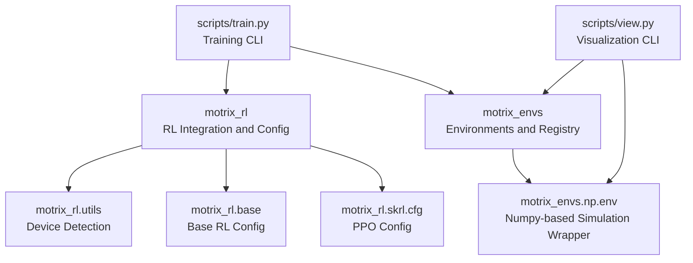
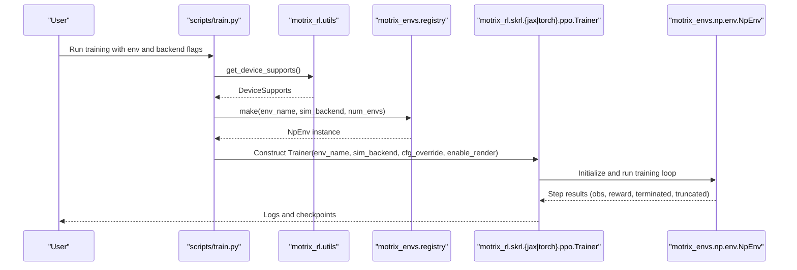
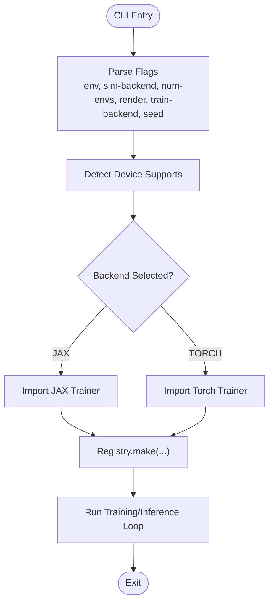
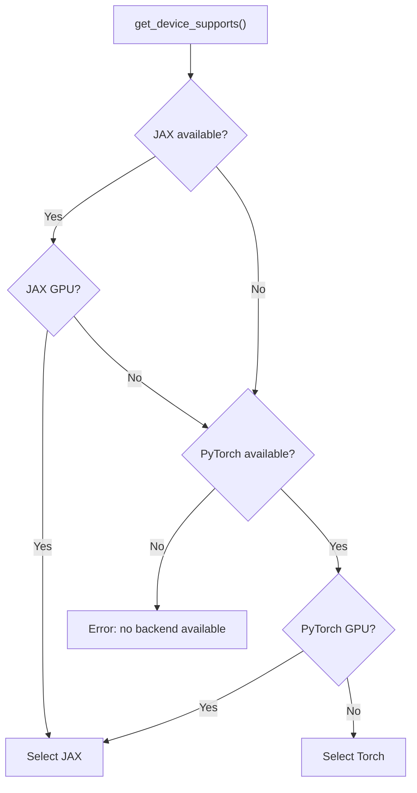
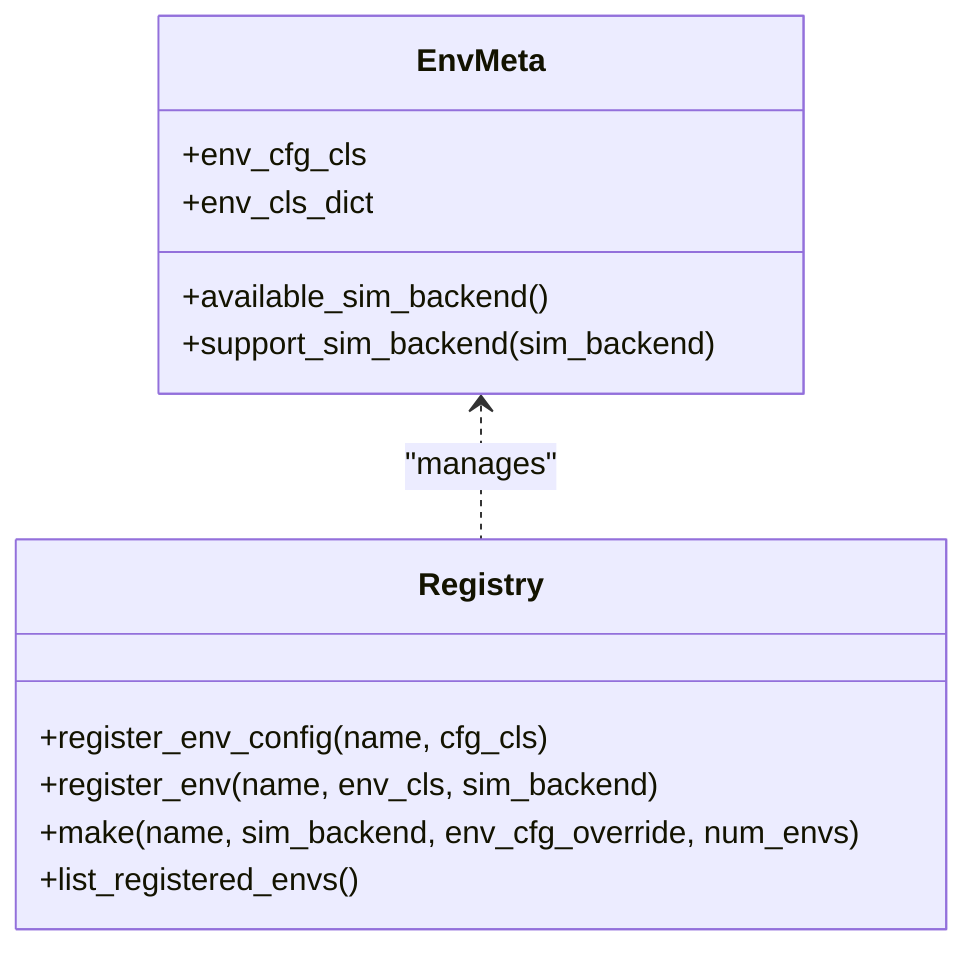
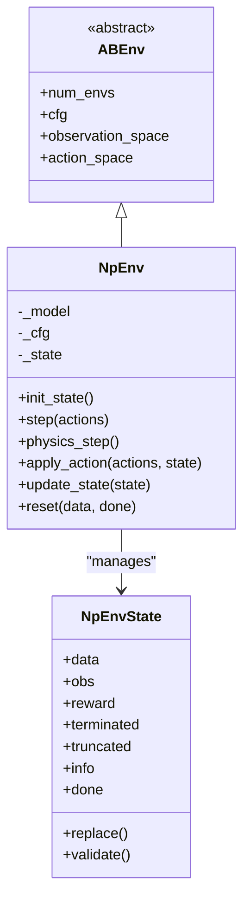
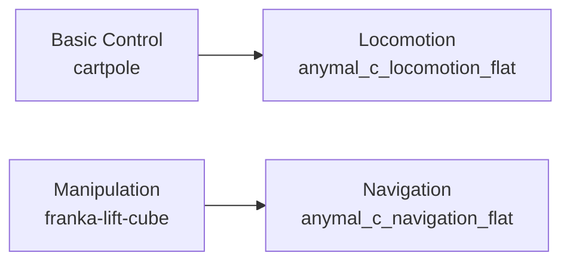
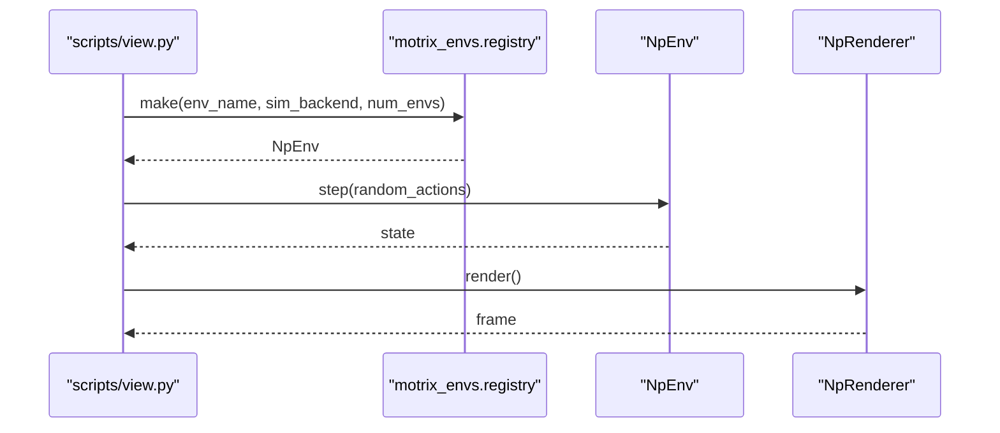
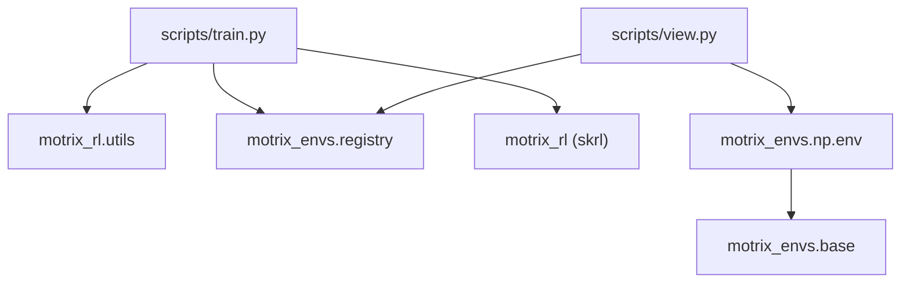

# Key Features and Capabilities

<cite>
**Referenced Files in This Document**
- [README.md](file://README.md)
- [__init__.py](file://motrix_envs/src/motrix_envs/__init__.py)
- [base.py](file://motrix_envs/src/motrix_envs/base.py)
- [registry.py](file://motrix_envs/src/motrix_envs/registry.py)
- [env.py](file://motrix_envs/src/motrix_envs/np/env.py)
- [__init__.py](file://motrix_rl/src/motrix_rl/__init__.py)
- [base.py](file://motrix_rl/src/motrix_rl/base.py)
- [utils.py](file://motrix_rl/src/motrix_rl/utils.py)
- [cfg.py](file://motrix_rl/src/motrix_rl/skrl/cfg.py)
- [train.py](file://scripts/train.py)
- [view.py](file://scripts/view.py)
- [cartpole_np.py](file://motrix_envs/src/motrix_envs/basic/cartpole/cartpole_np.py)
- [anymal_c_np.py](file://motrix_envs/src/motrix_envs/locomotion/anymal_c/anymal_c_np.py)
- [franka_lift_cube_np.py](file://motrix_envs/src/motrix_envs/manipulation/franka_lift_cube/franka_lift_cube_np.py)
- [anymal_c_np.py](file://motrix_envs/src/motrix_envs/navigation/anymal_c/anymal_c_np.py)
</cite>

## Table of Contents
1. [Introduction](#introduction)
2. [Project Structure](#project-structure)
3. [Core Components](#core-components)
4. [Architecture Overview](#architecture-overview)
5. [Detailed Component Analysis](#detailed-component-analysis)
6. [Dependency Analysis](#dependency-analysis)
7. [Performance Considerations](#performance-considerations)
8. [Troubleshooting Guide](#troubleshooting-guide)
9. [Conclusion](#conclusion)

## Introduction
MotrixLab-S1 is a reinforcement learning platform built on top of the MotrixSim physics engine. It provides a unified interface for training and evaluating policies across diverse robotic tasks, with a focus on modularity, framework-agnostic design, and high-performance simulation. The platform supports multiple training backends (JAX and PyTorch via SKRL), a rich environment library spanning basic control, locomotion, manipulation, and navigation, and visual training features including real-time rendering and training process visualization.

## Project Structure
The repository is organized into distinct modules:
- motrix_envs: Environment implementations and registries for simulation-backed tasks
- motrix_rl: RL training integration and configuration abstractions
- scripts: CLI utilities for training, inference, visualization, and testing
- docs: Documentation sources

**Diagram sources**
- [__init__.py](file://motrix_envs/src/motrix_envs/__init__.py#L16-L17)
- [env.py](file://motrix_envs/src/motrix_envs/np/env.py#L52-L95)
- [__init__.py](file://motrix_rl/src/motrix_rl/__init__.py#L16-L17)
- [utils.py](file://motrix_rl/src/motrix_rl/utils.py#L19-L62)
- [base.py](file://motrix_rl/src/motrix_rl/base.py#L20-L43)
- [cfg.py](file://motrix_rl/src/motrix_rl/skrl/cfg.py#L28-L74)
- [train.py](file://scripts/train.py#L52-L95)
- [view.py](file://scripts/view.py#L71-L83)

**Section sources**
- [README.md](file://README.md#L18-L34)
- [__init__.py](file://motrix_envs/src/motrix_envs/__init__.py#L16-L17)
- [__init__.py](file://motrix_rl/src/motrix_rl/__init__.py#L16-L17)

## Core Components
- Unified Interface: The training and visualization entry points provide a concise interface for selecting environments, configuring simulation backends, and launching training or inference.
- Multi-backend Support: Automatic detection of JAX and PyTorch availability and GPU support enables flexible backend selection optimized for the hardware environment.
- Rich Environment Library: A modular registry exposes environment configurations and implementations across basic control, locomotion, manipulation, and navigation domains.
- High-performance Simulation: Environments integrate with MotrixSim’s physics engine to deliver efficient, vectorized simulations.
- Visual Training: Real-time rendering and training process visualization are supported through dedicated CLI utilities.

**Section sources**
- [README.md](file://README.md#L27-L34)
- [train.py](file://scripts/train.py#L39-L89)
- [view.py](file://scripts/view.py#L71-L83)
- [registry.py](file://motrix_envs/src/motrix_envs/registry.py#L114-L161)

## Architecture Overview
The system architecture separates environment definition and simulation from RL training and configuration. The training script selects a backend, constructs the appropriate trainer, and orchestrates training loops. Environments are instantiated via a registry and encapsulate physics stepping, observation computation, reward shaping, and termination logic.

**Diagram sources**
- [train.py](file://scripts/train.py#L52-L95)
- [utils.py](file://motrix_rl/src/motrix_rl/utils.py#L39-L62)
- [registry.py](file://motrix_envs/src/motrix_envs/registry.py#L114-L161)
- [env.py](file://motrix_envs/src/motrix_envs/np/env.py#L52-L95)

## Detailed Component Analysis

### Unified Interface Design
- Training CLI: Provides flags for environment selection, simulation backend, number of environments, rendering toggle, training backend choice, and randomization seeds. It auto-detects device capabilities and selects the appropriate backend.
- Visualization CLI: Instantiates an environment and renders a continuous loop of random actions, enabling quick inspection of environment dynamics and rendering quality.

**Diagram sources**
- [train.py](file://scripts/train.py#L26-L89)
- [utils.py](file://motrix_rl/src/motrix_rl/utils.py#L39-L62)
- [registry.py](file://motrix_envs/src/motrix_envs/registry.py#L114-L161)

**Section sources**
- [train.py](file://scripts/train.py#L26-L95)
- [view.py](file://scripts/view.py#L24-L83)

### Multi-backend Support and Automatic Backend Selection
- Device detection: Determines whether JAX and/or PyTorch are installed and whether GPU backends are available.
- Selection logic: Prioritizes GPU-capable backends when present, falls back to CPU-only backends, and raises an error if neither is available.
- Backend configuration: Sets the appropriate SKRL backend configuration before constructing the trainer.

**Diagram sources**
- [utils.py](file://motrix_rl/src/motrix_rl/utils.py#L39-L62)
- [train.py](file://scripts/train.py#L39-L49)

**Section sources**
- [utils.py](file://motrix_rl/src/motrix_rl/utils.py#L19-L62)
- [train.py](file://scripts/train.py#L39-L89)

### Environment Registry and Modular Architecture
- Registration: Environments are registered with a configuration class and an implementation class for a given simulation backend.
- Discovery: The registry exposes available environments, their configuration classes, and supported backends.
- Instantiation: The make function validates configuration overrides, selects the backend, and constructs the environment instance.

**Diagram sources**
- [registry.py](file://motrix_envs/src/motrix_envs/registry.py#L24-L172)

**Section sources**
- [registry.py](file://motrix_envs/src/motrix_envs/registry.py#L46-L161)

### Environment Abstractions and Physics Integration
- NpEnv: Base class for numpy-based environments backed by MotrixSim. It manages scene data, timestep configuration, physics stepping, and environment lifecycle.
- State Management: Encapsulates observations, rewards, termination/truncation flags, and auxiliary info. It supports vectorized environments and periodic resets.
- Environment Lifecycle: Steps include applying actions, advancing physics, computing observations and rewards, updating termination/truncation, and resetting done environments.

**Diagram sources**
- [base.py](file://motrix_envs/src/motrix_envs/base.py#L61-L85)
- [env.py](file://motrix_envs/src/motrix_envs/np/env.py#L26-L209)

**Section sources**
- [base.py](file://motrix_envs/src/motrix_envs/base.py#L23-L85)
- [env.py](file://motrix_envs/src/motrix_envs/np/env.py#L52-L209)

### Rich Environment Library
- Basic Control: Simple environments such as cartpole for foundational RL testing.
- Locomotion: Quadruped locomotion tasks (e.g., Anymal C) with velocity commands, reward shaping, and termination logic.
- Manipulation: Robot manipulation tasks (e.g., Franka cube lifting) with kinematic observations and reward shaping.
- Navigation: Navigation tasks (e.g., Anymal C navigation) with target markers, heading arrows, and reward shaping.

**Diagram sources**
- [cartpole_np.py](file://motrix_envs/src/motrix_envs/basic/cartpole/cartpole_np.py#L26-L98)
- [anymal_c_np.py](file://motrix_envs/src/motrix_envs/locomotion/anymal_c/anymal_c_np.py#L28-L657)
- [franka_lift_cube_np.py](file://motrix_envs/src/motrix_envs/manipulation/franka_lift_cube/franka_lift_cube_np.py#L32-L292)
- [anymal_c_np.py](file://motrix_envs/src/motrix_envs/navigation/anymal_c/anymal_c_np.py#L26-L919)

**Section sources**
- [cartpole_np.py](file://motrix_envs/src/motrix_envs/basic/cartpole/cartpole_np.py#L26-L98)
- [anymal_c_np.py](file://motrix_envs/src/motrix_envs/locomotion/anymal_c/anymal_c_np.py#L28-L657)
- [franka_lift_cube_np.py](file://motrix_envs/src/motrix_envs/manipulation/franka_lift_cube/franka_lift_cube_np.py#L32-L292)
- [anymal_c_np.py](file://motrix_envs/src/motrix_envs/navigation/anymal_c/anymal_c_np.py#L26-L919)

### High-performance Simulation Capabilities
- Vectorized Execution: Environments support multiple simultaneous instances for scalable training.
- Physics Engine Integration: Uses MotrixSim for efficient simulation with configurable timesteps and substeps.
- Observation and Reward Computation: Implemented within environment classes to leverage vectorized operations for performance.

**Section sources**
- [env.py](file://motrix_envs/src/motrix_envs/np/env.py#L186-L209)
- [base.py](file://motrix_envs/src/motrix_envs/base.py#L23-L52)

### Visual Training Features
- Real-time Rendering: The visualization script creates an environment runner that continuously steps the environment and renders frames at a controlled cadence.
- Training Process Visualization: Training logs are written to runs directories and can be visualized with TensorBoard.

**Diagram sources**
- [view.py](file://scripts/view.py#L71-L83)
- [registry.py](file://motrix_envs/src/motrix_envs/registry.py#L114-L161)
- [env.py](file://motrix_envs/src/motrix_envs/np/env.py#L196-L209)

**Section sources**
- [view.py](file://scripts/view.py#L29-L83)
- [README.md](file://README.md#L75-L110)

### Modular Architecture Benefits and Extensibility
- Framework-agnostic Design: Environments rely on MotrixSim and Gymnasium spaces, enabling easy swapping of RL frameworks.
- Extensibility: Adding new environments involves registering a configuration class and an implementation class for the desired backend, then exposing it via the registry.
- Configuration-driven Training: RL configuration classes define hyperparameters and training schedules, allowing straightforward experimentation.

**Section sources**
- [registry.py](file://motrix_envs/src/motrix_envs/registry.py#L46-L100)
- [base.py](file://motrix_rl/src/motrix_rl/base.py#L20-L43)
- [cfg.py](file://motrix_rl/src/motrix_rl/skrl/cfg.py#L28-L74)

## Dependency Analysis
The following diagram highlights key dependencies among modules:

**Diagram sources**
- [train.py](file://scripts/train.py#L22-L95)
- [view.py](file://scripts/view.py#L20-L83)
- [env.py](file://motrix_envs/src/motrix_envs/np/env.py#L23-L95)
- [base.py](file://motrix_envs/src/motrix_envs/base.py#L16-L25)

**Section sources**
- [train.py](file://scripts/train.py#L22-L95)
- [view.py](file://scripts/view.py#L20-L83)
- [env.py](file://motrix_envs/src/motrix_envs/np/env.py#L23-L95)
- [base.py](file://motrix_envs/src/motrix_envs/base.py#L16-L25)

## Performance Considerations
- Backend Selection: Prefer GPU-enabled backends when available to accelerate training.
- Vectorization: Use larger num_envs to saturate accelerators and improve throughput.
- Rendering Overhead: Rendering can reduce training throughput; disable or reduce frequency for performance-sensitive runs.
- Timestep Configuration: Ensure sim_dt and ctrl_dt are configured appropriately to balance accuracy and speed.

## Troubleshooting Guide
- No Backend Available: If neither JAX nor PyTorch is available, the training script raises an error. Install the desired backend extras or ensure packages are installed.
- Unsupported Simulation Backend: Only the "np" backend is supported in the registry; attempting to use other backends will raise an error.
- Environment Not Registered: Using an unregistered environment name will cause a lookup error; ensure the environment is properly decorated and registered.
- Device Capability Mismatch: If a backend is selected but lacks GPU support, the system falls back to CPU; verify device drivers and CUDA/JAX setup.

**Section sources**
- [train.py](file://scripts/train.py#L39-L49)
- [registry.py](file://motrix_envs/src/motrix_envs/registry.py#L71-L83)
- [registry.py](file://motrix_envs/src/motrix_envs/registry.py#L132-L134)

## Conclusion
MotrixLab-S1 delivers a unified, modular, and high-performance reinforcement learning platform. Its framework-agnostic design, multi-backend support, rich environment library, and visual training features enable researchers to rapidly prototype, train, and evaluate policies across diverse robotic tasks. The environment registry and configuration abstractions facilitate extensibility, allowing seamless addition of new environments and training configurations.