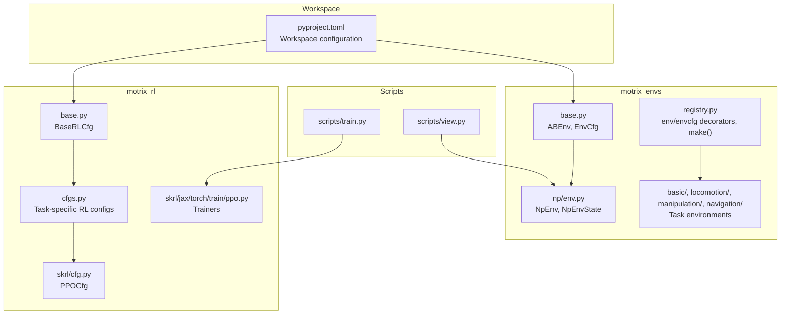
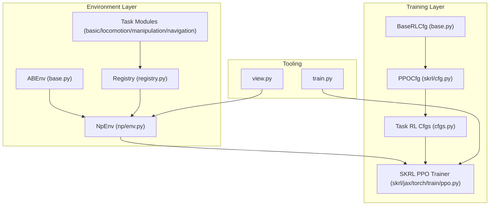
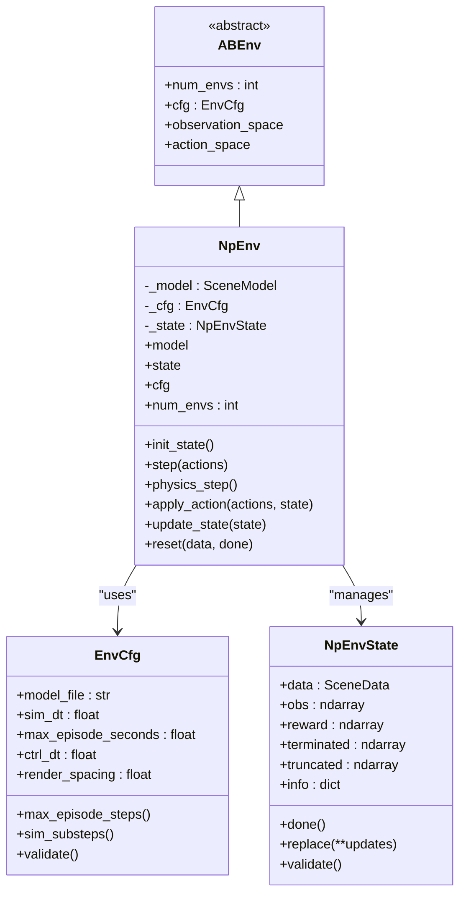
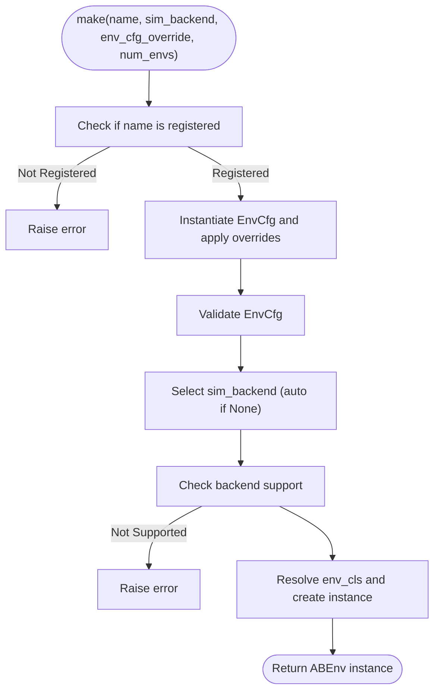
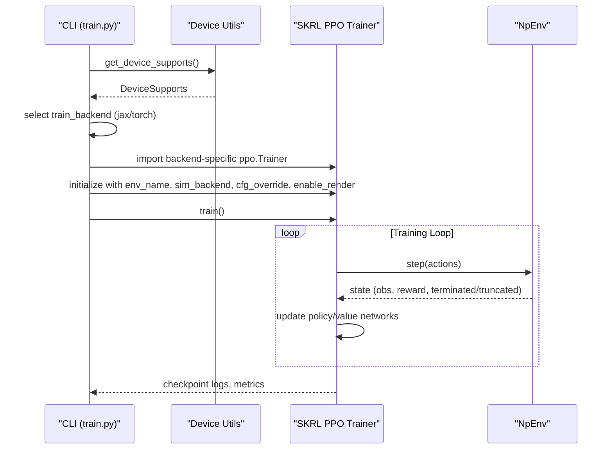
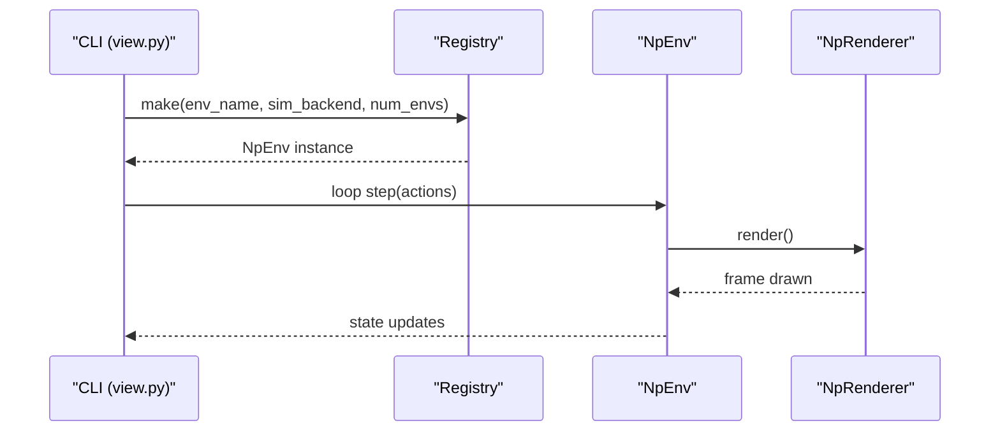
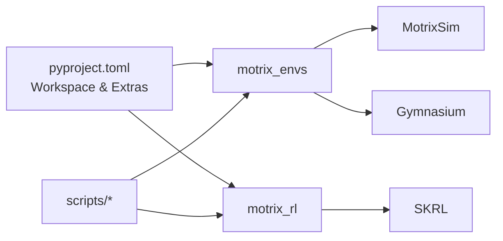

# Project Overview

<cite>
**Referenced Files in This Document**
- [README.md](file://README.md)
- [pyproject.toml](file://pyproject.toml)
- [motrix_envs/README.md](file://motrix_envs/README.md)
- [motrix_rl/README.md](file://motrix_rl/README.md)
- [motrix_envs/src/motrix_envs/base.py](file://motrix_envs/src/motrix_envs/base.py)
- [motrix_envs/src/motrix_envs/registry.py](file://motrix_envs/src/motrix_envs/registry.py)
- [motrix_envs/src/motrix_envs/np/env.py](file://motrix_envs/src/motrix_envs/np/env.py)
- [motrix_rl/src/motrix_rl/base.py](file://motrix_rl/src/motrix_rl/base.py)
- [motrix_rl/src/motrix_rl/cfgs.py](file://motrix_rl/src/motrix_rl/cfgs.py)
- [motrix_rl/src/motrix_rl/skrl/cfg.py](file://motrix_rl/src/motrix_rl/skrl/cfg.py)
- [scripts/train.py](file://scripts/train.py)
- [scripts/view.py](file://scripts/view.py)
</cite>

## Table of Contents
1. [Introduction](#introduction)
2. [Project Structure](#project-structure)
3. [Core Components](#core-components)
4. [Architecture Overview](#architecture-overview)
5. [Detailed Component Analysis](#detailed-component-analysis)
6. [Dependency Analysis](#dependency-analysis)
7. [Performance Considerations](#performance-considerations)
8. [Troubleshooting Guide](#troubleshooting-guide)
9. [Conclusion](#conclusion)

## Introduction
MotrixLab is a general-purpose machine learning architecture designed for robot training. Its core mission is to integrate physics simulation with reinforcement learning into a unified platform that enables fast iteration, standardized experimentation, and scalable deployment for both research and practical applications. The framework emphasizes:
- Unified interface for training and evaluation
- Multi-backend training support (JAX and PyTorch)
- Comprehensive environment library spanning basic control, locomotion, manipulation, and navigation tasks
- Seamless integration with MotrixSim physics engine
- Modular monorepo architecture with clear separation of concerns

Target audience spans researchers exploring novel RL algorithms and practitioners building production-ready robotic systems. The framework addresses common robotics research challenges by providing standardized interfaces, flexible configurations, and a consistent development workflow across environments and training backends.

## Project Structure
MotrixLab follows a modular monorepo layout with two primary packages:
- motrix_envs: Physics-based simulation environments built on MotrixSim, defining observation, action, and reward spaces. It is framework-agnostic and currently implements a NumPy backend.
- motrix_rl: RL framework integrations leveraging the environment parameters from motrix_envs for training. Currently supports SKRL’s PPO algorithm across JAX and PyTorch backends.

The workspace is managed via a shared project configuration that declares optional documentation dependencies and includes both packages as members.

**Diagram sources**
- [pyproject.toml](file://pyproject.toml#L21-L29)
- [motrix_envs/src/motrix_envs/base.py](file://motrix_envs/src/motrix_envs/base.py#L23-L85)
- [motrix_envs/src/motrix_envs/registry.py](file://motrix_envs/src/motrix_envs/registry.py#L24-L172)
- [motrix_envs/src/motrix_envs/np/env.py](file://motrix_envs/src/motrix_envs/np/env.py#L26-L209)
- [motrix_rl/src/motrix_rl/base.py](file://motrix_rl/src/motrix_rl/base.py#L20-L43)
- [motrix_rl/src/motrix_rl/cfgs.py](file://motrix_rl/src/motrix_rl/cfgs.py#L16-L333)
- [motrix_rl/src/motrix_rl/skrl/cfg.py](file://motrix_rl/src/motrix_rl/skrl/cfg.py#L28-L74)
- [scripts/train.py](file://scripts/train.py#L52-L95)
- [scripts/view.py](file://scripts/view.py#L71-L83)

**Section sources**
- [README.md](file://README.md#L16-L34)
- [pyproject.toml](file://pyproject.toml#L21-L29)

## Core Components
- Unified Interface: A concise interface for training and evaluation across environments and backends, enabling rapid prototyping and consistent workflows.
- Multi-backend Training Support: Flexible selection between JAX and PyTorch backends, with automatic detection of device capabilities and runtime configuration.
- Rich Environment Library: A broad set of environments covering classic control, locomotion, manipulation, and navigation tasks, each with standardized configuration and registration.
- High-performance Simulation: Built on MotrixSim’s physics engine, delivering deterministic, efficient simulations suitable for RL training.
- Visual Training: Real-time rendering and training process visualization for debugging and presentation.

Key value propositions:
- Standardized interfaces abstract away environment and backend specifics, simplifying experiment reproducibility.
- Flexible configurations allow tuning of training hyperparameters per task and backend.
- Clear separation between environment definition and RL training enables easy swapping of simulators and algorithms.

**Section sources**
- [README.md](file://README.md#L27-L34)
- [motrix_envs/README.md](file://motrix_envs/README.md#L1-L173)
- [motrix_rl/README.md](file://motrix_rl/README.md#L1-L4)

## Architecture Overview
The architecture centers around three pillars:
- Environment Systems: Define task-specific dynamics, observations, actions, rewards, and termination conditions. They expose a uniform interface and are backed by MotrixSim.
- Training Frameworks: Integrate RL algorithms (currently PPO via SKRL) with environment parameters and backend-specific implementations.
- Visualization Tools: Provide real-time rendering and interactive inspection of environment states and training progress.

**Diagram sources**
- [motrix_envs/src/motrix_envs/base.py](file://motrix_envs/src/motrix_envs/base.py#L61-L85)
- [motrix_envs/src/motrix_envs/np/env.py](file://motrix_envs/src/motrix_envs/np/env.py#L52-L209)
- [motrix_envs/src/motrix_envs/registry.py](file://motrix_envs/src/motrix_envs/registry.py#L114-L161)
- [motrix_rl/src/motrix_rl/base.py](file://motrix_rl/src/motrix_rl/base.py#L20-L43)
- [motrix_rl/src/motrix_rl/skrl/cfg.py](file://motrix_rl/src/motrix_rl/skrl/cfg.py#L28-L74)
- [motrix_rl/src/motrix_rl/cfgs.py](file://motrix_rl/src/motrix_rl/cfgs.py#L16-L333)
- [scripts/train.py](file://scripts/train.py#L52-L95)
- [scripts/view.py](file://scripts/view.py#L71-L83)

## Detailed Component Analysis

### Environment System
The environment system defines a framework-agnostic abstraction and a concrete NumPy-backed implementation integrated with MotrixSim. It standardizes configuration, simulation timing, and state transitions.

**Diagram sources**
- [motrix_envs/src/motrix_envs/base.py](file://motrix_envs/src/motrix_envs/base.py#L23-L85)
- [motrix_envs/src/motrix_envs/np/env.py](file://motrix_envs/src/motrix_envs/np/env.py#L26-L209)

Key behaviors:
- Configuration-driven simulation timing ensures consistent control and physics substeps.
- State encapsulation centralizes environment state and validation.
- Step lifecycle coordinates action application, physics simulation, state updates, truncation checks, and selective resets.

**Section sources**
- [motrix_envs/src/motrix_envs/base.py](file://motrix_envs/src/motrix_envs/base.py#L23-L85)
- [motrix_envs/src/motrix_envs/np/env.py](file://motrix_envs/src/motrix_envs/np/env.py#L52-L209)

### Registry and Environment Creation
The registry provides a centralized mechanism to declare and instantiate environments with specific configurations and backends. It validates availability and supports dynamic creation of environment instances.

**Diagram sources**
- [motrix_envs/src/motrix_envs/registry.py](file://motrix_envs/src/motrix_envs/registry.py#L114-L161)

Operational highlights:
- Environment configuration classes are registered first, followed by environment classes per backend.
- Overrides allow per-run customization of environment parameters.
- Backend selection respects availability and defaults to the first available backend when unspecified.

**Section sources**
- [motrix_envs/src/motrix_envs/registry.py](file://motrix_envs/src/motrix_envs/registry.py#L24-L172)

### Training Framework Integration
The RL layer builds on SKRL and exposes task-specific PPO configurations. It supports JAX and PyTorch backends and orchestrates training via a unified trainer interface.

**Diagram sources**
- [scripts/train.py](file://scripts/train.py#L39-L90)
- [motrix_rl/src/motrix_rl/skrl/cfg.py](file://motrix_rl/src/motrix_rl/skrl/cfg.py#L28-L74)
- [motrix_rl/src/motrix_rl/cfgs.py](file://motrix_rl/src/motrix_rl/cfgs.py#L16-L333)
- [motrix_envs/src/motrix_envs/np/env.py](file://motrix_envs/src/motrix_envs/np/env.py#L196-L209)

Configuration and backend selection:
- Task-specific RL configurations inherit from a base RL configuration and override parameters per environment and backend.
- Automatic backend selection prefers GPU-accelerated JAX or Torch when available; otherwise falls back to CPU variants.

**Section sources**
- [scripts/train.py](file://scripts/train.py#L52-L95)
- [motrix_rl/src/motrix_rl/base.py](file://motrix_rl/src/motrix_rl/base.py#L20-L43)
- [motrix_rl/src/motrix_rl/skrl/cfg.py](file://motrix_rl/src/motrix_rl/skrl/cfg.py#L28-L74)
- [motrix_rl/src/motrix_rl/cfgs.py](file://motrix_rl/src/motrix_rl/cfgs.py#L16-L333)

### Visualization Tooling
The viewer script demonstrates how to instantiate environments, sample actions, step the simulation, and render frames in real time. It showcases the environment’s rendering capabilities and control flow.

**Diagram sources**
- [scripts/view.py](file://scripts/view.py#L71-L83)
- [motrix_envs/src/motrix_envs/registry.py](file://motrix_envs/src/motrix_envs/registry.py#L114-L161)
- [motrix_envs/src/motrix_envs/np/env.py](file://motrix_envs/src/motrix_envs/np/env.py#L196-L209)

**Section sources**
- [scripts/view.py](file://scripts/view.py#L29-L83)

## Dependency Analysis
The project’s dependency structure emphasizes modularity and separation of concerns:
- Workspace configuration declares both packages as members and optional documentation extras.
- Environment package depends on MotrixSim for physics simulation and Gymnasium for spaces.
- RL package depends on SKRL and exposes backend-specific trainers.
- Scripts depend on the registry and environment/renderer implementations to provide end-to-end workflows.

**Diagram sources**
- [pyproject.toml](file://pyproject.toml#L21-L29)
- [motrix_envs/src/motrix_envs/np/env.py](file://motrix_envs/src/motrix_envs/np/env.py#L20-L21)
- [motrix_rl/src/motrix_rl/skrl/cfg.py](file://motrix_rl/src/motrix_rl/skrl/cfg.py#L17-L21)
- [scripts/train.py](file://scripts/train.py#L20-L22)

**Section sources**
- [pyproject.toml](file://pyproject.toml#L21-L29)
- [motrix_envs/src/motrix_envs/np/env.py](file://motrix_envs/src/motrix_envs/np/env.py#L20-L21)
- [motrix_rl/src/motrix_rl/skrl/cfg.py](file://motrix_rl/src/motrix_rl/skrl/cfg.py#L17-L21)

## Performance Considerations
- Vectorization: Environments support batching multiple instances to improve throughput; configuration controls the number of environments and checkpoint intervals.
- Backend selection: Automatic detection of JAX/Torch availability allows leveraging GPU acceleration when present.
- Simulation timing: Configuration of simulation timestep and control timestep influences accuracy and speed; substepping balances fidelity and performance.
- Rendering overhead: Render spacing and periodic rendering reduce visualization overhead during training.

[No sources needed since this section provides general guidance]

## Troubleshooting Guide
Common issues and resolutions:
- Environment not registered: Ensure the environment module is imported so decorators register the environment and configuration.
- Unsupported simulation backend: Confirm the environment supports the requested backend; currently only NumPy backend is supported in the environment package.
- No training backend available: Verify JAX or Torch is installed; the trainer will raise an error if neither is available.
- Configuration validation errors: Review EnvCfg constraints (e.g., simulation timestep vs control timestep) and adjust accordingly.

**Section sources**
- [motrix_envs/src/motrix_envs/registry.py](file://motrix_envs/src/motrix_envs/registry.py#L71-L83)
- [motrix_envs/src/motrix_envs/base.py](file://motrix_envs/src/motrix_envs/base.py#L53-L59)
- [scripts/train.py](file://scripts/train.py#L39-L50)

## Conclusion
MotrixLab provides a cohesive, extensible platform for robot simulation and training. By unifying environment definitions, RL training, and visualization tools under a modular monorepo architecture, it accelerates research and development across diverse robotics domains. Its standardized interfaces, flexible configurations, and multi-backend support make it suitable for both experimental exploration and production-scale deployments.