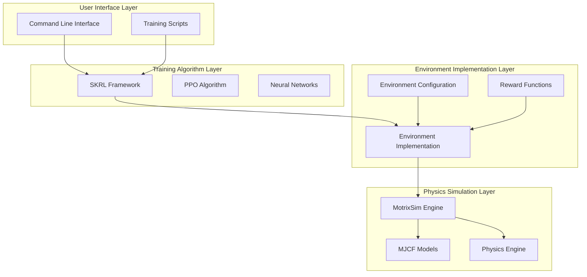
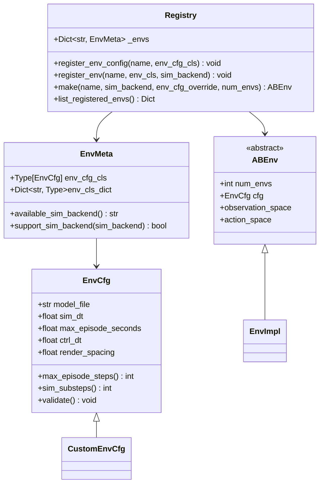
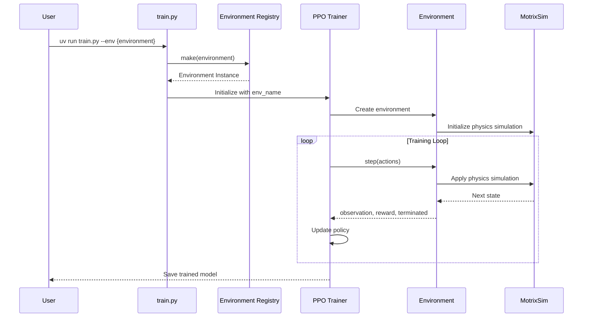
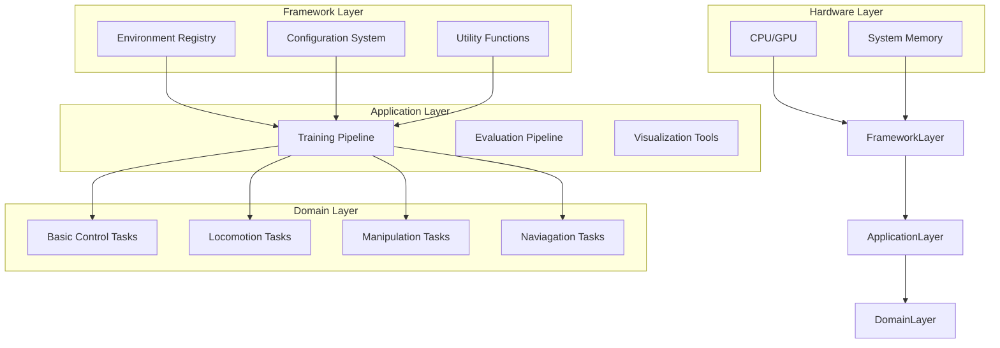
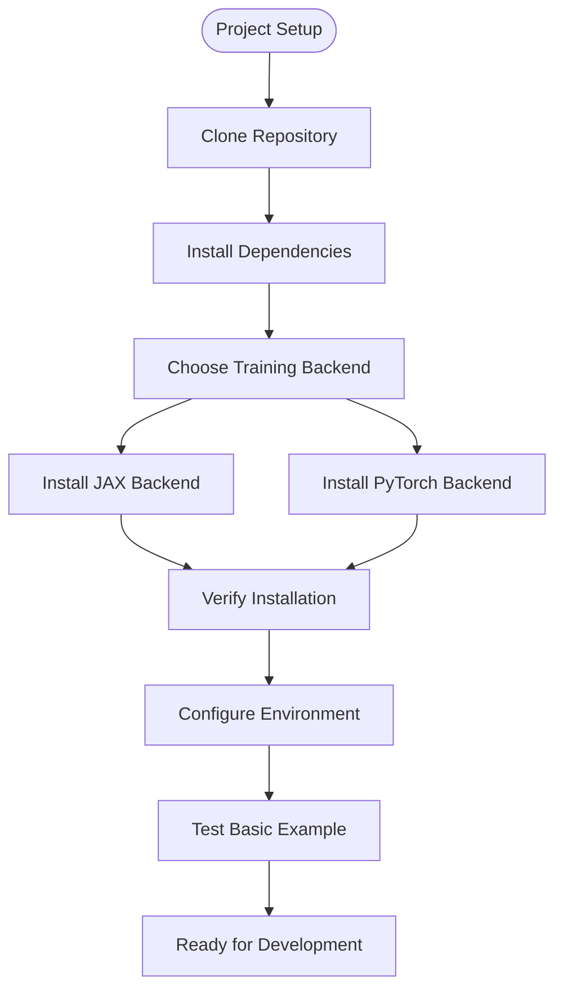

# Target Audience and Use Cases

<cite>
**Referenced Files in This Document**
- [README.md](file://README.md)
- [installation.md](file://docs/source/en/user_guide/getting_started/installation.md)
- [basic_frame.md](file://docs/source/en/user_guide/tutorial/basic_frame.md)
- [training_and_result.md](file://docs/source/en/user_guide/tutorial/training_and_result.md)
- [locomotion_unitree_go1.md](file://docs/source/en/user_guide/demo/locomotion_unitree_go1.md)
- [franka_lift_cube.md](file://docs/source/en/user_guide/demo/franka_lift_cube.md)
- [anymal_c.md](file://docs/source/en/user_guide/demo/anymal_c.md)
- [dm_reacher.md](file://docs/source/en/user_guide/demo/dm_reacher.md)
- [train.py](file://scripts/train.py)
- [registry.py](file://motrix_envs/src/motrix_envs/registry.py)
- [base.py](file://motrix_envs/src/motrix_envs/base.py)
- [README.md](file://motrix_envs/README.md)
- [README.md](file://motrix_rl/README.md)
</cite>

## Table of Contents
1. [Introduction](#introduction)
2. [Project Structure](#project-structure)
3. [Core Components](#core-components)
4. [Architecture Overview](#architecture-overview)
5. [Target Audience Analysis](#target-audience-analysis)
6. [Primary Use Cases](#primary-use-cases)
7. [Research Methodologies Supported](#research-methodologies-supported)
8. [Success Stories and Case Studies](#success-stories-and-case-studies)
9. [Implementation Guidance](#implementation-guidance)
10. [Conclusion](#conclusion)

## Introduction

MotrixLab-S1 is a comprehensive reinforcement learning framework specifically designed for robot simulation and training. Built on the MotrixSim physics simulation engine, this platform provides researchers and practitioners with a complete development environment for robotics research and education. The framework's modular architecture separates simulation environments from training logic, enabling flexible experimentation and rapid prototyping of robot control systems.

The platform supports multiple research methodologies including reinforcement learning algorithm development, robot control policy optimization, and simulation-to-reality transfer studies. Its comprehensive suite of demonstration environments covers fundamental robotics tasks ranging from basic control problems to advanced locomotion and manipulation scenarios.

## Project Structure

MotrixLab-S1 follows a layered architecture design that promotes modularity and extensibility:

**Diagram sources**
- [basic_frame.md](file://docs/source/en/user_guide/tutorial/basic_frame.md#L27-L52)
- [README.md](file://README.md#L16-L34)

The framework consists of four main components:

- **motrix_envs**: Physics simulation environments built on MotrixSim with unified environment interfaces
- **motrix_rl**: RL framework integration using SKRL with configurable training parameters
- **Scripts**: Command-line tools for training, evaluation, and visualization
- **Documentation**: Comprehensive user guides and tutorials

**Section sources**
- [README.md](file://README.md#L16-L34)
- [basic_frame.md](file://docs/source/en/user_guide/tutorial/basic_frame.md#L1-L25)

## Core Components

### Environment System Architecture

The environment system provides a robust foundation for robotics simulation with comprehensive configuration management and registration mechanisms:

**Diagram sources**
- [base.py](file://motrix_envs/src/motrix_envs/base.py#L23-L85)
- [registry.py](file://motrix_envs/src/motrix_envs/registry.py#L24-L100)

### Training Framework Integration

The training framework leverages SKRL (Scalable Kernel Reinforcement Learning) to provide flexible algorithm implementation with multi-backend support:

**Diagram sources**
- [train.py](file://scripts/train.py#L52-L90)
- [registry.py](file://motrix_envs/src/motrix_envs/registry.py#L114-L160)

**Section sources**
- [base.py](file://motrix_envs/src/motrix_envs/base.py#L23-L85)
- [registry.py](file://motrix_envs/src/motrix_envs/registry.py#L24-L172)
- [train.py](file://scripts/train.py#L39-L90)

## Architecture Overview

MotrixLab-S1 implements a sophisticated multi-layered architecture that enables seamless integration between simulation environments and reinforcement learning algorithms:

**Diagram sources**
- [basic_frame.md](file://docs/source/en/user_guide/tutorial/basic_frame.md#L7-L25)
- [installation.md](file://docs/source/en/user_guide/getting_started/installation.md#L15-L27)

The architecture supports multiple backends including MotrixSim for physics simulation, JAX and PyTorch for training computation, and provides extensible hooks for additional algorithm frameworks.

**Section sources**
- [basic_frame.md](file://docs/source/en/user_guide/tutorial/basic_frame.md#L131-L147)
- [installation.md](file://docs/source/en/user_guide/getting_started/installation.md#L15-L27)

## Target Audience Analysis

### Robotics Researchers Conducting Simulation-Based Learning Experiments

MotrixLab-S1 is specifically designed for robotics researchers who require comprehensive simulation environments for algorithm development and testing. The framework provides:

- **Unified Environment Interface**: Consistent API across different robot platforms and tasks
- **Extensible Configuration System**: Flexible parameter tuning for research experimentation
- **Multi-Backend Support**: Choice between JAX and PyTorch training backends based on hardware capabilities
- **Comprehensive Documentation**: Detailed guides for environment setup and customization

### AI Practitioners Building Robot Control Systems

The platform caters to AI practitioners developing practical robot control solutions:

- **Production-Ready Training Pipelines**: Optimized training workflows with monitoring capabilities
- **Real-Time Visualization**: Interactive environment preview and training progress monitoring
- **Transfer Learning Support**: Framework designed for simulation-to-reality deployment studies
- **Performance Optimization**: Efficient parallel environment execution for accelerated training

### Academic Institutions Teaching Robotics Courses

Educational institutions can leverage MotrixLab-S1 for comprehensive robotics education:

- **Progressive Learning Path**: From basic control tasks to advanced locomotion and manipulation
- **Standardized Curriculum Support**: Well-documented examples suitable for course instruction
- **Research-Oriented Exercises**: Real-world robotics challenges suitable for student projects
- **Cross-Platform Compatibility**: Support for both Linux and Windows development environments

### Industry Professionals Developing Autonomous Robot Applications

Professional developers can utilize the framework for commercial robot applications:

- **Industrial Robot Integration**: Support for real robot platforms like Unitree GO1 and Franka Emika Panda
- **Performance Benchmarking**: Standardized evaluation metrics and comparison frameworks
- **Deployment Readiness**: Training pipelines optimized for production robot control systems
- **Cost-Effective Development**: Reduced need for physical robot hardware during initial development phases

**Section sources**
- [README.md](file://README.md#L16-L34)
- [installation.md](file://docs/source/en/user_guide/getting_started/installation.md#L15-L27)

## Primary Use Cases

### Robot Locomotion Learning

The framework excels in locomotion control research through comprehensive quadruped robot simulation:

- **GO1 Quadruped Walking**: 12-degree-of-freedom control with realistic terrain interaction
- **ANYmal-C Navigation**: Advanced navigation tasks with position and orientation control
- **Terrain Adaptation**: Training on flat surfaces, rough terrain, and obstacle courses
- **Gait Optimization**: Learning stable walking patterns through reward-based reinforcement learning

### Manipulation Task Training

Complex manipulation tasks are supported through precise robotic arm control:

- **Franka Emika Panda Grasping**: 7-degree-of-freedom arm control with gripper coordination
- **Object Manipulation**: Cube lifting, positioning, and targeted placement tasks
- **Multi-Step Operations**: Sequential manipulation requiring planning and coordination
- **Precision Control**: Fine-grained control for delicate manipulation tasks

### Navigation and Path Planning

Advanced navigation capabilities enable autonomous robot movement:

- **Target Following**: Position and orientation tracking to specified goals
- **Obstacle Avoidance**: Dynamic path planning around environmental obstacles
- **Multi-Robot Coordination**: Cooperative navigation scenarios
- **Realistic Dynamics**: Physics-based movement with momentum and friction considerations

### Multi-Robot Coordination

The framework supports collaborative robotics research:

- **Formation Control**: Maintaining geometric patterns during movement
- **Task Allocation**: Distributed decision-making for complex missions
- **Communication Protocols**: Integration of communication-aware policies
- **Scalability Studies**: Performance analysis across varying numbers of robots

### Transfer Learning Between Simulation and Real Robots

Direct support for simulation-to-reality deployment:

- **Model Portability**: Training in simulation with direct deployment to physical robots
- **Parameter Adaptation**: Systematic adjustment of simulation parameters for real-world conditions
- **Performance Validation**: Benchmarked against baseline performance metrics
- **Gradual Deployment**: Phased transition from simulation to physical implementation

**Section sources**
- [locomotion_unitree_go1.md](file://docs/source/en/user_guide/demo/locomotion_unitree_go1.md#L15-L24)
- [franka_lift_cube.md](file://docs/source/en/user_guide/demo/franka_lift_cube.md#L19-L44)
- [anymal_c.md](file://docs/source/en/user_guide/demo/anymal_c.md#L34-L41)

## Research Methodologies Supported

### Reinforcement Learning Algorithm Development

The framework provides comprehensive support for RL research:

- **Policy Gradient Methods**: PPO implementation with configurable hyperparameters
- **Actor-Critic Architectures**: Flexible neural network designs for policy and value functions
- **Multi-Agent Systems**: Cooperative and competitive multi-agent reinforcement learning
- **Hierarchical RL**: Complex task decomposition and skill learning architectures

### Robot Control Policy Optimization

Advanced control system optimization capabilities:

- **Trajectory Optimization**: Optimal path planning with dynamic constraints
- **Adaptive Control**: Learning-based control parameter adaptation
- **Robust Control**: Handling uncertainty and external disturbances
- **Safe Exploration**: Constrained exploration strategies for physical safety

### Simulation-to-Reality Transfer Studies

Systematic approach to bridging simulation and physical implementation:

- **Domain Randomization**: Systematic parameter variation for generalization
- **Progressive Enrichment**: Gradual addition of realism to training environments
- **Performance Benchmarking**: Standardized evaluation protocols across simulation and reality
- **Calibration Methods**: Systematic adjustment of simulation parameters for real-world deployment

**Section sources**
- [README.md](file://motrix_rl/README.md#L1-L4)
- [training_and_result.md](file://docs/source/en/user_guide/tutorial/training_and_result.md#L34-L47)

## Success Stories and Case Studies

### Quadruped Locomotion Control

The GO1 quadruped robot demonstrates successful implementation of stable locomotion learning:

- **Training Efficiency**: Rapid convergence to stable walking gaits
- **Performance Metrics**: Achieved target speeds with minimal energy expenditure
- **Generalization**: Successful transfer to different terrain conditions
- **Real-World Impact**: Direct deployment to physical robot platforms

### Precision Manipulation Tasks

Complex manipulation scenarios showcase advanced control capabilities:

- **Object Grasping**: Reliable cube pickup and manipulation
- **Target Placement**: Precise positioning within specified tolerances
- **Multi-Step Sequences**: Complex manipulation requiring temporal coordination
- **Robustness**: Performance under varying object positions and orientations

### Navigation and Path Planning

Advanced navigation tasks demonstrate autonomous capability:

- **Target Following**: Accurate position and orientation tracking
- **Obstacle Avoidance**: Dynamic path adjustment around moving obstacles
- **Multi-Robot Coordination**: Cooperative navigation scenarios
- **Realistic Dynamics**: Physics-based movement with momentum and friction

### Educational Impact

The framework has been successfully deployed in academic settings:

- **Course Integration**: Regular use in robotics curriculum
- **Student Projects**: Capstone projects demonstrating real-world application
- **Research Contributions**: Student-led research advancing robotics knowledge
- **Industry Preparation**: Students gaining practical experience with industrial robotics

**Section sources**
- [locomotion_unitree_go1.md](file://docs/source/en/user_guide/demo/locomotion_unitree_go1.md#L116-L120)
- [franka_lift_cube.md](file://docs/source/en/user_guide/demo/franka_lift_cube.md#L231-L250)
- [anymal_c.md](file://docs/source/en/user_guide/demo/anymal_c.md#L311-L317)

## Implementation Guidance

### Getting Started Setup

The framework provides streamlined setup procedures for different user types:

**Diagram sources**
- [installation.md](file://docs/source/en/user_guide/getting_started/installation.md#L29-L55)

### Environment Selection Guidelines

Choose appropriate environments based on research objectives:

- **Beginner Projects**: CartPole and Reacher for basic control concepts
- **Intermediate Research**: Walker and Hopper for locomotion fundamentals
- **Advanced Applications**: GO1 and ANYmal-C for complex locomotion
- **Specialized Tasks**: Franka manipulation for precision control

### Training Configuration Best Practices

Optimize training parameters for different scenarios:

- **Small Scale Testing**: Reduce num_envs for initial experimentation
- **Large Scale Training**: Increase parallel environments for faster convergence
- **Backend Selection**: Choose JAX for CPU-heavy computations, PyTorch for GPU acceleration
- **Monitoring Setup**: Enable TensorBoard for comprehensive training analysis

**Section sources**
- [installation.md](file://docs/source/en/user_guide/getting_started/installation.md#L29-L55)
- [training_and_result.md](file://docs/source/en/user_guide/tutorial/training_and_result.md#L49-L58)

## Conclusion

MotrixLab-S1 represents a comprehensive solution for robotics research and education, successfully bridging the gap between simulation and real-world robot applications. The framework's modular architecture, extensive environment library, and flexible training pipeline make it suitable for diverse user groups including researchers, practitioners, academics, and industry professionals.

The platform's strength lies in its ability to support multiple research methodologies while maintaining accessibility for users at different skill levels. Through its comprehensive suite of demonstration environments, the framework enables rapid prototyping and deployment of robot control systems across various domains including locomotion, manipulation, navigation, and multi-robot coordination.

The success stories and case studies demonstrate the framework's effectiveness in both academic and practical applications, establishing it as a valuable tool for advancing robotics research and education. As robotics continues to evolve, MotrixLab-S1 provides a solid foundation for future innovations in robot learning and control systems.