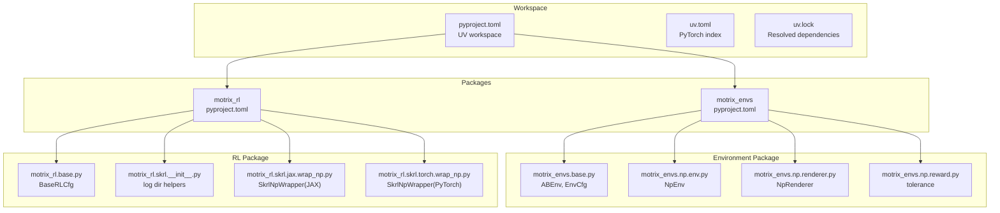
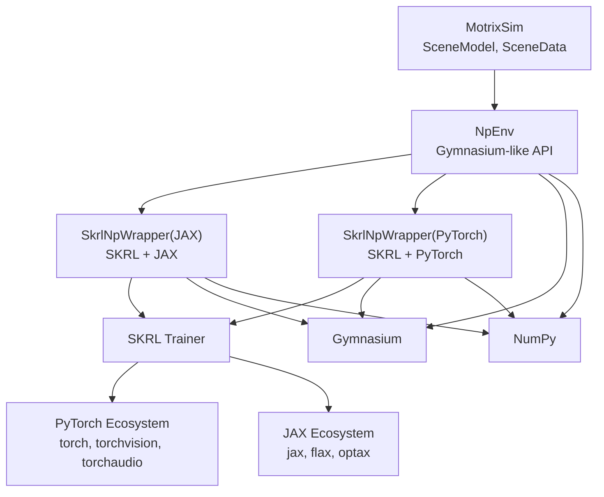
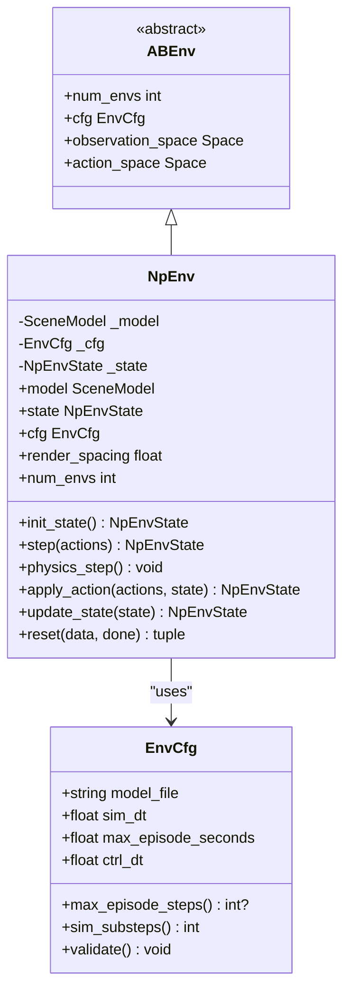
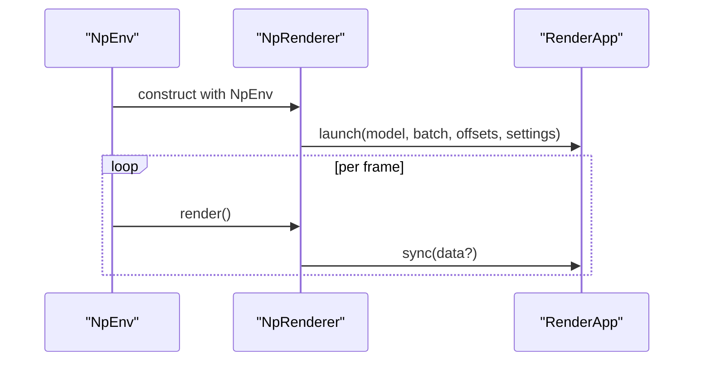
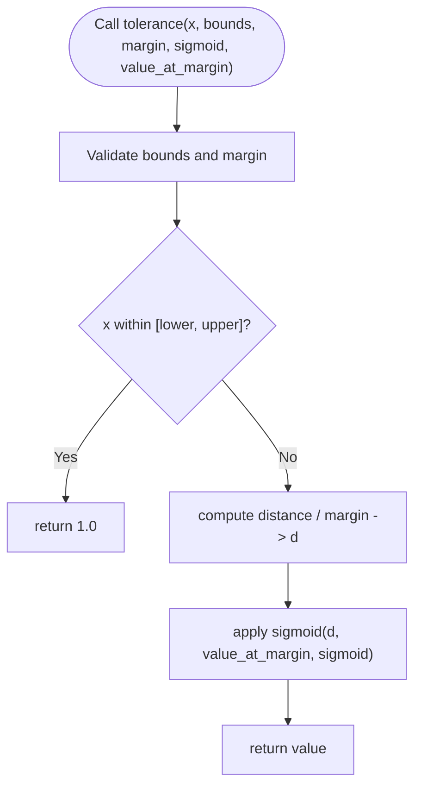
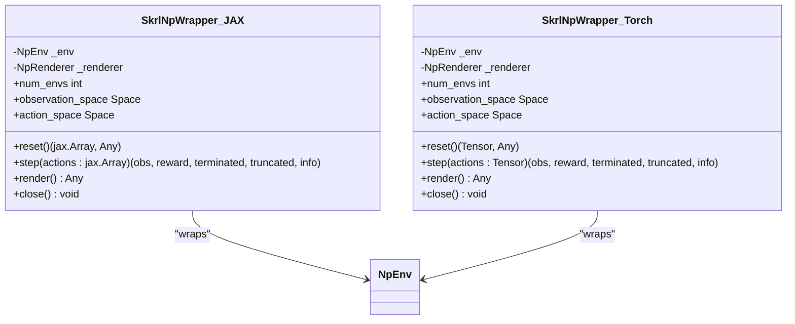
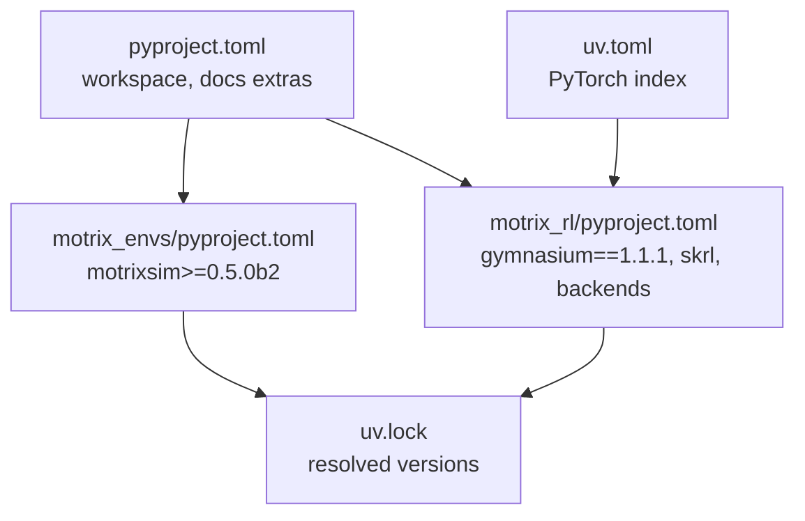

# Technology Stack

<cite>
**Referenced Files in This Document**
- [pyproject.toml](file://pyproject.toml)
- [uv.toml](file://uv.toml)
- [uv.lock](file://uv.lock)
- [motrix_envs/pyproject.toml](file://motrix_envs/pyproject.toml)
- [motrix_rl/pyproject.toml](file://motrix_rl/pyproject.toml)
- [motrix_envs/src/motrix_envs/__init__.py](file://motrix_envs/src/motrix_envs/__init__.py)
- [motrix_rl/src/motrix_rl/__init__.py](file://motrix_rl/src/motrix_rl/__init__.py)
- [motrix_envs/src/motrix_envs/base.py](file://motrix_envs/src/motrix_envs/base.py)
- [motrix_envs/src/motrix_envs/np/env.py](file://motrix_envs/src/motrix_envs/np/env.py)
- [motrix_envs/src/motrix_envs/np/renderer.py](file://motrix_envs/src/motrix_envs/np/renderer.py)
- [motrix_envs/src/motrix_envs/np/reward.py](file://motrix_envs/src/motrix_envs/np/reward.py)
- [motrix_rl/src/motrix_rl/base.py](file://motrix_rl/src/motrix_rl/base.py)
- [motrix_rl/src/motrix_rl/skrl/__init__.py](file://motrix_rl/src/motrix_rl/skrl/__init__.py)
- [motrix_rl/src/motrix_rl/skrl/jax/wrap_np.py](file://motrix_rl/src/motrix_rl/skrl/jax/wrap_np.py)
- [motrix_rl/src/motrix_rl/skrl/torch/wrap_np.py](file://motrix_rl/src/motrix_rl/skrl/torch/wrap_np.py)
</cite>

## Table of Contents
1. [Introduction](#introduction)
2. [Project Structure](#project-structure)
3. [Core Components](#core-components)
4. [Architecture Overview](#architecture-overview)
5. [Detailed Component Analysis](#detailed-component-analysis)
6. [Dependency Analysis](#dependency-analysis)
7. [Performance Considerations](#performance-considerations)
8. [Troubleshooting Guide](#troubleshooting-guide)
9. [Conclusion](#conclusion)
10. [Appendices](#appendices)

## Introduction
This document describes the technology stack and dependencies of MotrixLab-S1, focusing on the core Python libraries, optional training backends, development tooling, build system, and integration points. It explains how the MotrixSim physics engine integrates with Gymnasium RL environments via NumPy-based wrappers, how SKRL provides a unified training interface across JAX and PyTorch backends, and how NumPy serves as the numerical foundation. It also covers optional dependencies for JAX/Flax and PyTorch, hardware and installation considerations, documentation tooling, and recommended development environments.

## Project Structure
MotrixLab-S1 is organized as a workspace with three primary parts:
- Workspace configuration and top-level metadata
- A physics environment package (motrix-envs) built on MotrixSim
- A reinforcement learning package (motrix-rl) built on Gymnasium and SKRL, with optional JAX/Flax and PyTorch backends

**Diagram sources**
- [pyproject.toml](file://pyproject.toml#L21-L29)
- [motrix_envs/pyproject.toml](file://motrix_envs/pyproject.toml#L1-L16)
- [motrix_rl/pyproject.toml](file://motrix_rl/pyproject.toml#L1-L32)
- [motrix_envs/src/motrix_envs/base.py](file://motrix_envs/src/motrix_envs/base.py#L23-L85)
- [motrix_envs/src/motrix_envs/np/env.py](file://motrix_envs/src/motrix_envs/np/env.py#L26-L209)
- [motrix_envs/src/motrix_envs/np/renderer.py](file://motrix_envs/src/motrix_envs/np/renderer.py#L22-L65)
- [motrix_envs/src/motrix_envs/np/reward.py](file://motrix_envs/src/motrix_envs/np/reward.py#L63-L84)
- [motrix_rl/src/motrix_rl/base.py](file://motrix_rl/src/motrix_rl/base.py#L20-L43)
- [motrix_rl/src/motrix_rl/skrl/__init__.py](file://motrix_rl/src/motrix_rl/skrl/__init__.py#L19-L22)
- [motrix_rl/src/motrix_rl/skrl/jax/wrap_np.py](file://motrix_rl/src/motrix_rl/skrl/jax/wrap_np.py#L27-L81)
- [motrix_rl/src/motrix_rl/skrl/torch/wrap_np.py](file://motrix_rl/src/motrix_rl/skrl/torch/wrap_np.py#L26-L80)

**Section sources**
- [pyproject.toml](file://pyproject.toml#L1-L29)
- [motrix_envs/pyproject.toml](file://motrix_envs/pyproject.toml#L1-L16)
- [motrix_rl/pyproject.toml](file://motrix_rl/pyproject.toml#L1-L32)

## Core Components
- MotrixSim physics engine: Provides the SceneModel and SceneData used by NumPy-based environments for simulation stepping and state management.
- Gymnasium RL environment interface: Exposed via ABEnv and NpEnv abstractions, enabling vectorized environments and standard RL APIs.
- SKRL reinforcement learning framework: Provides a unified training interface across JAX and PyTorch backends through environment wrappers.
- NumPy numerical computing foundation: Used pervasively for arrays, state tensors, and reward computations.

Key integration points:
- NpEnv wraps MotrixSim’s SceneModel and SceneData to produce Gymnasium-compatible observations, rewards, and termination signals.
- SKRL wrappers adapt NpEnv to JAX or PyTorch tensor conventions while preserving Gymnasium semantics.
- Reward utilities provide robust shaped reward computation via tolerance functions.

**Section sources**
- [motrix_envs/src/motrix_envs/np/env.py](file://motrix_envs/src/motrix_envs/np/env.py#L52-L209)
- [motrix_envs/src/motrix_envs/base.py](file://motrix_envs/src/motrix_envs/base.py#L61-L85)
- [motrix_rl/src/motrix_rl/skrl/jax/wrap_np.py](file://motrix_rl/src/motrix_rl/skrl/jax/wrap_np.py#L27-L81)
- [motrix_rl/src/motrix_rl/skrl/torch/wrap_np.py](file://motrix_rl/src/motrix_rl/skrl/torch/wrap_np.py#L26-L80)
- [motrix_envs/src/motrix_envs/np/reward.py](file://motrix_envs/src/motrix_envs/np/reward.py#L63-L84)

## Architecture Overview
The system architecture connects the physics simulation layer to RL training backends through a common Gymnasium interface.

**Diagram sources**
- [motrix_envs/src/motrix_envs/np/env.py](file://motrix_envs/src/motrix_envs/np/env.py#L52-L209)
- [motrix_rl/src/motrix_rl/skrl/jax/wrap_np.py](file://motrix_rl/src/motrix_rl/skrl/jax/wrap_np.py#L27-L81)
- [motrix_rl/src/motrix_rl/skrl/torch/wrap_np.py](file://motrix_rl/src/motrix_rl/skrl/torch/wrap_np.py#L26-L80)
- [motrix_rl/pyproject.toml](file://motrix_rl/pyproject.toml#L15-L27)

## Detailed Component Analysis

### Physics Simulation Engine Integration (MotrixSim)
- NpEnv loads a model from a model file and steps the physics simulation using MotrixSim’s SceneModel.
- Simulation timestep and control timestep are configured via EnvCfg; sim_substeps ensures control-rate fidelity.
- NpEnvState encapsulates batched simulation data, observations, rewards, and termination/truncation flags.

**Diagram sources**
- [motrix_envs/src/motrix_envs/base.py](file://motrix_envs/src/motrix_envs/base.py#L23-L85)
- [motrix_envs/src/motrix_envs/np/env.py](file://motrix_envs/src/motrix_envs/np/env.py#L26-L209)

**Section sources**
- [motrix_envs/src/motrix_envs/np/env.py](file://motrix_envs/src/motrix_envs/np/env.py#L52-L209)
- [motrix_envs/src/motrix_envs/base.py](file://motrix_envs/src/motrix_envs/base.py#L23-L85)

### Rendering Pipeline and Visualization
- NpRenderer initializes a RenderApp with RenderSettings and launches a batched rendering view of the environment.
- It synchronizes simulation data to the renderer and supports interactive toggling of data synchronization.

**Diagram sources**
- [motrix_envs/src/motrix_envs/np/renderer.py](file://motrix_envs/src/motrix_envs/np/renderer.py#L22-L65)

**Section sources**
- [motrix_envs/src/motrix_envs/np/renderer.py](file://motrix_envs/src/motrix_envs/np/renderer.py#L22-L65)

### Reward Computation Utilities
- tolerance computes shaped rewards using configurable sigmoid functions and margins around target bounds.

**Diagram sources**
- [motrix_envs/src/motrix_envs/np/reward.py](file://motrix_envs/src/motrix_envs/np/reward.py#L63-L84)

**Section sources**
- [motrix_envs/src/motrix_envs/np/reward.py](file://motrix_envs/src/motrix_envs/np/reward.py#L21-L84)

### SKRL Training Wrappers (Unified Interface)
- SkrlNpWrapper (JAX) and SkrlNpWrapper (PyTorch) adapt NpEnv to SKRL’s environment interface, converting between NumPy arrays and JAX/PyTorch tensors.
- Both expose Gymnasium-compatible reset and step semantics and optionally render during training.

**Diagram sources**
- [motrix_rl/src/motrix_rl/skrl/jax/wrap_np.py](file://motrix_rl/src/motrix_rl/skrl/jax/wrap_np.py#L27-L81)
- [motrix_rl/src/motrix_rl/skrl/torch/wrap_np.py](file://motrix_rl/src/motrix_rl/skrl/torch/wrap_np.py#L26-L80)

**Section sources**
- [motrix_rl/src/motrix_rl/skrl/jax/wrap_np.py](file://motrix_rl/src/motrix_rl/skrl/jax/wrap_np.py#L27-L81)
- [motrix_rl/src/motrix_rl/skrl/torch/wrap_np.py](file://motrix_rl/src/motrix_rl/skrl/torch/wrap_np.py#L26-L80)

### RL Configuration and Logging
- BaseRLCfg defines training hyperparameters such as seed, number of environments, maximum steps, and checkpoint intervals.
- Logging directory prefix is standardized for SKRL runs.

**Section sources**
- [motrix_rl/src/motrix_rl/base.py](file://motrix_rl/src/motrix_rl/base.py#L20-L43)
- [motrix_rl/src/motrix_rl/skrl/__init__.py](file://motrix_rl/src/motrix_rl/skrl/__init__.py#L19-L22)

## Dependency Analysis
The project uses a modern Python workspace managed by UV with explicit optional backends and a lock file for reproducibility.

**Diagram sources**
- [pyproject.toml](file://pyproject.toml#L21-L29)
- [motrix_envs/pyproject.toml](file://motrix_envs/pyproject.toml#L13-L15)
- [motrix_rl/pyproject.toml](file://motrix_rl/pyproject.toml#L13-L27)
- [uv.toml](file://uv.toml#L1-L3)
- [uv.lock](file://uv.lock#L1-L11)

**Section sources**
- [pyproject.toml](file://pyproject.toml#L1-L29)
- [motrix_envs/pyproject.toml](file://motrix_envs/pyproject.toml#L1-L16)
- [motrix_rl/pyproject.toml](file://motrix_rl/pyproject.toml#L1-L32)
- [uv.toml](file://uv.toml#L1-L3)
- [uv.lock](file://uv.lock#L1-L11)

## Performance Considerations
- Vectorization: NpEnv supports batching multiple environments to improve throughput; EnvCfg controls sim_substeps to balance fidelity and speed.
- Rendering overhead: NpRenderer can synchronize simulation data per frame; toggling synchronization reduces overhead for high-frequency training.
- Backend choice: JAX/Flax and PyTorch backends offer different performance characteristics; selection depends on deployment and GPU availability.

[No sources needed since this section provides general guidance]

## Troubleshooting Guide
- Environment validation: EnvCfg.validate enforces sim_dt ≤ ctrl_dt to prevent unstable simulations.
- State consistency: NpEnvState.validate asserts shape consistency across reward, terminated, truncated, and observations.
- Episode truncation: _update_truncate applies max episode steps when configured.

**Section sources**
- [motrix_envs/src/motrix_envs/base.py](file://motrix_envs/src/motrix_envs/base.py#L53-L59)
- [motrix_envs/src/motrix_envs/np/env.py](file://motrix_envs/src/motrix_envs/np/env.py#L45-L50)
- [motrix_envs/src/motrix_envs/np/env.py](file://motrix_envs/src/motrix_envs/np/env.py#L141-L148)

## Conclusion
MotrixLab-S1 integrates MotrixSim for physics simulation, Gymnasium for environment interfaces, and SKRL for unified RL training across JAX and PyTorch. NumPy provides the numerical backbone for state representation and reward shaping. The project’s build and dependency management leverage UV with a lock file and optional PyTorch index for CUDA packages. The modular design enables flexible backend selection and efficient multi-environment training.

[No sources needed since this section summarizes without analyzing specific files]

## Appendices

### Core Dependencies and Versions
- Python: 3.10.*
- Gymnasium: 1.1.1
- SKRL: 1.4.3 (backend-specific extras)
- NumPy: 2.2.6
- MotrixSim: 0.5.0b2
- Optional JAX/Flax: JAX 0.4.34 (CUDA), Flax 0.10.4, TensorFlow 2.20.0 (Linux only)
- Optional PyTorch: torch 2.7.0+cu128, torchvision 0.22.0+cu128, torchaudio 2.7.0+cu128

**Section sources**
- [motrix_rl/pyproject.toml](file://motrix_rl/pyproject.toml#L15-L27)
- [uv.lock](file://uv.lock#L543-L627)

### Optional Backends and Hardware Requirements
- JAX/Flax backend:
  - Linux-only constraint for SKRL JAX extras
  - Requires CUDA-capable runtime and matching NVIDIA drivers
- PyTorch backend:
  - CUDA 12.8 wheels via PyTorch index
  - Suitable for GPU-accelerated training

**Section sources**
- [motrix_rl/pyproject.toml](file://motrix_rl/pyproject.toml#L15-L27)
- [uv.toml](file://uv.toml#L1-L3)

### Build System and Development Tools
- Build system: uv_build
- Workspace: members include motrix_envs and motrix_rl
- Documentation: Sphinx ecosystem with autodocsumm, pydata-sphinx-theme, myst-parser, sphinx-copybutton, sphinx-subfigure, sphinxcontrib-video, sphinx-togglebutton, sphinx-design
- Pre-commit hooks: managed via .prettierrc and .prettierignore

**Section sources**
- [motrix_envs/pyproject.toml](file://motrix_envs/pyproject.toml#L1-L3)
- [motrix_rl/pyproject.toml](file://motrix_rl/pyproject.toml#L1-L3)
- [pyproject.toml](file://pyproject.toml#L8-L19)
- [.prettierrc](file://.prettierrc)
- [.prettierignore](file://.prettierignore)

### Platform Compatibility and Recommended Environments
- Python: 3.10.*
- Operating systems: Linux (JAX/Flax), Windows, macOS (general support)
- GPU acceleration: Recommended for PyTorch; JAX/Flax require Linux with CUDA runtime
- Installation: Use UV-managed workspace; install optional extras for desired backend

**Section sources**
- [pyproject.toml](file://pyproject.toml#L6)
- [motrix_rl/pyproject.toml](file://motrix_rl/pyproject.toml#L15-L27)