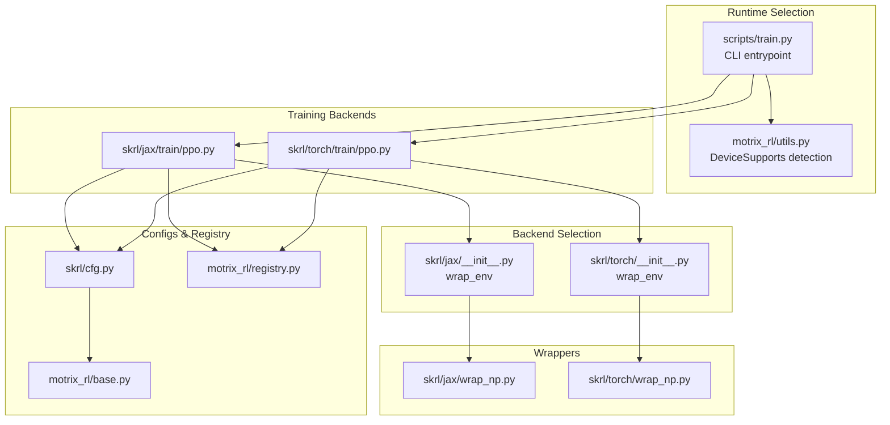
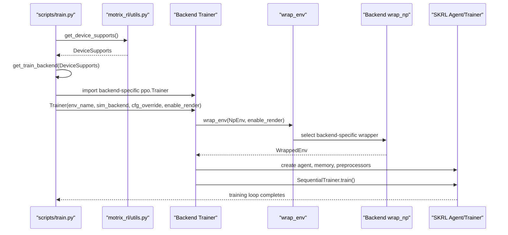
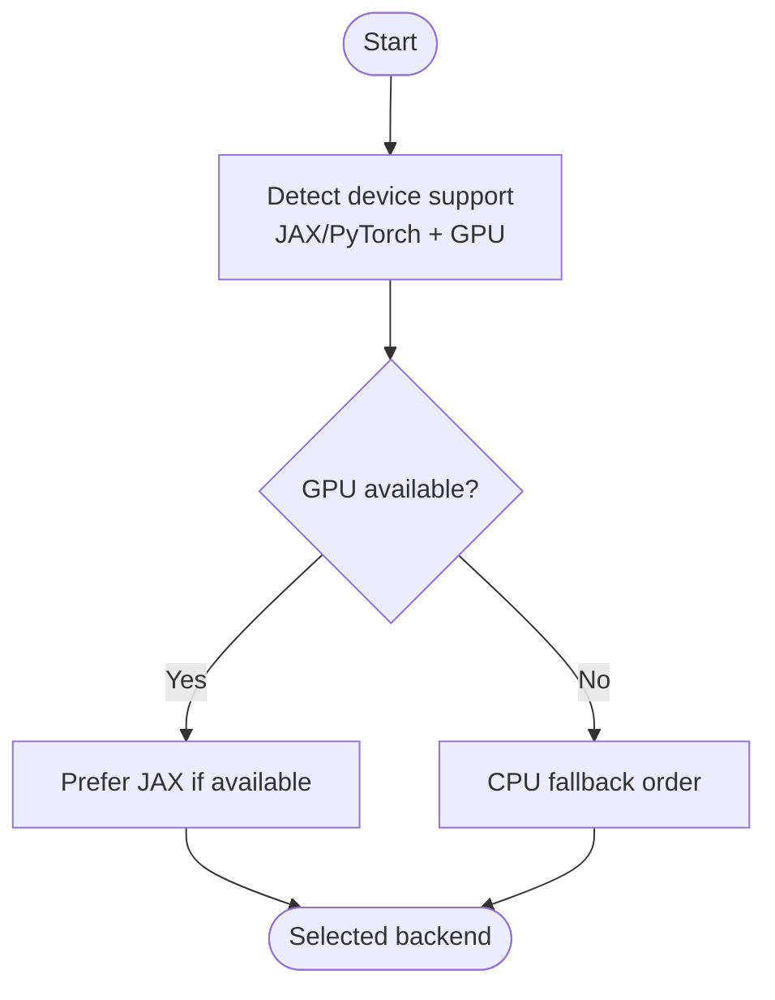
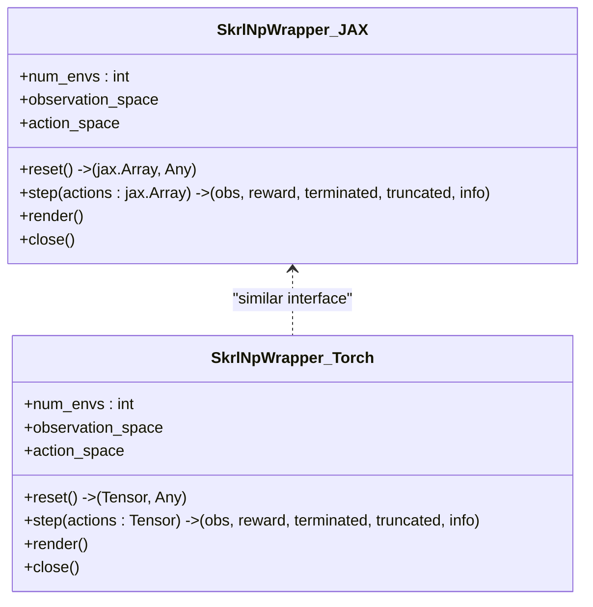
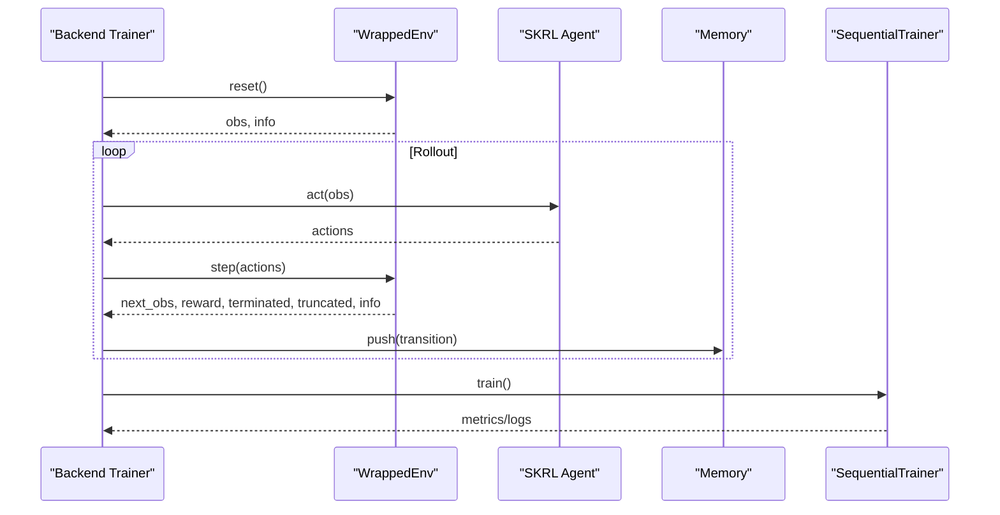
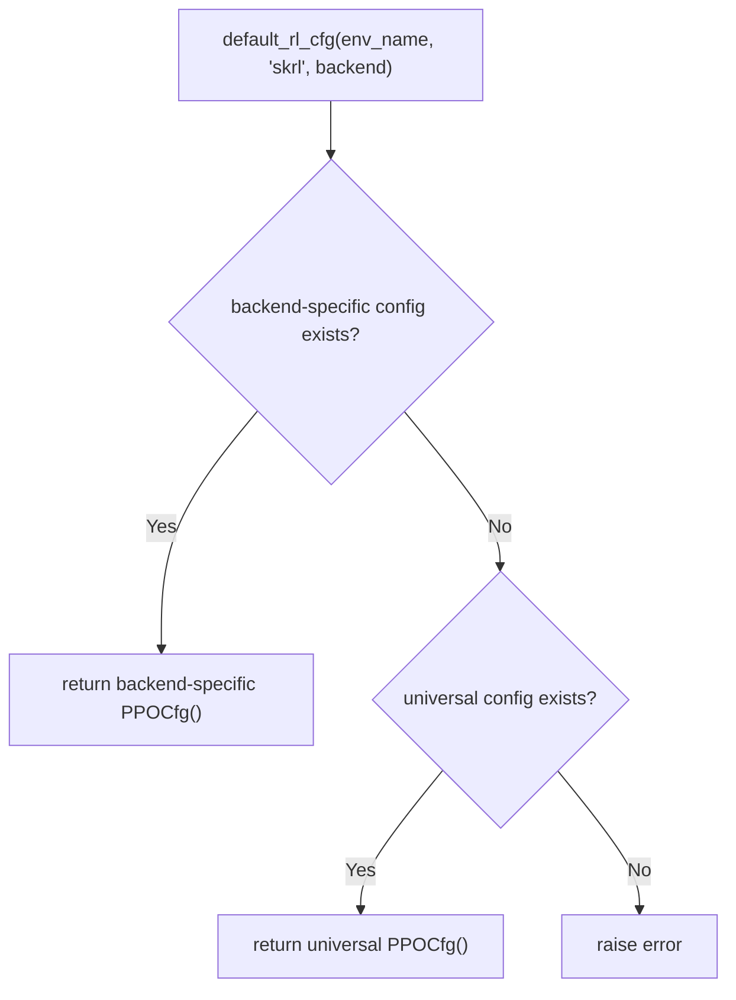
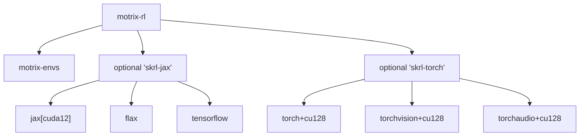

# Multi-Backend Support

<cite>
**Referenced Files in This Document**
- [train.py](file://scripts/train.py)
- [utils.py](file://motrix_rl/src/motrix_rl/utils.py)
- [registry.py](file://motrix_rl/src/motrix_rl/registry.py)
- [cfg.py](file://motrix_rl/src/motrix_rl/skrl/cfg.py)
- [base.py](file://motrix_rl/src/motrix_rl/base.py)
- [jax/__init__.py](file://motrix_rl/src/motrix_rl/skrl/jax/__init__.py)
- [torch/__init__.py](file://motrix_rl/src/motrix_rl/skrl/torch/__init__.py)
- [jax/wrap_np.py](file://motrix_rl/src/motrix_rl/skrl/jax/wrap_np.py)
- [torch/wrap_np.py](file://motrix_rl/src/motrix_rl/skrl/torch/wrap_np.py)
- [jax/train/ppo.py](file://motrix_rl/src/motrix_rl/skrl/jax/train/ppo.py)
- [torch/train/ppo.py](file://motrix_rl/src/motrix_rl/skrl/torch/train/ppo.py)
- [pyproject.toml](file://motrix_rl/pyproject.toml)
- [pyproject.toml](file://motrix_envs/pyproject.toml)
- [pyproject.toml](file://pyproject.toml)
- [test_all_demos.py](file://scripts/test_all_demos.py)
</cite>

## Table of Contents
1. [Introduction](#introduction)
2. [Project Structure](#project-structure)
3. [Core Components](#core-components)
4. [Architecture Overview](#architecture-overview)
5. [Detailed Component Analysis](#detailed-component-analysis)
6. [Dependency Analysis](#dependency-analysis)
7. [Performance Considerations](#performance-considerations)
8. [Troubleshooting Guide](#troubleshooting-guide)
9. [Conclusion](#conclusion)
10. [Appendices](#appendices)

## Introduction
This document explains the multi-backend support in the MotrixLab-S1 training pipeline, focusing on the dual-backend architecture that unifies training across JAX and PyTorch via the SKRL framework. It covers backend selection mechanisms, automatic detection, runtime switching, and the NumPy environment wrappers that enable seamless integration across backends. It also documents performance characteristics, configuration options, optimization techniques, hardware requirements, and practical guidance for choosing, debugging, and migrating between backends.

## Project Structure
The multi-backend design centers around:
- A unified training interface that selects a backend at runtime
- Backend-specific trainers and model implementations
- Backend-specific environment wrappers for NumPy-based environments
- Configuration classes and registries that manage RL hyperparameters per backend
- Dependency declarations that isolate JAX and PyTorch stacks

**Diagram sources**
- [train.py](file://scripts/train.py#L39-L90)
- [utils.py](file://motrix_rl/src/motrix_rl/utils.py#L39-L61)
- [jax/__init__.py](file://motrix_rl/src/motrix_rl/skrl/jax/__init__.py#L22-L29)
- [torch/__init__.py](file://motrix_rl/src/motrix_rl/skrl/torch/__init__.py#L22-L29)
- [jax/wrap_np.py](file://motrix_rl/src/motrix_rl/skrl/jax/wrap_np.py#L27-L81)
- [torch/wrap_np.py](file://motrix_rl/src/motrix_rl/skrl/torch/wrap_np.py#L26-L80)
- [jax/train/ppo.py](file://motrix_rl/src/motrix_rl/skrl/jax/train/ppo.py#L145-L296)
- [torch/train/ppo.py](file://motrix_rl/src/motrix_rl/skrl/torch/train/ppo.py#L145-L356)
- [cfg.py](file://motrix_rl/src/motrix_rl/skrl/cfg.py#L28-L74)
- [registry.py](file://motrix_rl/src/motrix_rl/registry.py#L81-L115)
- [base.py](file://motrix_rl/src/motrix_rl/base.py#L20-L43)

**Section sources**
- [train.py](file://scripts/train.py#L39-L90)
- [utils.py](file://motrix_rl/src/motrix_rl/utils.py#L39-L61)
- [jax/__init__.py](file://motrix_rl/src/motrix_rl/skrl/jax/__init__.py#L22-L29)
- [torch/__init__.py](file://motrix_rl/src/motrix_rl/skrl/torch/__init__.py#L22-L29)
- [jax/wrap_np.py](file://motrix_rl/src/motrix_rl/skrl/jax/wrap_np.py#L27-L81)
- [torch/wrap_np.py](file://motrix_rl/src/motrix_rl/skrl/torch/wrap_np.py#L26-L80)
- [jax/train/ppo.py](file://motrix_rl/src/motrix_rl/skrl/jax/train/ppo.py#L145-L296)
- [torch/train/ppo.py](file://motrix_rl/src/motrix_rl/skrl/torch/train/ppo.py#L145-L356)
- [cfg.py](file://motrix_rl/src/motrix_rl/skrl/cfg.py#L28-L74)
- [registry.py](file://motrix_rl/src/motrix_rl/registry.py#L81-L115)
- [base.py](file://motrix_rl/src/motrix_rl/base.py#L20-L43)

## Core Components
- Backend selection and runtime switching:
  - Automatic detection of available backends and GPUs
  - CLI flag-driven override for explicit backend choice
  - Runtime import of backend-specific trainer modules
- Unified environment wrapper:
  - A single wrap_env interface dispatches to backend-specific wrappers
  - Backend wrappers adapt NumPy-based environments to SKRL’s expected tensor types
- Backend-specific trainers and models:
  - JAX and PyTorch PPO trainers encapsulate SKRL agent creation, memory, preprocessing, and training loops
  - Models are defined per backend with appropriate tensor libraries and device placement
- Configuration and registry:
  - PPO configuration classes unify hyperparameters across backends
  - Registry resolves backend-specific RL configurations for environments

**Section sources**
- [train.py](file://scripts/train.py#L39-L90)
- [jax/__init__.py](file://motrix_rl/src/motrix_rl/skrl/jax/__init__.py#L22-L29)
- [torch/__init__.py](file://motrix_rl/src/motrix_rl/skrl/torch/__init__.py#L22-L29)
- [jax/wrap_np.py](file://motrix_rl/src/motrix_rl/skrl/jax/wrap_np.py#L27-L81)
- [torch/wrap_np.py](file://motrix_rl/src/motrix_rl/skrl/torch/wrap_np.py#L26-L80)
- [jax/train/ppo.py](file://motrix_rl/src/motrix_rl/skrl/jax/train/ppo.py#L145-L296)
- [torch/train/ppo.py](file://motrix_rl/src/motrix_rl/skrl/torch/train/ppo.py#L145-L356)
- [cfg.py](file://motrix_rl/src/motrix_rl/skrl/cfg.py#L28-L74)
- [registry.py](file://motrix_rl/src/motrix_rl/registry.py#L81-L115)
- [base.py](file://motrix_rl/src/motrix_rl/base.py#L20-L43)

## Architecture Overview
The system orchestrates training by selecting a backend at runtime, wrapping the NumPy environment for the chosen backend, and constructing the agent and trainer accordingly.

**Diagram sources**
- [train.py](file://scripts/train.py#L39-L90)
- [utils.py](file://motrix_rl/src/motrix_rl/utils.py#L39-L61)
- [jax/__init__.py](file://motrix_rl/src/motrix_rl/skrl/jax/__init__.py#L22-L29)
- [torch/__init__.py](file://motrix_rl/src/motrix_rl/skrl/torch/__init__.py#L22-L29)
- [jax/wrap_np.py](file://motrix_rl/src/motrix_rl/skrl/jax/wrap_np.py#L27-L81)
- [torch/wrap_np.py](file://motrix_rl/src/motrix_rl/skrl/torch/wrap_np.py#L26-L80)
- [jax/train/ppo.py](file://motrix_rl/src/motrix_rl/skrl/jax/train/ppo.py#L145-L296)
- [torch/train/ppo.py](file://motrix_rl/src/motrix_rl/skrl/torch/train/ppo.py#L145-L356)

## Detailed Component Analysis

### Backend Selection and Automatic Detection
- Automatic detection:
  - DeviceSupports reports availability of JAX and PyTorch, and whether GPU backends are present
  - get_train_backend chooses JAX with GPU first, then PyTorch with GPU, then CPU fallbacks
- Runtime switching:
  - CLI flag --train-backend allows overriding automatic selection
  - At runtime, the appropriate backend module is imported and its Trainer instantiated

**Diagram sources**
- [utils.py](file://motrix_rl/src/motrix_rl/utils.py#L39-L61)
- [train.py](file://scripts/train.py#L39-L49)

**Section sources**
- [utils.py](file://motrix_rl/src/motrix_rl/utils.py#L39-L61)
- [train.py](file://scripts/train.py#L39-L49)

### Environment Wrapper and NumPy Integration
- Unified interface:
  - wrap_env inspects the environment type and dispatches to the backend-specific wrapper
- JAX wrapper:
  - Exposes jax.Array tensors and preserves SKRL’s JAX device semantics
  - Converts NumPy actions to JAX arrays inside step
- PyTorch wrapper:
  - Exposes torch.Tensor tensors and places them on the selected device
  - Converts torch.Tensor actions to NumPy arrays inside step

**Diagram sources**
- [jax/wrap_np.py](file://motrix_rl/src/motrix_rl/skrl/jax/wrap_np.py#L27-L81)
- [torch/wrap_np.py](file://motrix_rl/src/motrix_rl/skrl/torch/wrap_np.py#L26-L80)

**Section sources**
- [jax/__init__.py](file://motrix_rl/src/motrix_rl/skrl/jax/__init__.py#L22-L29)
- [torch/__init__.py](file://motrix_rl/src/motrix_rl/skrl/torch/__init__.py#L22-L29)
- [jax/wrap_np.py](file://motrix_rl/src/motrix_rl/skrl/jax/wrap_np.py#L27-L81)
- [torch/wrap_np.py](file://motrix_rl/src/motrix_rl/skrl/torch/wrap_np.py#L26-L80)

### Backend-Specific Trainers and Models
- JAX trainer:
  - Uses SKRL JAX agent, JAX models, JAX memory, and JAX preprocessors
  - Defines stochastic policy and deterministic value models using Flax/NN
- PyTorch trainer:
  - Uses SKRL PyTorch agent, PyTorch models, PyTorch memory, and PyTorch preprocessors
  - Defines shared or separate policy/value networks with configurable feature sharing

**Diagram sources**
- [jax/train/ppo.py](file://motrix_rl/src/motrix_rl/skrl/jax/train/ppo.py#L145-L296)
- [torch/train/ppo.py](file://motrix_rl/src/motrix_rl/skrl/torch/train/ppo.py#L145-L356)

**Section sources**
- [jax/train/ppo.py](file://motrix_rl/src/motrix_rl/skrl/jax/train/ppo.py#L145-L296)
- [torch/train/ppo.py](file://motrix_rl/src/motrix_rl/skrl/torch/train/ppo.py#L145-L356)

### Configuration and Registry
- PPO configuration:
  - Provides unified hyperparameters across backends
  - Includes model sizes, training schedule, clipping, loss scaling, and reward shaping
- Backend-specific defaults:
  - default_rl_cfg selects backend-specific RL configs; falls back to universal config if needed

**Diagram sources**
- [registry.py](file://motrix_rl/src/motrix_rl/registry.py#L81-L115)
- [cfg.py](file://motrix_rl/src/motrix_rl/skrl/cfg.py#L28-L74)
- [base.py](file://motrix_rl/src/motrix_rl/base.py#L20-L43)

**Section sources**
- [cfg.py](file://motrix_rl/src/motrix_rl/skrl/cfg.py#L28-L74)
- [registry.py](file://motrix_rl/src/motrix_rl/registry.py#L81-L115)
- [base.py](file://motrix_rl/src/motrix_rl/base.py#L20-L43)

## Dependency Analysis
- Python version and workspace:
  - Project targets Python 3.10 across packages
- Optional dependency groups:
  - skrl-jax: SKRL, JAX CUDA, Flax, TensorFlow
  - skrl-torch: SKRL, PyTorch CUDA stack
- Environment dependencies:
  - motrix-envs depends on MotrixSim

**Diagram sources**
- [pyproject.toml](file://motrix_rl/pyproject.toml#L15-L27)
- [pyproject.toml](file://motrix_envs/pyproject.toml#L13-L15)
- [pyproject.toml](file://pyproject.toml#L21-L22)

**Section sources**
- [pyproject.toml](file://motrix_rl/pyproject.toml#L15-L27)
- [pyproject.toml](file://motrix_envs/pyproject.toml#L13-L15)
- [pyproject.toml](file://pyproject.toml#L21-L22)

## Performance Considerations
- Memory usage patterns:
  - JAX: Uses functional arrays and JIT compilation; memory can be managed via device placement and controlled batching
  - PyTorch: Uses dynamic computation graphs; memory footprint depends on gradient accumulation and optimizer states
- Computational efficiency:
  - JAX: Strong JIT compilation and vectorization; efficient for large-scale parallel rollouts
  - PyTorch: Flexible autograd and extensive ecosystem; performance depends on model architecture and device utilization
- GPU utilization strategies:
  - JAX: Requires CUDA-enabled JAX; ensure GPU backend availability for optimal throughput
  - PyTorch: CUDA builds enable GPU acceleration; monitor GPU memory and adjust batch sizes accordingly
- Practical tips:
  - Increase num_envs for JAX when GPU memory allows
  - Tune mini-batch sizes and learning epochs for PyTorch to balance convergence speed and stability
  - Use device-specific preprocessors and ensure tensors are placed on the intended device

[No sources needed since this section provides general guidance]

## Troubleshooting Guide
- Backend not available:
  - Symptom: Exception indicating neither JAX nor PyTorch is available
  - Action: Install optional dependency group matching your target backend
- GPU not detected:
  - Symptom: Automatic selection falls back to CPU
  - Action: Verify CUDA installation and driver compatibility; ensure correct optional dependency group is installed
- Environment wrapper mismatch:
  - Symptom: ValueError for unsupported environment type
  - Action: Ensure the environment inherits from the expected NumPy base class and is wrapped via wrap_env
- Training failures:
  - Use the demo runner to test both backends and capture logs for diagnosis
  - Adjust hyperparameters (learning rate, batch sizes) based on backend-specific behavior

**Section sources**
- [train.py](file://scripts/train.py#L49-L88)
- [utils.py](file://motrix_rl/src/motrix_rl/utils.py#L39-L61)
- [jax/__init__.py](file://motrix_rl/src/motrix_rl/skrl/jax/__init__.py#L24-L29)
- [torch/__init__.py](file://motrix_rl/src/motrix_rl/skrl/torch/__init__.py#L24-L29)
- [test_all_demos.py](file://scripts/test_all_demos.py#L47-L124)

## Conclusion
The MotrixLab-S1 training pipeline provides a robust, unified multi-backend architecture that seamlessly integrates JAX and PyTorch through SKRL. Automatic backend detection, runtime switching, and backend-specific environment wrappers enable flexible deployment across diverse hardware configurations. With clear separation of concerns, consistent configuration management, and backend-specific optimization strategies, users can choose the most suitable backend for their use case and migrate between them with minimal friction.

[No sources needed since this section summarizes without analyzing specific files]

## Appendices

### Practical Guidance: Choosing a Backend
- Choose JAX when:
  - You need strong GPU utilization with functional programming paradigms
  - You require fast JIT compilation and vectorized operations
- Choose PyTorch when:
  - You need flexibility in model architectures and dynamic computation graphs
  - You rely on extensive ecosystem tools and debugging features

### Migration Between Backends
- Swap backend by changing the CLI flag or environment variable controlling backend selection
- Re-run training with identical hyperparameters; observe differences in convergence and resource usage
- Adjust batch sizes and learning rates to account for backend-specific characteristics

### Compatibility and Version Requirements
- Python 3.10 across packages
- Optional dependency groups:
  - skrl-jax: JAX CUDA, Flax, TensorFlow
  - skrl-torch: PyTorch CUDA stack (including torchvision and torchaudio)
- Environment dependency: MotrixSim

**Section sources**
- [pyproject.toml](file://motrix_rl/pyproject.toml#L15-L27)
- [pyproject.toml](file://motrix_envs/pyproject.toml#L13-L15)
- [pyproject.toml](file://pyproject.toml#L6-L6)