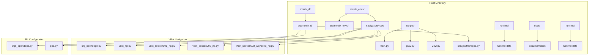
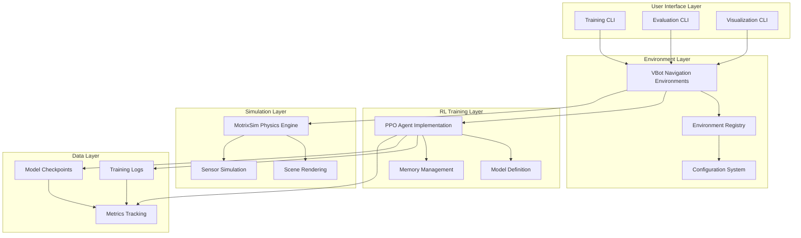
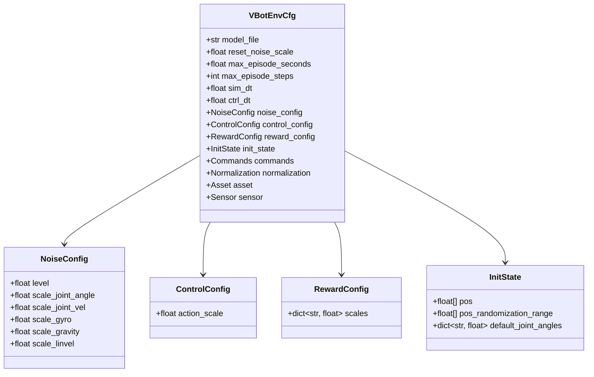
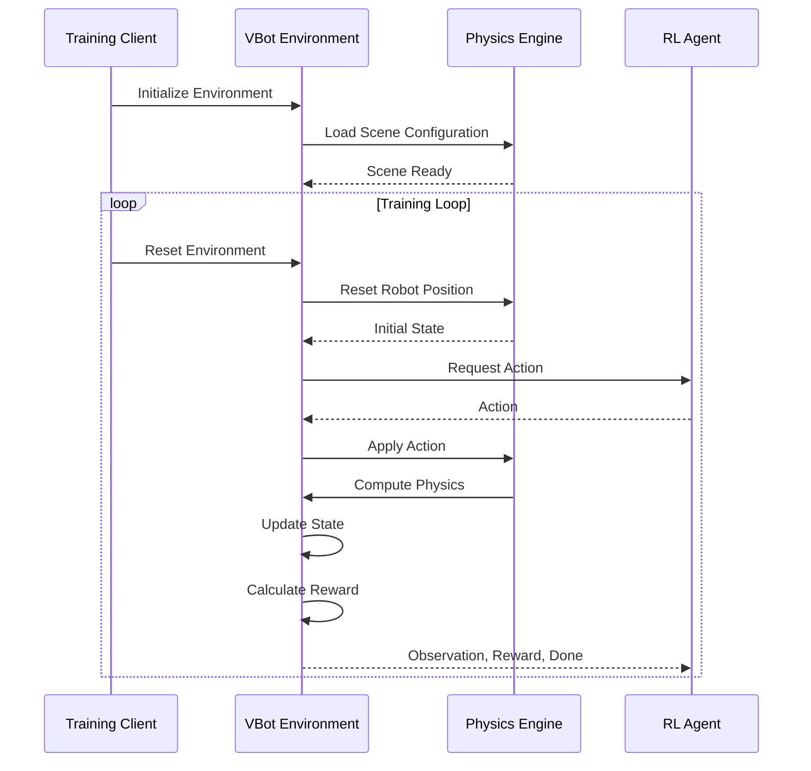
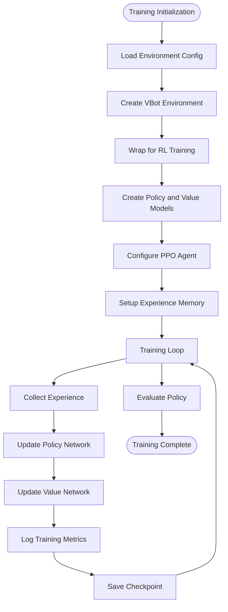
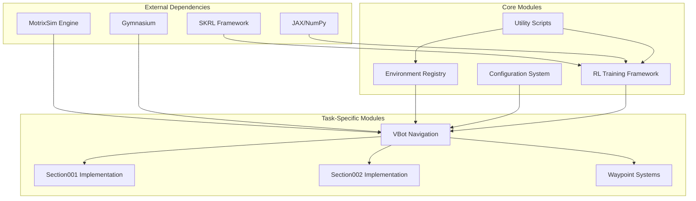

# OpenDoge Competition Documentation

<cite>
**Referenced Files in This Document**
- [README.md](file://README.md)
- [ReadMe_opendoge.md](file://docs/ReadMe_opendoge.md)
- [train.py](file://scripts/train.py)
- [play.py](file://scripts/play.py)
- [view.py](file://scripts/view.py)
- [cfg_opendoge.py](file://motrix_envs/src/motrix_envs/navigation/vbot/cfg_opendoge.py)
- [vbot_np.py](file://motrix_envs/src/motrix_envs/navigation/vbot/vbot_np.py)
- [vbot_section001_np.py](file://motrix_envs/src/motrix_envs/navigation/vbot/vbot_section001_np.py)
- [vbot_section002_np.py](file://motrix_envs/src/motrix_envs/navigation/vbot/vbot_section002_np.py)
- [vbot_section002_waypoint_np.py](file://motrix_envs/src/motrix_envs/navigation/vbot/vbot_section002_waypoint_np.py)
- [cfgs_opendoge.py](file://motrix_rl/src/motrix_rl/cfgs_opendoge.py)
- [ppo.py](file://motrix_rl/src/motrix_rl/skrl/jax/train/ppo.py)
</cite>

## Table of Contents
1. [Introduction](#introduction)
2. [Project Structure](#project-structure)
3. [Core Components](#core-components)
4. [Architecture Overview](#architecture-overview)
5. [Detailed Component Analysis](#detailed-component-analysis)
6. [Dependency Analysis](#dependency-analysis)
7. [Performance Considerations](#performance-considerations)
8. [Troubleshooting Guide](#troubleshooting-guide)
9. [Conclusion](#conclusion)

## Introduction
This document provides comprehensive documentation for the OpenDoge competition within the MotrixLab S1 framework. The OpenDoge competition focuses on VBot navigation challenges across multiple terrains and waypoint-based tasks. The project integrates reinforcement learning training and inference capabilities with a high-performance physics simulation engine, enabling efficient robot training and evaluation.

The competition consists of two primary tracks:
- Section001: Flat terrain navigation with waypoint-based objectives
- Section01: Multi-section navigation covering stairs, ramps, and complex terrains

Key features include unified interfaces for training and evaluation, multi-backend support (JAX and PyTorch), rich simulation environments, and high-performance physics simulation through MotrixSim.

**Section sources**
- [README.md](file://README.md#L1-L125)
- [ReadMe_opendoge.md](file://docs/ReadMe_opendoge.md#L1-L26)

## Project Structure
The project follows a modular architecture with clear separation between simulation environments, reinforcement learning components, and training/inference utilities.

**Diagram sources**
- [train.py](file://scripts/train.py#L1-L95)
- [play.py](file://scripts/play.py#L1-L162)
- [view.py](file://scripts/view.py#L1-L83)
- [cfg_opendoge.py](file://motrix_envs/src/motrix_envs/navigation/vbot/cfg_opendoge.py#L1-L973)
- [cfgs_opendoge.py](file://motrix_rl/src/motrix_rl/cfgs_opendoge.py#L1-L500)

**Section sources**
- [README.md](file://README.md#L18-L34)

## Core Components
The OpenDoge competition comprises several core components working together to provide a complete RL training and evaluation pipeline.

### Environment Configuration System
The environment configuration system defines task-specific parameters, reward functions, and navigation objectives through dataclass configurations. Each environment type maintains separate configuration classes that inherit common base configurations.

### VBot Navigation Environments
Multiple VBot navigation environments are implemented, each targeting specific terrain types and navigation challenges:
- Flat terrain navigation with waypoint systems
- Stair navigation with complex elevation changes
- Multi-section navigation combining different terrain types
- Waypoint-based navigation with celebration animations

### Reinforcement Learning Framework
The RL framework utilizes SKRL (Scalable Kernel for Reinforcement Learning) with PPO (Proximal Policy Optimization) algorithm implementation supporting both JAX and PyTorch backends.

### Training and Inference Utilities
Command-line utilities provide streamlined interfaces for training, evaluation, and visualization of robot behaviors across different environments.

**Section sources**
- [cfg_opendoge.py](file://motrix_envs/src/motrix_envs/navigation/vbot/cfg_opendoge.py#L24-L138)
- [cfgs_opendoge.py](file://motrix_rl/src/motrix_rl/cfgs_opendoge.py#L333-L360)
- [ppo.py](file://motrix_rl/src/motrix_rl/skrl/jax/train/ppo.py#L87-L144)

## Architecture Overview
The OpenDoge competition architecture follows a layered design pattern with clear separation of concerns between simulation, RL training, and environment configuration.

**Diagram sources**
- [train.py](file://scripts/train.py#L52-L90)
- [play.py](file://scripts/play.py#L110-L159)
- [view.py](file://scripts/view.py#L71-L79)
- [ppo.py](file://motrix_rl/src/motrix_rl/skrl/jax/train/ppo.py#L145-L184)

The architecture ensures scalability and maintainability through modular design, allowing easy addition of new environments and RL algorithms while maintaining consistent interfaces.

**Section sources**
- [train.py](file://scripts/train.py#L39-L90)
- [play.py](file://scripts/play.py#L110-L159)
- [ppo.py](file://motrix_rl/src/motrix_rl/skrl/jax/train/ppo.py#L145-L184)

## Detailed Component Analysis

### Environment Configuration System
The configuration system provides a structured approach to defining environment parameters, reward functions, and navigation objectives.

**Diagram sources**
- [cfg_opendoge.py](file://motrix_envs/src/motrix_envs/navigation/vbot/cfg_opendoge.py#L24-L138)
- [cfg_opendoge.py](file://motrix_envs/src/motrix_envs/navigation/vbot/cfg_opendoge.py#L25-L32)

The configuration system enables fine-grained control over environment parameters, allowing for precise tuning of navigation challenges and reward structures.

**Section sources**
- [cfg_opendoge.py](file://motrix_envs/src/motrix_envs/navigation/vbot/cfg_opendoge.py#L24-L138)

### VBot Navigation Environment Implementation
The VBot navigation environments implement sophisticated control systems with waypoint tracking, terrain adaptation, and reward shaping mechanisms.

**Diagram sources**
- [vbot_section001_np.py](file://motrix_envs/src/motrix_envs/navigation/vbot/vbot_section001_np.py#L40-L110)
- [vbot_section002_waypoint_np.py](file://motrix_envs/src/motrix_envs/navigation/vbot/vbot_section002_waypoint_np.py#L27-L102)

The environment implementation includes advanced features such as:
- Waypoint-based navigation with sequential path following
- Terrain-adaptive control systems for different surface types
- Celebration animations for waypoint achievements
- Cardiac detection systems to prevent robot entrapment
- Comprehensive reward shaping for navigation objectives

**Section sources**
- [vbot_section001_np.py](file://motrix_envs/src/motrix_envs/navigation/vbot/vbot_section001_np.py#L155-L377)
- [vbot_section002_waypoint_np.py](file://motrix_envs/src/motrix_envs/navigation/vbot/vbot_section002_waypoint_np.py#L103-L185)

### Reinforcement Learning Training Pipeline
The training pipeline implements a complete PPO algorithm with configurable hyperparameters and monitoring capabilities.

**Diagram sources**
- [ppo.py](file://motrix_rl/src/motrix_rl/skrl/jax/train/ppo.py#L167-L184)
- [cfgs_opendoge.py](file://motrix_rl/src/motrix_rl/cfgs_opendoge.py#L333-L360)

The training pipeline includes comprehensive metrics tracking, custom reward logging, and adaptive learning rate scheduling to optimize training performance.

**Section sources**
- [ppo.py](file://motrix_rl/src/motrix_rl/skrl/jax/train/ppo.py#L87-L144)
- [cfgs_opendoge.py](file://motrix_rl/src/motrix_rl/cfgs_opendoge.py#L333-L360)

## Dependency Analysis
The OpenDoge competition exhibits a well-structured dependency hierarchy with clear separation between modules.

**Diagram sources**
- [train.py](file://scripts/train.py#L19-L24)
- [cfg_opendoge.py](file://motrix_envs/src/motrix_envs/navigation/vbot/cfg_opendoge.py#L19-L25)
- [cfgs_opendoge.py](file://motrix_rl/src/motrix_rl/cfgs_opendoge.py#L18-L20)

The dependency analysis reveals a clean architecture where external dependencies are encapsulated within specific modules, facilitating maintenance and potential dependency updates.

**Section sources**
- [train.py](file://scripts/train.py#L19-L24)
- [play.py](file://scripts/play.py#L19-L23)

## Performance Considerations
The OpenDoge competition implements several performance optimization strategies:

### Hardware Acceleration
- JAX backend utilization for GPU acceleration
- Automatic backend selection based on hardware availability
- Optimized memory management for large-scale parallel environments

### Training Efficiency
- Configurable parallel environment counts (up to 2048 environments)
- Adaptive learning rate scheduling
- Efficient experience replay memory systems

### Simulation Optimization
- High-performance physics simulation through MotrixSim
- Optimized rendering pipeline for real-time visualization
- Reduced computational overhead in reward calculations

### Memory Management
- Configurable checkpoint intervals for model saving
- Efficient state representation for navigation tasks
- Optimized data structures for waypoint tracking

**Section sources**
- [train.py](file://scripts/train.py#L39-L49)
- [cfgs_opendoge.py](file://motrix_rl/src/motrix_rl/cfgs_opendoge.py#L333-L360)

## Troubleshooting Guide

### Common Training Issues
1. **Environment Loading Failures**: Verify environment names match registered configurations
2. **GPU Memory Issues**: Reduce num_envs parameter or switch to CPU backend
3. **Training Instability**: Adjust learning rate or increase entropy loss scale
4. **Checkpoint Loading Errors**: Ensure policy file format matches training backend

### Environment-Specific Problems
1. **Waypoint Navigation Issues**: Check waypoint sensor configurations and contact detection
2. **Terrain Adaptation Problems**: Verify slope detection sensors and PD controller parameters
3. **Cardiac Detection Failures**: Review stuck detection thresholds and history window sizes
4. **Reward Shaping Issues**: Validate reward function weights and normalization factors

### Performance Optimization Tips
- Monitor training metrics through TensorBoard for early issue detection
- Adjust batch sizes based on available GPU memory
- Use appropriate simulation dt and control dt combinations
- Implement proper seeding for reproducible results

**Section sources**
- [play.py](file://scripts/play.py#L48-L107)
- [vbot_section002_waypoint_np.py](file://motrix_envs/src/motrix_envs/navigation/vbot/vbot_section002_waypoint_np.py#L103-L120)

## Conclusion
The OpenDoge competition within the MotrixLab S1 framework provides a comprehensive platform for VBot navigation research and development. The modular architecture, sophisticated environment configurations, and robust RL training pipeline enable efficient exploration of navigation challenges across diverse terrains.

Key strengths of the implementation include:
- Flexible environment configuration system enabling rapid prototyping
- Advanced navigation algorithms with terrain adaptation capabilities
- Comprehensive training infrastructure with monitoring and visualization
- Scalable performance through hardware acceleration and optimized memory management

Future enhancements could include expanded terrain types, additional navigation objectives, and integration of advanced RL algorithms beyond PPO. The modular design facilitates such extensions while maintaining backward compatibility and consistent interfaces.