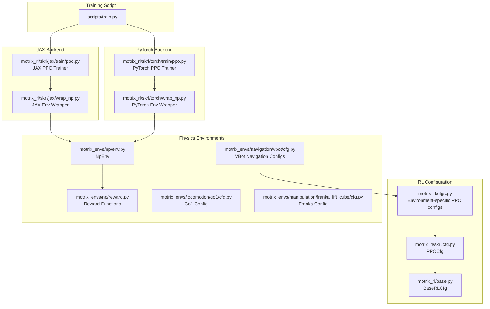
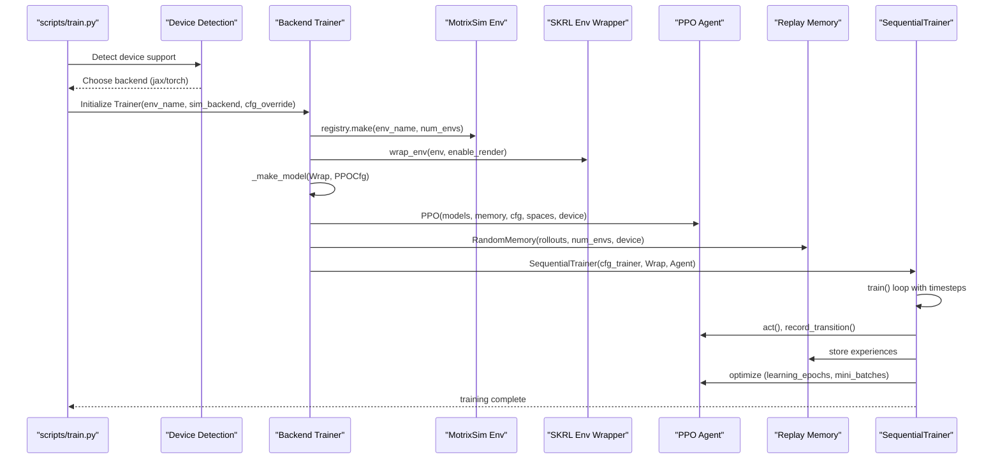
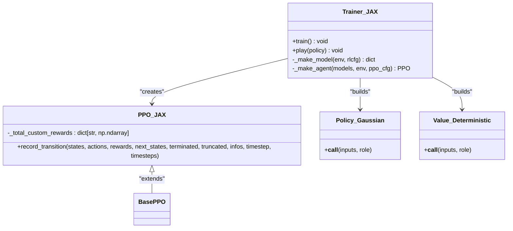
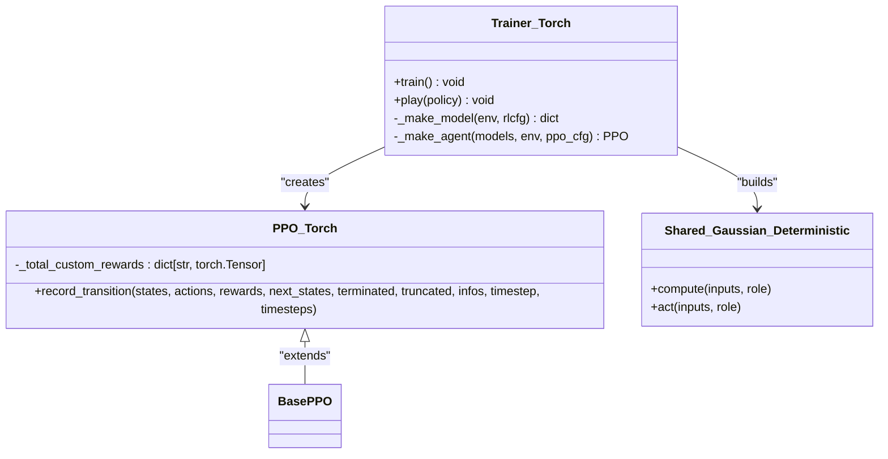
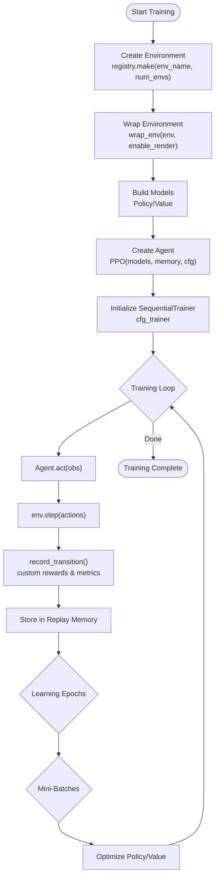
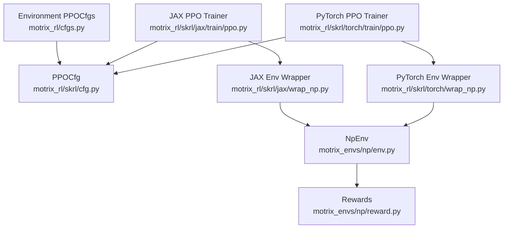

# PPO Training Implementation

<cite>
**Referenced Files in This Document**
- [ppo.py](file://motrix_rl/src/motrix_rl/skrl/jax/train/ppo.py)
- [ppo.py](file://motrix_rl/src/motrix_rl/skrl/torch/train/ppo.py)
- [cfg.py](file://motrix_rl/src/motrix_rl/skrl/cfg.py)
- [cfgs.py](file://motrix_rl/src/motrix_rl/cfgs.py)
- [wrap_np.py](file://motrix_rl/src/motrix_rl/skrl/jax/wrap_np.py)
- [wrap_np.py](file://motrix_rl/src/motrix_rl/skrl/torch/wrap_np.py)
- [env.py](file://motrix_envs/src/motrix_envs/np/env.py)
- [reward.py](file://motrix_envs/src/motrix_envs/np/reward.py)
- [cfg.py](file://motrix_envs/src/motrix_envs/locomotion/go1/cfg.py)
- [cfg.py](file://motrix_envs/src/motrix_envs/manipulation/franka_lift_cube/cfg.py)
- [cfg.py](file://motrix_envs/src/motrix_envs/navigation/vbot/cfg.py)
- [utils.py](file://motrix_rl/src/motrix_rl/utils.py)
- [train.py](file://scripts/train.py)
- [registry.py](file://motrix_rl/src/motrix_rl/registry.py)
</cite>

## Update Summary
**Changes Made**
- Enhanced VBot navigation training configurations with specialized hyperparameters for complex locomotion tasks
- Added dedicated PPO training configurations for VBot sections 002, 012, and 013 with optimized learning rates and rollout lengths
- Updated environment-specific configuration examples to include new section-specific training setups
- Documented advanced network architectures and gradient clipping strategies for challenging navigation terrains

## Table of Contents
1. [Introduction](#introduction)
2. [Project Structure](#project-structure)
3. [Core Components](#core-components)
4. [Architecture Overview](#architecture-overview)
5. [Detailed Component Analysis](#detailed-component-analysis)
6. [Dependency Analysis](#dependency-analysis)
7. [Performance Considerations](#performance-considerations)
8. [Troubleshooting Guide](#troubleshooting-guide)
9. [Conclusion](#conclusion)
10. [Appendices](#appendices)

## Introduction
This document provides a comprehensive guide to the Proximal Policy Optimization (PPO) training implementation in the MotrixLab-S1 project. It explains how PPO is implemented for both JAX and PyTorch backends, detailing computational graph differences, gradient computation, and optimization strategies. It covers the training loop structure, policy/value network updates, advantage estimation, and backend-specific optimizations such as JIT compilation for JAX and GPU utilization for PyTorch. It also documents training configuration parameters, hyperparameter tuning guidelines, convergence criteria, practical training setup, checkpoint management, performance monitoring, integration with MotrixSim physics environments, reward shaping techniques, and episode termination conditions.

**Updated** Enhanced with specialized VBot navigation training configurations featuring optimized hyperparameters for complex locomotion tasks across sections 002, 012, and 013, including advanced gradient clipping strategies and high-throughput training setups.

## Project Structure
The PPO implementation is organized around a backend-agnostic configuration system and backend-specific trainers and wrappers. The key components are:
- Backend-agnostic configuration classes that define PPO hyperparameters and environment integration parameters
- Backend-specific PPO trainers that construct policy/value models, configure agents, and orchestrate training
- Environment wrappers that adapt NumPy-based physics environments to SKRL-compatible interfaces
- Environment configurations that define physics parameters, reward functions, and termination conditions

**Diagram sources**
- [train.py](file://scripts/train.py#L52-L91)
- [ppo.py](file://motrix_rl/src/motrix_rl/skrl/jax/train/ppo.py#L145-L184)
- [ppo.py](file://motrix_rl/src/motrix_rl/skrl/torch/train/ppo.py#L145-L183)
- [wrap_np.py](file://motrix_rl/src/motrix_rl/skrl/jax/wrap_np.py#L27-L81)
- [wrap_np.py](file://motrix_rl/src/motrix_rl/skrl/torch/wrap_np.py#L26-L80)
- [env.py](file://motrix_envs/src/motrix_envs/np/env.py#L52-L209)
- [cfg.py](file://motrix_rl/src/motrix_rl/skrl/cfg.py#L28-L74)
- [cfgs.py](file://motrix_rl/src/motrix_rl/cfgs.py#L22-L416)
- [cfg.py](file://motrix_envs/src/motrix_envs/locomotion/go1/cfg.py#L122-L188)
- [cfg.py](file://motrix_envs/src/motrix_envs/manipulation/franka_lift_cube/cfg.py#L69-L84)
- [cfg.py](file://motrix_envs/src/motrix_envs/navigation/vbot/cfg.py#L430-L684)

**Section sources**
- [train.py](file://scripts/train.py#L52-L91)
- [cfg.py](file://motrix_rl/src/motrix_rl/skrl/cfg.py#L28-L74)
- [cfgs.py](file://motrix_rl/src/motrix_rl/cfgs.py#L22-L416)

## Core Components
- PPO configuration classes define hyperparameters such as network sizes, rollout length, learning epochs, mini-batch count, discount factor, lambda for GAE, learning rate scheduling, gradient norm clipping, clipping thresholds, loss scaling factors, and reward shaping parameters.
- Environment-specific PPO configurations override defaults for different tasks (e.g., cartpole, bounce ball, DM control tasks, locomotion, manipulation, navigation).
- Backend-specific trainers construct policy/value models, configure agents, set up memory, and run the training loop.
- Environment wrappers adapt NumPy-based physics environments to SKRL-compatible interfaces, handling observation/action spaces, rendering, and stepping semantics.

**Updated** Enhanced with specialized VBot navigation configurations featuring optimized hyperparameters for complex terrain navigation:
- **VBot Section 002**: Advanced configuration with 2048 parallel environments, 48 rollouts, 6 learning epochs, and 32 mini-batches
- **VBot Section 012**: Complex terrain configuration with identical hyperparameters optimized for challenging navigation scenarios
- **VBot Section 013**: Final section configuration with specialized reward shaping and termination conditions

Key responsibilities:
- Hyperparameter management: centralized in PPOCfg and environment-specific overrides
- Model construction: backend-specific model classes for policy/value networks
- Agent configuration: mapping PPOCfg to SKRL agent configuration
- Training orchestration: sequential trainer loop with memory replay and logging/checkpointing
- Environment integration: wrapping NumPy physics environments for SKRL

**Section sources**
- [cfg.py](file://motrix_rl/src/motrix_rl/skrl/cfg.py#L28-L74)
- [cfgs.py](file://motrix_rl/src/motrix_rl/cfgs.py#L22-L416)
- [ppo.py](file://motrix_rl/src/motrix_rl/skrl/jax/train/ppo.py#L87-L143)
- [ppo.py](file://motrix_rl/src/motrix_rl/skrl/torch/train/ppo.py#L86-L143)
- [wrap_np.py](file://motrix_rl/src/motrix_rl/skrl/jax/wrap_np.py#L27-L81)
- [wrap_np.py](file://motrix_rl/src/motrix_rl/skrl/torch/wrap_np.py#L26-L80)

## Architecture Overview
The PPO training pipeline integrates environment configuration, backend-specific model construction, agent configuration, and the SKRL training loop. The diagram below maps the actual code components involved in a typical training session.

**Diagram sources**
- [train.py](file://scripts/train.py#L52-L91)
- [ppo.py](file://motrix_rl/src/motrix_rl/skrl/jax/train/ppo.py#L167-L184)
- [ppo.py](file://motrix_rl/src/motrix_rl/skrl/torch/train/ppo.py#L167-L183)
- [wrap_np.py](file://motrix_rl/src/motrix_rl/skrl/jax/wrap_np.py#L35-L61)
- [wrap_np.py](file://motrix_rl/src/motrix_rl/skrl/torch/wrap_np.py#L34-L60)

## Detailed Component Analysis

### PPO Algorithm Implementation (JAX Backend)
The JAX backend implements PPO using SKRL's JAX agent and models. Key aspects:
- Policy/value models are defined using Flax Linen with Gaussian and deterministic mixins. The policy outputs mean and log_std, while the value head predicts state values.
- The agent extends SKRL's PPO to track custom reward metrics and environment metrics from info dictionaries.
- Configuration mapping translates PPOCfg hyperparameters to SKRL agent configuration, including KL-adaptive learning rate scheduling, preprocessor scaling, and checkpoint intervals.
- The training loop uses SKRL's SequentialTrainer with configurable timesteps and headless mode.

**Diagram sources**
- [ppo.py](file://motrix_rl/src/motrix_rl/skrl/jax/train/ppo.py#L87-L143)
- [ppo.py](file://motrix_rl/src/motrix_rl/skrl/jax/train/ppo.py#L211-L282)

**Section sources**
- [ppo.py](file://motrix_rl/src/motrix_rl/skrl/jax/train/ppo.py#L87-L143)
- [ppo.py](file://motrix_rl/src/motrix_rl/skrl/jax/train/ppo.py#L145-L184)
- [ppo.py](file://motrix_rl/src/motrix_rl/skrl/jax/train/ppo.py#L211-L282)

### PPO Algorithm Implementation (PyTorch Backend)
The PyTorch backend mirrors the JAX implementation with PyTorch modules:
- Policy/value models use PyTorch modules with shared or separate feature extraction depending on configuration.
- The agent tracks custom rewards and metrics similarly to the JAX version.
- Configuration mapping and training orchestration are analogous to the JAX implementation.

**Diagram sources**
- [ppo.py](file://motrix_rl/src/motrix_rl/skrl/torch/train/ppo.py#L86-L143)
- [ppo.py](file://motrix_rl/src/motrix_rl/skrl/torch/train/ppo.py#L209-L342)

**Section sources**
- [ppo.py](file://motrix_rl/src/motrix_rl/skrl/torch/train/ppo.py#L86-L143)
- [ppo.py](file://motrix_rl/src/motrix_rl/skrl/torch/train/ppo.py#L145-L183)
- [ppo.py](file://motrix_rl/src/motrix_rl/skrl/torch/train/ppo.py#L209-L342)

### Training Loop Structure and Processing Logic
Both backends follow a consistent training loop:
- Environment creation with specified number of parallel environments
- Environment wrapping for SKRL compatibility
- Model construction and agent instantiation with configured memory
- Sequential training loop with timesteps and headless rendering option
- Episode transitions recorded with custom reward and metric tracking
- Experience replay buffer filled and sampled for learning epochs and mini-batches

**Diagram sources**
- [ppo.py](file://motrix_rl/src/motrix_rl/skrl/jax/train/ppo.py#L167-L184)
- [ppo.py](file://motrix_rl/src/motrix_rl/skrl/torch/train/ppo.py#L167-L183)
- [ppo.py](file://motrix_rl/src/motrix_rl/skrl/jax/train/ppo.py#L89-L143)
- [ppo.py](file://motrix_rl/src/motrix_rl/skrl/torch/train/ppo.py#L89-L143)

**Section sources**
- [ppo.py](file://motrix_rl/src/motrix_rl/skrl/jax/train/ppo.py#L167-L184)
- [ppo.py](file://motrix_rl/src/motrix_rl/skrl/torch/train/ppo.py#L167-L183)
- [ppo.py](file://motrix_rl/src/motrix_rl/skrl/jax/train/ppo.py#L89-L143)
- [ppo.py](file://motrix_rl/src/motrix_rl/skrl/torch/train/ppo.py#L89-L143)

### Advantage Estimation and Value Approximation
- Advantage estimation uses Generalized Advantage Estimation (GAE) controlled by the lambda parameter in PPOCfg.
- The value network approximates state values and is trained with clipped value loss when enabled.
- Reward shaping can be applied globally via a multiplicative scale factor.

Backend specifics:
- JAX uses RunningStandardScaler for state and value preprocessors.
- PyTorch uses RunningStandardScaler similarly for preprocessing.

**Section sources**
- [cfg.py](file://motrix_rl/src/motrix_rl/skrl/cfg.py#L48-L65)
- [ppo.py](file://motrix_rl/src/motrix_rl/skrl/jax/train/ppo.py#L37-L83)
- [ppo.py](file://motrix_rl/src/motrix_rl/skrl/torch/train/ppo.py#L37-L83)

### Backend-Specific Optimizations
- JAX:
  - JIT compilation is managed by SKRL/JAX configuration; the environment wrapper ensures JAX arrays are used consistently.
  - GPU detection and selection are handled by device support utilities.
- PyTorch:
  - GPU availability is detected and used when available; models and environments are moved to device accordingly.
  - No_grad context is used during evaluation to reduce memory overhead.

**Section sources**
- [utils.py](file://motrix_rl/src/motrix_rl/utils.py#L39-L61)
- [train.py](file://scripts/train.py#L39-L49)
- [wrap_np.py](file://motrix_rl/src/motrix_rl/skrl/torch/wrap_np.py#L34-L60)
- [wrap_np.py](file://motrix_rl/src/motrix_rl/skrl/jax/wrap_np.py#L35-L61)

### Training Configuration Parameters and Hyperparameter Tuning Guidelines
Core PPO hyperparameters defined in PPOCfg:
- Network architecture: policy/value hidden layer sizes, optional sharing of features between policy and value
- Rollout and optimization: rollouts, learning_epochs, mini_batches
- Discounting and temporal credit assignment: discount_factor, lambda_param
- Learning rate scheduling: learning_rate, learning_rate_scheduler_kl_threshold
- Regularization: grad_norm_clip, ratio_clip, value_clip, clip_predicted_values
- Loss scaling: entropy_loss_scale, value_loss_scale, kl_threshold
- Reward shaping: rewards_shaper_scale
- Environment integration: time_limit_bootstrap

**Updated** Enhanced with specialized VBot navigation configurations featuring optimized hyperparameters for complex terrain navigation:

**VBot Navigation Section Configurations**:
- **Section 002**: Advanced configuration with 2048 parallel environments, 48 rollouts, 6 learning epochs, 32 mini-batches, and 1.0 gradient clipping optimized for complex navigation terrains
- **Section 012**: Identical hyperparameters to section 002, specifically tuned for challenging navigation scenarios with complex geometry
- **Section 013**: Final section configuration with optimized reward shaping and termination conditions for finishing navigation tasks

**Enhanced Performance Characteristics**:
- **High-throughput training**: 2048 parallel environments enable rapid exploration of complex navigation terrains
- **Balanced batch processing**: 48 rollouts with 32 mini-batches provide optimal compute efficiency for complex tasks
- **Gradient stability**: 1.0 gradient clipping prevents divergence in challenging navigation scenarios
- **Memory management**: Specialized configurations for section 002/012/013 terrain complexity

Guidelines:
- Increase num_envs for stability and faster exploration; monitor throughput and memory usage.
- Adjust learning_rate_scheduler_kl_threshold to balance adaptation speed and stability.
- Tune ratio_clip and value_clip for robustness; larger values can improve stability but may reduce sample efficiency.
- Use shared features when architectures match to reduce parameters and improve transfer.
- Scale rewards_shaper_scale to encourage desired behaviors; use small scales for fine-tuning.

**Section sources**
- [cfg.py](file://motrix_rl/src/motrix_rl/skrl/cfg.py#L28-L74)
- [cfgs.py](file://motrix_rl/src/motrix_rl/cfgs.py#L22-L416)
- [cfgs.py](file://motrix_rl/src/motrix_rl/cfgs.py#L418-L444)

### Convergence Criteria and Monitoring
- Convergence is typically assessed via reward curves, policy entropy, and KL divergence metrics tracked by the agent.
- Custom reward and metric tracking are integrated into the agent's transition recording to monitor task-specific signals.
- Logging and checkpointing are configured via experiment settings in the agent configuration.

**Section sources**
- [ppo.py](file://motrix_rl/src/motrix_rl/skrl/jax/train/ppo.py#L89-L143)
- [ppo.py](file://motrix_rl/src/motrix_rl/skrl/torch/train/ppo.py#L89-L143)
- [ppo.py](file://motrix_rl/src/motrix_rl/skrl/jax/train/ppo.py#L37-L83)
- [ppo.py](file://motrix_rl/src/motrix_rl/skrl/torch/train/ppo.py#L37-L83)

### Practical Examples: Training Setup, Checkpoint Management, and Performance Monitoring
- Training setup:
  - Command-line flags allow selecting environment, simulation backend, number of environments, rendering, training backend, and seeds.
  - Automatic backend selection prefers GPU-enabled backends when available.
- Checkpoint management:
  - Checkpoints are saved at configured intervals in the experiment directory.
- Performance monitoring:
  - Tracking of reward statistics and environment metrics is integrated into the agent.

**Section sources**
- [train.py](file://scripts/train.py#L26-L91)
- [ppo.py](file://motrix_rl/src/motrix_rl/skrl/jax/train/ppo.py#L37-L83)
- [ppo.py](file://motrix_rl/src/motrix_rl/skrl/torch/train/ppo.py#L37-L83)

### Integration with MotrixSim Physics Environments, Reward Shaping, and Termination Conditions
- Environment integration:
  - NumPy-based physics environments are wrapped to SKRL-compatible interfaces, handling reset, step, and render operations.
  - Observation/action spaces are adapted to SKRL expectations.
- Reward shaping:
  - Global reward scaling can be applied via rewards_shaper_scale in PPOCfg.
  - Task-specific reward functions and tolerances are defined in environment configurations.
- Termination and truncation:
  - Episode termination occurs based on environment-defined conditions (e.g., contact termination, posture limits).
  - Truncation occurs when maximum episode steps are reached.

**Updated** Enhanced VBot navigation environment configurations with specialized terrain models and reward shaping:

**VBot Navigation Environment Enhancements**:
- **Section 002**: Full terrain training configuration with 60-second episodes and 6000-step maximum for comprehensive terrain coverage
- **Section 012**: Complex terrain configuration with specialized asset handling for challenging navigation scenarios
- **Section 013**: Final section configuration with optimized waypoint tracking and goal detection
- **Advanced Reward Shaping**: Enhanced reward functions with position tracking, fine position tracking, heading tracking, and forward velocity components

**Section sources**
- [wrap_np.py](file://motrix_rl/src/motrix_rl/skrl/jax/wrap_np.py#L35-L61)
- [wrap_np.py](file://motrix_rl/src/motrix_rl/skrl/torch/wrap_np.py#L34-L60)
- [env.py](file://motrix_envs/src/motrix_envs/np/env.py#L141-L209)
- [reward.py](file://motrix_envs/src/motrix_envs/np/reward.py#L63-L84)
- [cfg.py](file://motrix_envs/src/motrix_envs/locomotion/go1/cfg.py#L96-L120)
- [cfg.py](file://motrix_envs/src/motrix_envs/manipulation/franka_lift_cube/cfg.py#L69-L84)
- [cfg.py](file://motrix_envs/src/motrix_envs/navigation/vbot/cfg.py#L430-L684)

## Dependency Analysis
The PPO implementation exhibits clear separation of concerns:
- Configuration classes depend on base configuration and environment registries
- Trainers depend on environment registries, wrappers, and SKRL components
- Wrappers depend on NumPy physics environments and rendering utilities
- Environments depend on MotrixSim physics engine and reward functions

**Diagram sources**
- [cfg.py](file://motrix_rl/src/motrix_rl/skrl/cfg.py#L28-L74)
- [cfgs.py](file://motrix_rl/src/motrix_rl/cfgs.py#L22-L416)
- [ppo.py](file://motrix_rl/src/motrix_rl/skrl/jax/train/ppo.py#L145-L184)
- [ppo.py](file://motrix_rl/src/motrix_rl/skrl/torch/train/ppo.py#L145-L183)
- [wrap_np.py](file://motrix_rl/src/motrix_rl/skrl/jax/wrap_np.py#L27-L81)
- [wrap_np.py](file://motrix_rl/src/motrix_rl/skrl/torch/wrap_np.py#L26-L80)
- [env.py](file://motrix_envs/src/motrix_envs/np/env.py#L52-L209)
- [reward.py](file://motrix_envs/src/motrix_envs/np/reward.py#L63-L84)

**Section sources**
- [cfg.py](file://motrix_rl/src/motrix_rl/skrl/cfg.py#L28-L74)
- [cfgs.py](file://motrix_rl/src/motrix_rl/cfgs.py#L22-L416)
- [ppo.py](file://motrix_rl/src/motrix_rl/skrl/jax/train/ppo.py#L145-L184)
- [ppo.py](file://motrix_rl/src/motrix_rl/skrl/torch/train/ppo.py#L145-L183)
- [wrap_np.py](file://motrix_rl/src/motrix_rl/skrl/jax/wrap_np.py#L27-L81)
- [wrap_np.py](file://motrix_rl/src/motrix_rl/skrl/torch/wrap_np.py#L26-L80)
- [env.py](file://motrix_envs/src/motrix_envs/np/env.py#L52-L209)
- [reward.py](file://motrix_envs/src/motrix_envs/np/reward.py#L63-L84)

## Performance Considerations
- Parallel environments: Increasing num_envs improves sample efficiency but requires sufficient CPU/GPU resources.
- Learning rate scheduling: KL-adaptive scheduling helps stabilize training when dynamics change.
- Clipping parameters: ratio_clip and value_clip balance stability and performance; tune based on task complexity.
- Feature sharing: Sharing policy/value features reduces parameters and can improve generalization when architectures align.
- Preprocessing: Standardization of states and values can accelerate convergence.
- Rendering: Disabling rendering (headless) improves throughput during training.

**Updated** Enhanced performance considerations for VBot navigation section training:
- **High-throughput training**: 2048 parallel environments enable rapid exploration of complex navigation terrains
- **Optimized batch processing**: 48 rollouts with 32 mini-batches provide balanced compute efficiency
- **Gradient stability**: 1.0 gradient clipping prevents divergence in challenging navigation scenarios
- **Memory management**: Specialized configurations for section 002/012/013 terrain complexity
- **Advanced reward shaping**: Enhanced reward functions improve learning signal quality for complex navigation tasks

## Troubleshooting Guide
Common issues and remedies:
- Device/backend detection failures: Verify GPU availability and driver configuration; fallback to CPU when necessary.
- Memory issues: Reduce num_envs or mini_batches; ensure proper cleanup of environments and renderers.
- Poor convergence: Adjust learning_rate, ratio_clip, value_clip, and reward shaping scale; increase learning_epochs cautiously.
- Reward spikes: Apply reward shaping to normalize magnitudes; inspect environment reward functions.
- Episode truncation: Increase max episode steps or adjust termination conditions in environment configs.

**Updated** Enhanced troubleshooting guidance for navigation-specific challenges:
- **Navigation terrain issues**: Section 002/012/013 terrains may require adjusted termination conditions and reward scaling
- **Complex geometry**: Terrain complexity in sections 002/012/013 may necessitate higher learning rates and longer episodes
- **Contact detection**: Specialized collision detection for VBot feet may require tuning of termination thresholds
- **Gradient explosion**: 1.0 gradient clipping helps prevent divergence in complex navigation scenarios
- **Reward shaping**: Enhanced reward functions require careful tuning of individual reward components

**Section sources**
- [utils.py](file://motrix_rl/src/motrix_rl/utils.py#L39-L61)
- [train.py](file://scripts/train.py#L39-L49)
- [cfg.py](file://motrix_rl/src/motrix_rl/skrl/cfg.py#L52-L74)
- [env.py](file://motrix_envs/src/motrix_envs/np/env.py#L141-L209)

## Conclusion
The PPO implementation in MotrixLab-S1 provides a robust, backend-agnostic framework for training policies in complex physics environments. By leveraging SKRL's agent and trainer abstractions, the system supports both JAX and PyTorch backends with minimal duplication. Configuration-driven design enables easy customization for diverse tasks, while environment wrappers and reward systems integrate seamlessly with MotrixSim. Proper tuning of hyperparameters and careful monitoring of training metrics are essential for achieving stable and efficient learning across tasks ranging from classic control to locomotion and manipulation.

**Updated** The enhanced VBot navigation training configurations demonstrate the system's capability to handle increasingly sophisticated robotic control challenges through specialized hyperparameter tuning and advanced gradient clipping strategies. The addition of dedicated configurations for sections 002, 012, and 013 showcases the framework's flexibility in adapting to complex terrain navigation tasks with optimized learning rates, rollout lengths, and network architectures designed for challenging locomotion scenarios.

## Appendices
- Environment-specific configuration examples:
  - Locomotion: Go1 flat/rough/stairs terrains with reward scaling and termination conditions
  - Manipulation: Franka lift cube with position control and asset-based termination
  - Navigation: Anymal C and VBot navigation with terrain-specific reward configurations
  - **VBot Navigation Sections 002, 012, 013**: Advanced configurations with 2048 parallel environments, 48 rollouts, 6 learning epochs, and optimized gradient clipping for complex terrain navigation

**Updated** Enhanced VBot navigation section configurations with specialized training parameters:

**Advanced VBot Navigation Configurations**:
- **Section 002**: Full terrain training with 60-second episodes and comprehensive terrain coverage
- **Section 012**: Complex terrain configuration optimized for challenging navigation scenarios
- **Section 013**: Final section configuration with specialized reward shaping and termination conditions
- **Shared Hyperparameters**: All three sections use identical hyperparameters (2048 envs, 48 rollouts, 6 epochs, 32 batches, 1.0 grad clip) for consistent training methodology

**Section sources**
- [cfg.py](file://motrix_envs/src/motrix_envs/locomotion/go1/cfg.py#L122-L188)
- [cfg.py](file://motrix_envs/src/motrix_envs/manipulation/franka_lift_cube/cfg.py#L69-L84)
- [cfgs.py](file://motrix_rl/src/motrix_rl/cfgs.py#L277-L416)
- [cfg.py](file://motrix_envs/src/motrix_envs/navigation/vbot/cfg.py#L430-L684)
- [cfgs.py](file://motrix_rl/src/motrix_rl/cfgs.py#L418-L444)