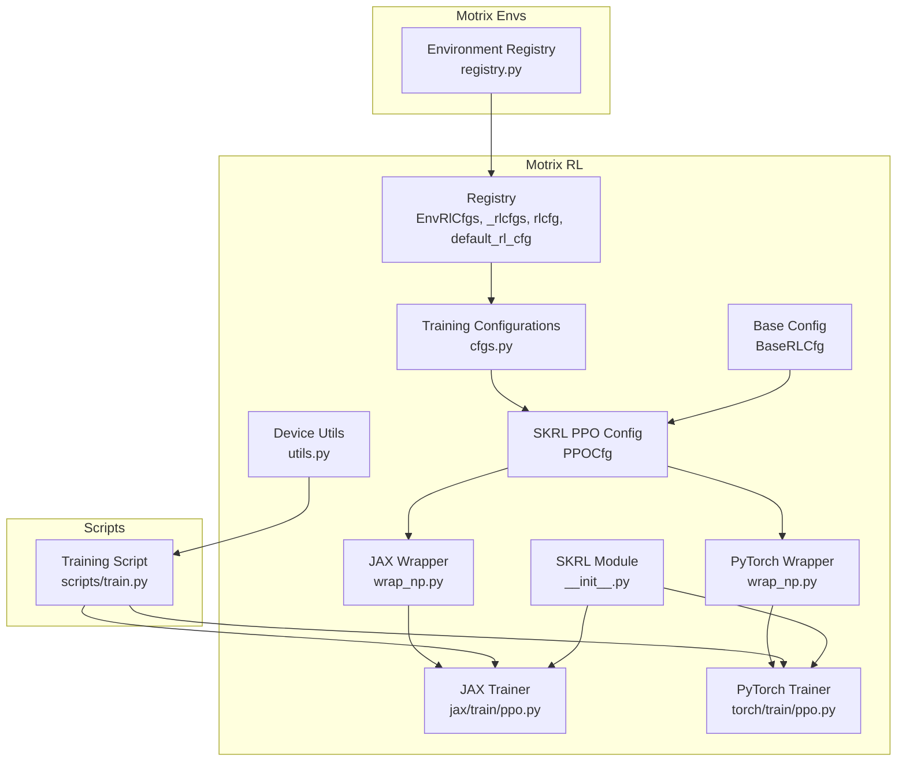
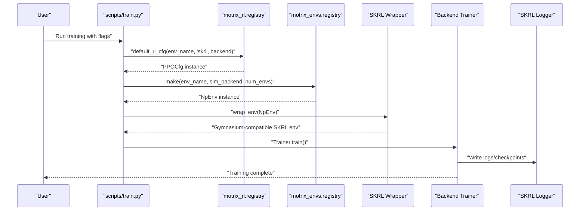
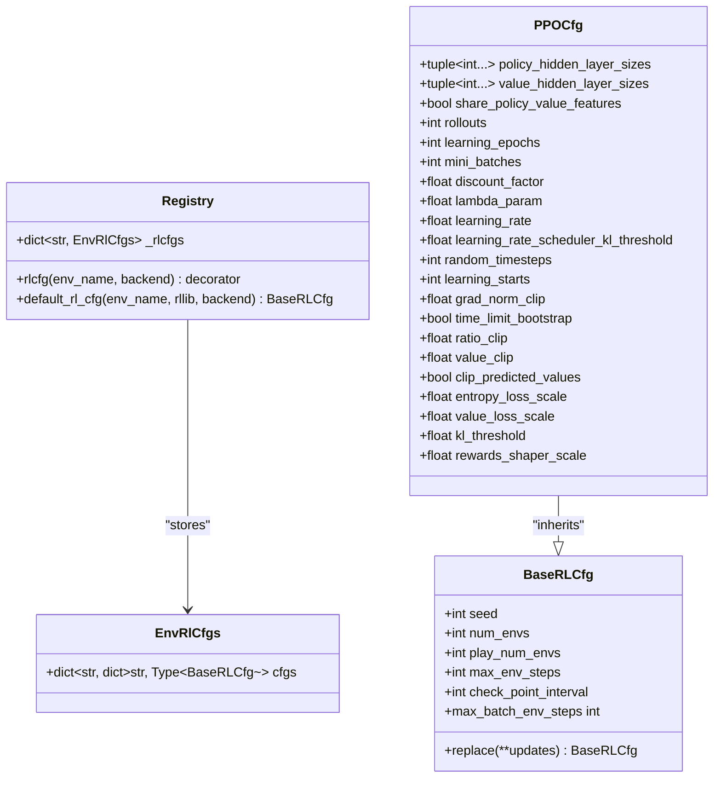
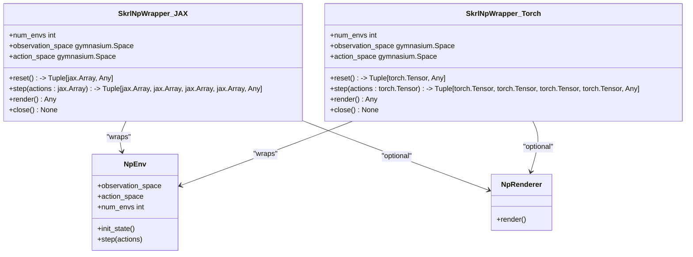
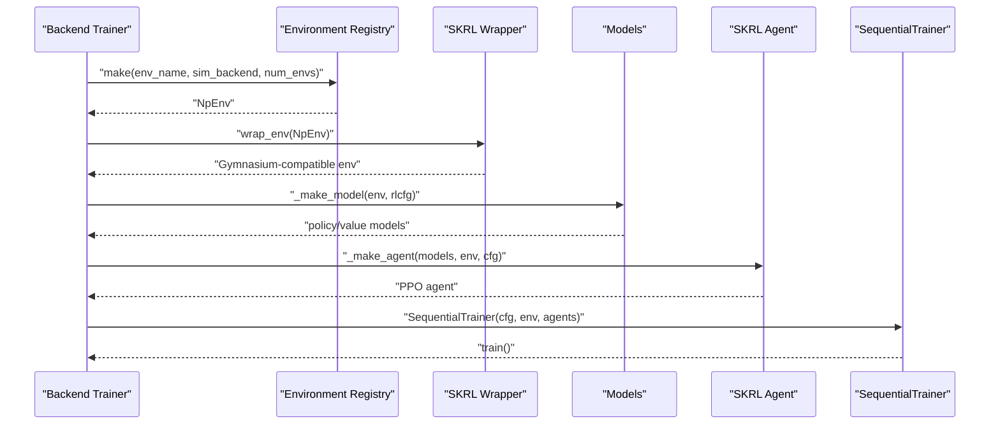
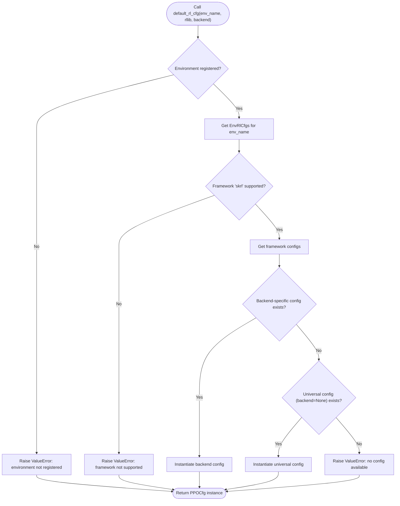
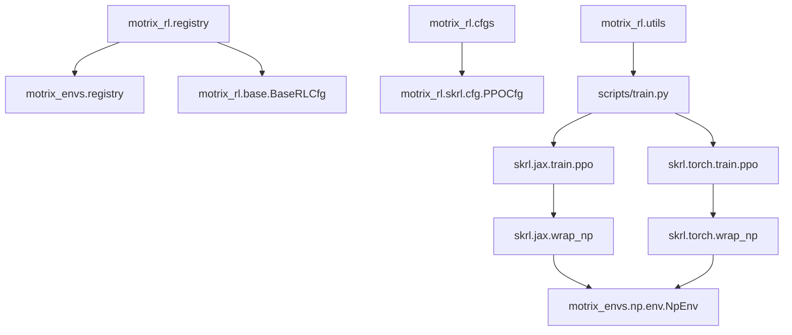

# SKRL Framework Integration

<cite>
**Referenced Files in This Document**
- [registry.py](file://motrix_rl/src/motrix_rl/registry.py)
- [cfgs.py](file://motrix_rl/src/motrix_rl/cfgs.py)
- [cfg.py](file://motrix_rl/src/motrix_rl/skrl/cfg.py)
- [base.py](file://motrix_rl/src/motrix_rl/base.py)
- [wrap_np.py (JAX)](file://motrix_rl/src/motrix_rl/skrl/jax/wrap_np.py)
- [wrap_np.py (PyTorch)](file://motrix_rl/src/motrix_rl/skrl/torch/wrap_np.py)
- [ppo.py (JAX)](file://motrix_rl/src/motrix_rl/skrl/jax/train/ppo.py)
- [ppo.py (PyTorch)](file://motrix_rl/src/motrix_rl/skrl/torch/train/ppo.py)
- [__init__.py (SKRL)](file://motrix_rl/src/motrix_rl/skrl/__init__.py)
- [utils.py](file://motrix_rl/src/motrix_rl/utils.py)
- [registry.py (Environments)](file://motrix_envs/src/motrix_envs/registry.py)
- [train.py](file://scripts/train.py)
</cite>

## Table of Contents
1. [Introduction](#introduction)
2. [Project Structure](#project-structure)
3. [Core Components](#core-components)
4. [Architecture Overview](#architecture-overview)
5. [Detailed Component Analysis](#detailed-component-analysis)
6. [Dependency Analysis](#dependency-analysis)
7. [Performance Considerations](#performance-considerations)
8. [Troubleshooting Guide](#troubleshooting-guide)
9. [Conclusion](#conclusion)
10. [Appendices](#appendices)

## Introduction
This document explains the SKRL (Stable Keras Reinforcement Learning) integration within MotrixLab-S1. It focuses on the modular reinforcement learning configuration system that maps environments to training configurations, the registry mechanisms, decorators for registration, and the hierarchical configuration structure supporting multiple RL frameworks and backends. Practical examples demonstrate how to register custom training configurations, map environments to configurations, and leverage backend-specific optimizations. The integration pattern integrates MotrixSim physics engines and Gymnasium-compatible environments seamlessly.

## Project Structure
The SKRL integration spans several modules:
- Registry and configuration mapping for environments and RL training configs
- Hierarchical configuration classes for SKRL PPO
- Backend-specific wrappers for Gymnasium-compatible environments
- Trainer implementations for JAX and PyTorch backends
- Utilities for device capability detection and training orchestration

**Diagram sources**
- [registry.py](file://motrix_rl/src/motrix_rl/registry.py#L28-L115)
- [cfgs.py](file://motrix_rl/src/motrix_rl/cfgs.py#L1-L333)
- [base.py](file://motrix_rl/src/motrix_rl/base.py#L20-L43)
- [cfg.py](file://motrix_rl/src/motrix_rl/skrl/cfg.py#L28-L74)
- [wrap_np.py (JAX)](file://motrix_rl/src/motrix_rl/skrl/jax/wrap_np.py#L26-L81)
- [wrap_np.py (PyTorch)](file://motrix_rl/src/motrix_rl/skrl/torch/wrap_np.py#L26-L80)
- [ppo.py (JAX)](file://motrix_rl/src/motrix_rl/skrl/jax/train/ppo.py#L145-L301)
- [ppo.py (PyTorch)](file://motrix_rl/src/motrix_rl/skrl/torch/train/ppo.py#L145-L356)
- [__init__.py (SKRL)](file://motrix_rl/src/motrix_rl/skrl/__init__.py#L19-L22)
- [utils.py](file://motrix_rl/src/motrix_rl/utils.py#L19-L62)
- [registry.py (Environments)](file://motrix_envs/src/motrix_envs/registry.py#L114-L161)
- [train.py](file://scripts/train.py#L52-L95)

**Section sources**
- [registry.py](file://motrix_rl/src/motrix_rl/registry.py#L28-L115)
- [cfgs.py](file://motrix_rl/src/motrix_rl/cfgs.py#L1-L333)
- [base.py](file://motrix_rl/src/motrix_rl/base.py#L20-L43)
- [cfg.py](file://motrix_rl/src/motrix_rl/skrl/cfg.py#L28-L74)
- [wrap_np.py (JAX)](file://motrix_rl/src/motrix_rl/skrl/jax/wrap_np.py#L26-L81)
- [wrap_np.py (PyTorch)](file://motrix_rl/src/motrix_rl/skrl/torch/wrap_np.py#L26-L80)
- [ppo.py (JAX)](file://motrix_rl/src/motrix_rl/skrl/jax/train/ppo.py#L145-L301)
- [ppo.py (PyTorch)](file://motrix_rl/src/motrix_rl/skrl/torch/train/ppo.py#L145-L356)
- [__init__.py (SKRL)](file://motrix_rl/src/motrix_rl/skrl/__init__.py#L19-L22)
- [utils.py](file://motrix_rl/src/motrix_rl/utils.py#L19-L62)
- [registry.py (Environments)](file://motrix_envs/src/motrix_envs/registry.py#L114-L161)
- [train.py](file://scripts/train.py#L52-L95)

## Core Components
- EnvRlCfgs: Hierarchical mapping of environment to RL framework to backend to configuration class.
- _rlcfgs: Global registry storing EnvRlCfgs for each environment.
- rlcfg decorator: Registers training configuration classes for a named environment and optional backend.
- _register_rlcfg: Internal function that validates environment registration and inserts configuration class into the registry.
- default_rl_cfg: Retrieves a configuration instance by environment, RL framework, and backend, with fallback to universal backend.

These components form a modular system enabling:
- Environment-to-configuration mapping
- Backend-specific overrides
- Universal fallbacks
- Extensible registration for new environments and backends

**Section sources**
- [registry.py](file://motrix_rl/src/motrix_rl/registry.py#L28-L115)

## Architecture Overview
The SKRL integration follows a layered architecture:
- Environment layer: MotrixSim-backed environments exposed via Gymnasium-compatible wrappers.
- Configuration layer: Hierarchical RL configuration classes derived from a base configuration.
- Registry layer: Centralized mapping of environments to configuration classes organized by RL framework and backend.
- Trainer layer: Backend-specific trainers that assemble models, agents, memories, and run training loops.

**Diagram sources**
- [train.py](file://scripts/train.py#L52-L95)
- [registry.py](file://motrix_rl/src/motrix_rl/registry.py#L81-L115)
- [registry.py (Environments)](file://motrix_envs/src/motrix_envs/registry.py#L114-L161)
- [wrap_np.py (JAX)](file://motrix_rl/src/motrix_rl/skrl/jax/wrap_np.py#L26-L81)
- [wrap_np.py (PyTorch)](file://motrix_rl/src/motrix_rl/skrl/torch/wrap_np.py#L26-L80)
- [ppo.py (JAX)](file://motrix_rl/src/motrix_rl/skrl/jax/train/ppo.py#L167-L184)
- [ppo.py (PyTorch)](file://motrix_rl/src/motrix_rl/skrl/torch/train/ppo.py#L167-L184)

## Detailed Component Analysis

### Registry System and Configuration Mapping
The registry system organizes RL configuration classes in a three-level hierarchy:
- Environment name
- RL framework identifier
- Backend name (e.g., "jax", "torch") or universal fallback

Key elements:
- EnvRlCfgs: Holds a nested dictionary mapping RL framework to backend to configuration class type.
- _rlcfgs: Global registry keyed by environment name.
- rlcfg decorator: Registers configuration classes for an environment and backend (or all backends when backend is None).
- _register_rlcfg: Validates environment existence and inserts configuration class into the registry.
- default_rl_cfg: Resolves a configuration instance by environment, RL framework, and backend, with fallback to universal backend.

**Diagram sources**
- [registry.py](file://motrix_rl/src/motrix_rl/registry.py#L28-L115)
- [base.py](file://motrix_rl/src/motrix_rl/base.py#L20-L43)
- [cfg.py](file://motrix_rl/src/motrix_rl/skrl/cfg.py#L28-L74)

**Section sources**
- [registry.py](file://motrix_rl/src/motrix_rl/registry.py#L28-L115)
- [base.py](file://motrix_rl/src/motrix_rl/base.py#L20-L43)
- [cfg.py](file://motrix_rl/src/motrix_rl/skrl/cfg.py#L28-L74)

### Training Configuration Classes and Registration Examples
Training configuration classes are defined as dataclasses inheriting from the base configuration and decorated with the rlcfg decorator. The cfgs module demonstrates:
- Environment-specific configurations (e.g., CartPole, BounceBall)
- Backend-specific overrides (e.g., JAX vs. PyTorch variants for DM Control tasks)
- Hierarchical specialization (e.g., locomotion and manipulation tasks)

Practical registration patterns:
- Single-backend registration: Apply rlcfg with a specific backend.
- Multi-backend registration: Apply rlcfg without specifying backend to register for all supported backends.
- Specialization: Subclass existing configuration classes to override parameters for specific scenarios.

Examples of registration patterns are visible in the cfgs module for various environments and tasks.

**Section sources**
- [cfgs.py](file://motrix_rl/src/motrix_rl/cfgs.py#L22-L333)

### Gymnasium-Compatible Wrappers and Environment Integration
The integration wraps MotrixSim-based NumPy environments into Gymnasium-compatible SKRL environments:
- JAX wrapper: Converts NumPy arrays to JAX arrays and maintains Gymnasium spaces.
- PyTorch wrapper: Converts NumPy arrays to PyTorch tensors and maintains Gymnasium spaces.
- Both wrappers expose reset, step, render, and close methods and forward spaces to SKRL.

**Diagram sources**
- [wrap_np.py (JAX)](file://motrix_rl/src/motrix_rl/skrl/jax/wrap_np.py#L26-L81)
- [wrap_np.py (PyTorch)](file://motrix_rl/src/motrix_rl/skrl/torch/wrap_np.py#L26-L80)

**Section sources**
- [wrap_np.py (JAX)](file://motrix_rl/src/motrix_rl/skrl/jax/wrap_np.py#L26-L81)
- [wrap_np.py (PyTorch)](file://motrix_rl/src/motrix_rl/skrl/torch/wrap_np.py#L26-L80)

### Backend-Specific Trainers and PPO Agents
Backend-specific trainers orchestrate environment creation, model construction, agent instantiation, and training:
- JAX trainer: Uses JAX-based models and agents with JAX-compatible wrappers.
- PyTorch trainer: Uses PyTorch-based models and agents with PyTorch-compatible wrappers.
- Both trainers construct policies and value networks from configuration, configure agent hyperparameters, and run SKRL SequentialTrainer.

**Diagram sources**
- [ppo.py (JAX)](file://motrix_rl/src/motrix_rl/skrl/jax/train/ppo.py#L167-L184)
- [ppo.py (PyTorch)](file://motrix_rl/src/motrix_rl/skrl/torch/train/ppo.py#L167-L184)
- [registry.py (Environments)](file://motrix_envs/src/motrix_envs/registry.py#L114-L161)
- [wrap_np.py (JAX)](file://motrix_rl/src/motrix_rl/skrl/jax/wrap_np.py#L26-L81)
- [wrap_np.py (PyTorch)](file://motrix_rl/src/motrix_rl/skrl/torch/wrap_np.py#L26-L80)

**Section sources**
- [ppo.py (JAX)](file://motrix_rl/src/motrix_rl/skrl/jax/train/ppo.py#L145-L301)
- [ppo.py (PyTorch)](file://motrix_rl/src/motrix_rl/skrl/torch/train/ppo.py#L145-L356)

### Hierarchical Configuration Retrieval Flow
The retrieval process resolves a configuration instance with backend-specific precedence and universal fallback.

**Diagram sources**
- [registry.py](file://motrix_rl/src/motrix_rl/registry.py#L81-L115)

**Section sources**
- [registry.py](file://motrix_rl/src/motrix_rl/registry.py#L81-L115)

### Practical Examples

#### Registering a Custom Training Configuration
Steps:
- Define a dataclass configuration inheriting from the base configuration.
- Decorate the class with rlcfg specifying the environment name and optional backend.
- Optionally subclass an existing configuration to specialize parameters.

Reference paths:
- [cfgs.py](file://motrix_rl/src/motrix_rl/cfgs.py#L22-L333)

#### Environment-to-Configuration Mapping
- Ensure the environment is registered in the environment registry.
- Use the rlcfg decorator to bind a configuration class to the environment and backend.
- Retrieve the configuration via default_rl_cfg during training initialization.

Reference paths:
- [registry.py (Environments)](file://motrix_envs/src/motrix_envs/registry.py#L46-L100)
- [registry.py](file://motrix_rl/src/motrix_rl/registry.py#L63-L115)

#### Backend-Specific Optimizations
- Register backend-specific variants of configurations for performance tuning.
- Use the training script to select the appropriate backend based on device capabilities.

Reference paths:
- [cfgs.py](file://motrix_rl/src/motrix_rl/cfgs.py#L51-L91)
- [utils.py](file://motrix_rl/src/motrix_rl/utils.py#L39-L62)
- [train.py](file://scripts/train.py#L39-L95)

## Dependency Analysis
The SKRL integration exhibits clear separation of concerns:
- Registry depends on environment registry and base configuration classes.
- Configuration classes depend on base configuration and are consumed by trainers.
- Wrappers depend on environment and renderer abstractions.
- Trainers depend on SKRL agents, memories, preprocessors, schedulers, and registries.

**Diagram sources**
- [registry.py](file://motrix_rl/src/motrix_rl/registry.py#L20-L21)
- [cfgs.py](file://motrix_rl/src/motrix_rl/cfgs.py#L18-L19)
- [cfg.py](file://motrix_rl/src/motrix_rl/skrl/cfg.py#L25)
- [wrap_np.py (JAX)](file://motrix_rl/src/motrix_rl/skrl/jax/wrap_np.py#L22-L24)
- [wrap_np.py (PyTorch)](file://motrix_rl/src/motrix_rl/skrl/torch/wrap_np.py#L22-L24)
- [ppo.py (JAX)](file://motrix_rl/src/motrix_rl/skrl/jax/train/ppo.py#L30-L35)
- [ppo.py (PyTorch)](file://motrix_rl/src/motrix_rl/skrl/torch/train/ppo.py#L30-L35)
- [utils.py](file://motrix_rl/src/motrix_rl/utils.py#L39-L62)
- [train.py](file://scripts/train.py#L76-L87)

**Section sources**
- [registry.py](file://motrix_rl/src/motrix_rl/registry.py#L20-L21)
- [cfgs.py](file://motrix_rl/src/motrix_rl/cfgs.py#L18-L19)
- [cfg.py](file://motrix_rl/src/motrix_rl/skrl/cfg.py#L25)
- [wrap_np.py (JAX)](file://motrix_rl/src/motrix_rl/skrl/jax/wrap_np.py#L22-L24)
- [wrap_np.py (PyTorch)](file://motrix_rl/src/motrix_rl/skrl/torch/wrap_np.py#L22-L24)
- [ppo.py (JAX)](file://motrix_rl/src/motrix_rl/skrl/jax/train/ppo.py#L30-L35)
- [ppo.py (PyTorch)](file://motrix_rl/src/motrix_rl/skrl/torch/train/ppo.py#L30-L35)
- [utils.py](file://motrix_rl/src/motrix_rl/utils.py#L39-L62)
- [train.py](file://scripts/train.py#L76-L87)

## Performance Considerations
- Parallel environments: Configure num_envs to maximize throughput while respecting device memory limits.
- Backend selection: Prefer GPU-capable backends when available to accelerate training.
- Logging intervals: Tune check_point_interval to balance checkpoint frequency and overhead.
- Model sharing: Enable share_policy_value_features for PyTorch when architectures match to reduce parameters and improve efficiency.

[No sources needed since this section provides general guidance]

## Troubleshooting Guide
Common issues and resolutions:
- Environment not registered: Ensure the environment is registered in the environment registry before registering RL configurations.
- Framework not supported: Verify the RL framework identifier matches the expected value (e.g., "skrl").
- Backend-specific config missing: Provide a backend-specific configuration or rely on the universal fallback.
- Device capability errors: Use device capability utilities to detect available backends and adjust training backend accordingly.

**Section sources**
- [registry.py](file://motrix_rl/src/motrix_rl/registry.py#L52-L53)
- [registry.py](file://motrix_rl/src/motrix_rl/registry.py#L94-L98)
- [registry.py](file://motrix_rl/src/motrix_rl/registry.py#L111-L114)
- [utils.py](file://motrix_rl/src/motrix_rl/utils.py#L39-L62)

## Conclusion
The SKRL integration in MotrixLab-S1 provides a robust, modular framework for configuring and training reinforcement learning agents. The registry system enables flexible environment-to-configuration mapping with backend-specific overrides and universal fallbacks. The Gymnasium-compatible wrappers integrate MotrixSim physics engines seamlessly, while backend-specific trainers deliver optimized training pipelines. This design supports scalable experimentation across diverse environments and backends.

## Appendices

### API Summary
- EnvRlCfgs: Hierarchical mapping container for RL configurations.
- _rlcfgs: Global registry keyed by environment name.
- rlcfg: Decorator for registering configuration classes.
- _register_rlcfg: Internal registration function with validation.
- default_rl_cfg: Configuration resolution with backend precedence and fallback.

**Section sources**
- [registry.py](file://motrix_rl/src/motrix_rl/registry.py#L28-L115)