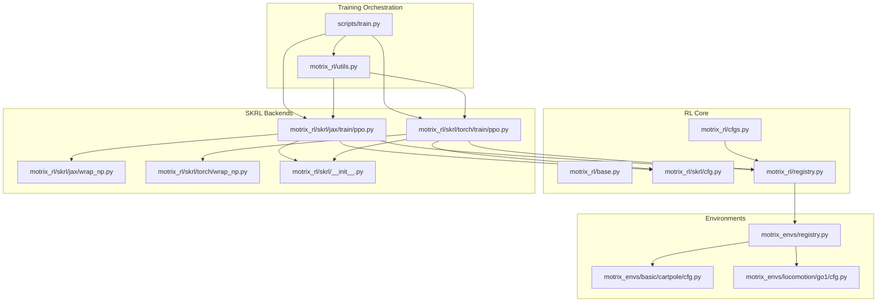
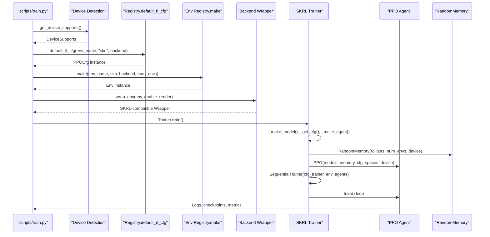
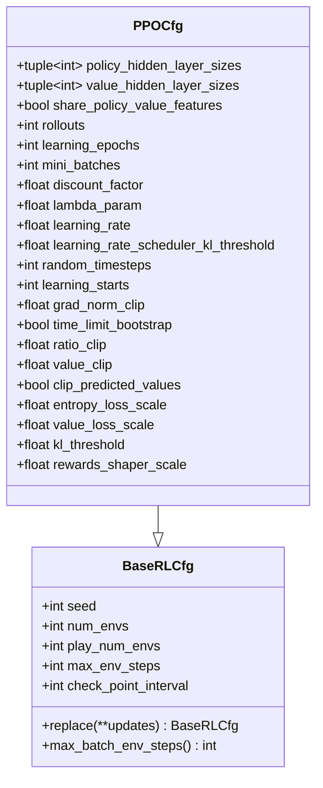
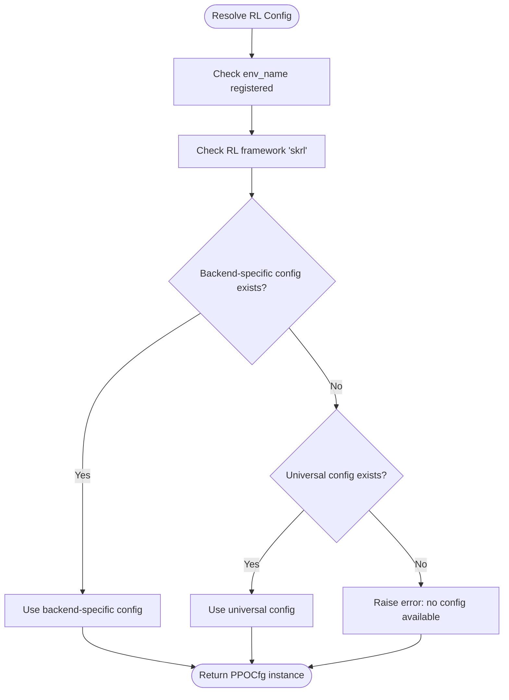
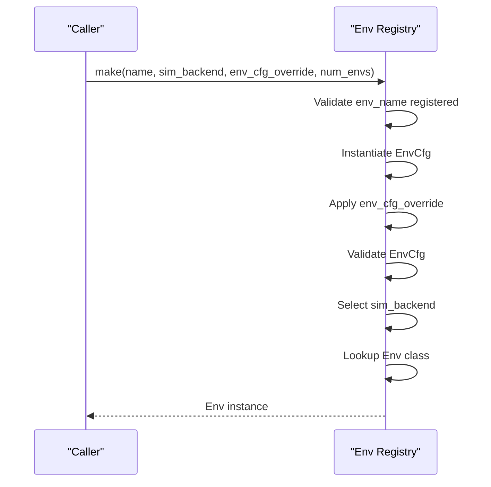
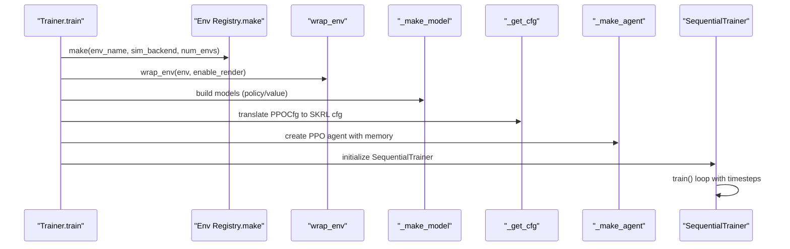
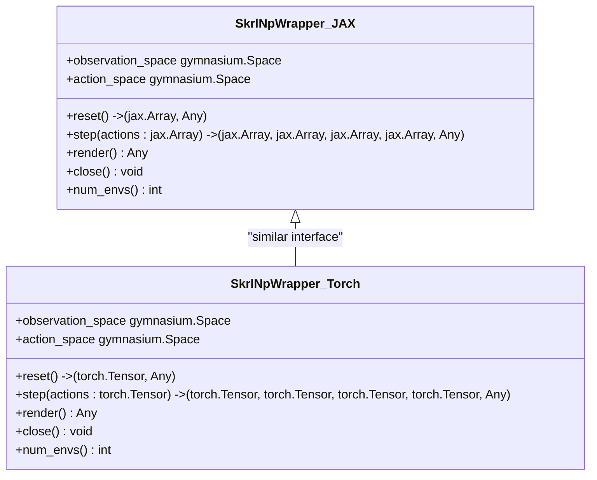
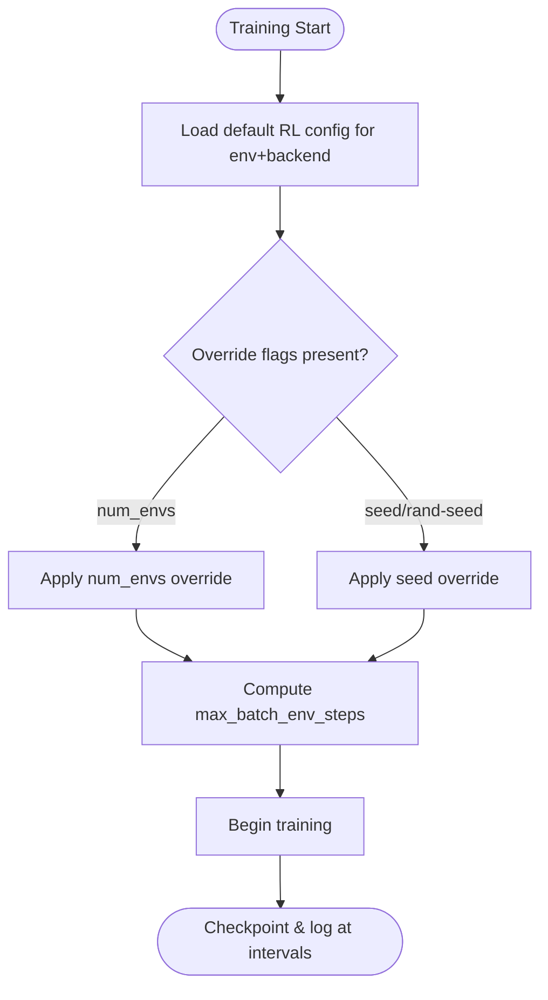
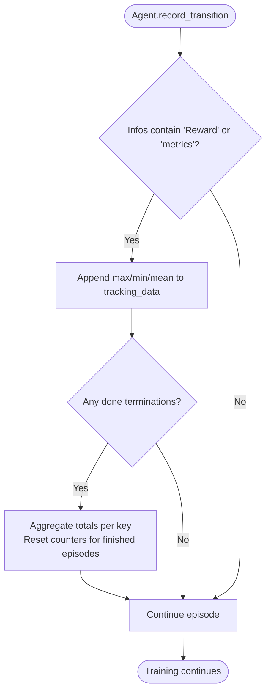
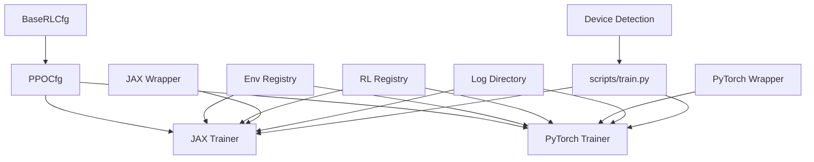

# Training Framework Integration

<cite>
**Referenced Files in This Document**
- [base.py](file://motrix_rl/src/motrix_rl/base.py)
- [cfg.py](file://motrix_rl/src/motrix_rl/skrl/cfg.py)
- [registry.py](file://motrix_rl/src/motrix_rl/registry.py)
- [cfgs.py](file://motrix_rl/src/motrix_rl/cfgs.py)
- [jax/ppo.py](file://motrix_rl/src/motrix_rl/skrl/jax/train/ppo.py)
- [torch/ppo.py](file://motrix_rl/src/motrix_rl/skrl/torch/train/ppo.py)
- [jax/wrap_np.py](file://motrix_rl/src/motrix_rl/skrl/jax/wrap_np.py)
- [torch/wrap_np.py](file://motrix_rl/src/motrix_rl/skrl/torch/wrap_np.py)
- [skrl/__init__.py](file://motrix_rl/src/motrix_rl/skrl/__init__.py)
- [utils.py](file://motrix_rl/src/motrix_rl/utils.py)
- [train.py](file://scripts/train.py)
- [registry.py](file://motrix_envs/src/motrix_envs/registry.py)
- [cartpole/cfg.py](file://motrix_envs/src/motrix_envs/basic/cartpole/cfg.py)
- [go1/cfg.py](file://motrix_envs/src/motrix_envs/locomotion/go1/cfg.py)
</cite>

## Table of Contents
1. [Introduction](#introduction)
2. [Project Structure](#project-structure)
3. [Core Components](#core-components)
4. [Architecture Overview](#architecture-overview)
5. [Detailed Component Analysis](#detailed-component-analysis)
6. [Dependency Analysis](#dependency-analysis)
7. [Performance Considerations](#performance-considerations)
8. [Troubleshooting Guide](#troubleshooting-guide)
9. [Conclusion](#conclusion)
10. [Appendices](#appendices)

## Introduction
This document explains the training framework integration built around the SKRL reinforcement learning library. It covers the PPO algorithm implementation, training configuration management, and multi-backend support for JAX and PyTorch. It also documents the registry system that maps environments to training configurations, base RL configuration classes, and hyperparameter management. The training pipeline is described from environment selection to model optimization, including batch processing, memory management, and parallel execution strategies. Backend-specific optimizations, GPU utilization, and performance considerations are included, along with practical examples for training configuration customization, experiment tracking, and result analysis workflows.

## Project Structure
The training integration spans several modules:
- RL configuration base and SKRL-specific PPO configuration
- Registry system for mapping environments to RL configurations
- Backend-specific trainers and model definitions (JAX and PyTorch)
- Environment wrappers for SKRL compatibility
- Utilities for device detection and training script orchestration
- Environment registry and example environment configurations

**Diagram sources**
- [train.py](file://scripts/train.py#L52-L91)
- [utils.py](file://motrix_rl/src/motrix_rl/utils.py#L39-L61)
- [base.py](file://motrix_rl/src/motrix_rl/base.py#L20-L43)
- [cfg.py](file://motrix_rl/src/motrix_rl/skrl/cfg.py#L28-L74)
- [registry.py](file://motrix_rl/src/motrix_rl/registry.py#L81-L115)
- [cfgs.py](file://motrix_rl/src/motrix_rl/cfgs.py#L18-L333)
- [jax/ppo.py](file://motrix_rl/src/motrix_rl/skrl/jax/train/ppo.py#L145-L296)
- [torch/ppo.py](file://motrix_rl/src/motrix_rl/skrl/torch/train/ppo.py#L145-L356)
- [jax/wrap_np.py](file://motrix_rl/src/motrix_rl/skrl/jax/wrap_np.py#L27-L81)
- [torch/wrap_np.py](file://motrix_rl/src/motrix_rl/skrl/torch/wrap_np.py#L26-L80)
- [skrl/__init__.py](file://motrix_rl/src/motrix_rl/skrl/__init__.py#L19-L22)
- [registry.py](file://motrix_envs/src/motrix_envs/registry.py#L114-L161)
- [cartpole/cfg.py](file://motrix_envs/src/motrix_envs/basic/cartpole/cfg.py#L25-L32)
- [go1/cfg.py](file://motrix_envs/src/motrix_envs/locomotion/go1/cfg.py#L122-L188)

**Section sources**
- [train.py](file://scripts/train.py#L52-L91)
- [utils.py](file://motrix_rl/src/motrix_rl/utils.py#L39-L61)
- [registry.py](file://motrix_rl/src/motrix_rl/registry.py#L81-L115)
- [cfgs.py](file://motrix_rl/src/motrix_rl/cfgs.py#L18-L333)
- [jax/ppo.py](file://motrix_rl/src/motrix_rl/skrl/jax/train/ppo.py#L145-L296)
- [torch/ppo.py](file://motrix_rl/src/motrix_rl/skrl/torch/train/ppo.py#L145-L356)
- [jax/wrap_np.py](file://motrix_rl/src/motrix_rl/skrl/jax/wrap_np.py#L27-L81)
- [torch/wrap_np.py](file://motrix_rl/src/motrix_rl/skrl/torch/wrap_np.py#L26-L80)
- [skrl/__init__.py](file://motrix_rl/src/motrix_rl/skrl/__init__.py#L19-L22)
- [registry.py](file://motrix_envs/src/motrix_envs/registry.py#L114-L161)
- [cartpole/cfg.py](file://motrix_envs/src/motrix_envs/basic/cartpole/cfg.py#L25-L32)
- [go1/cfg.py](file://motrix_envs/src/motrix_envs/locomotion/go1/cfg.py#L122-L188)

## Core Components
- Base RL configuration class: Defines common training parameters such as seeds, number of environments, checkpoint intervals, and derived batch sizes.
- SKRL PPO configuration: Extends the base configuration with PPO-specific hyperparameters (network sizes, rollout length, epochs, mini-batches, discount factors, clipping, loss scaling, and reward shaping).
- Registry system: Maps environment names to RL configuration classes per RL framework and backend, enabling flexible selection and override of training parameters.
- Environment registry: Manages environment configurations and available simulation backends, ensuring proper instantiation with optional overrides.
- Backend trainers: Provide JAX and PyTorch implementations of PPO training, including model construction, memory management, agent configuration, and experiment logging.
- Wrappers: Bridge NumPy-based environments to SKRL-compatible wrappers for both JAX and PyTorch backends.
- Utilities: Detect device capabilities (CPU/GPU) for JAX and PyTorch and select optimal training backend automatically.

**Section sources**
- [base.py](file://motrix_rl/src/motrix_rl/base.py#L20-L43)
- [cfg.py](file://motrix_rl/src/motrix_rl/skrl/cfg.py#L28-L74)
- [registry.py](file://motrix_rl/src/motrix_rl/registry.py#L28-L115)
- [registry.py](file://motrix_envs/src/motrix_envs/registry.py#L24-L161)
- [jax/ppo.py](file://motrix_rl/src/motrix_rl/skrl/jax/train/ppo.py#L145-L296)
- [torch/ppo.py](file://motrix_rl/src/motrix_rl/skrl/torch/train/ppo.py#L145-L356)
- [jax/wrap_np.py](file://motrix_rl/src/motrix_rl/skrl/jax/wrap_np.py#L27-L81)
- [torch/wrap_np.py](file://motrix_rl/src/motrix_rl/skrl/torch/wrap_np.py#L26-L80)
- [utils.py](file://motrix_rl/src/motrix_rl/utils.py#L39-L61)

## Architecture Overview
The training pipeline integrates environment selection, configuration resolution, backend selection, model creation, agent setup, and execution via SKRL’s SequentialTrainer. Logging and checkpointing are handled centrally, and the system supports both JAX and PyTorch backends with environment-specific configurations.

**Diagram sources**
- [train.py](file://scripts/train.py#L52-L91)
- [utils.py](file://motrix_rl/src/motrix_rl/utils.py#L39-L61)
- [registry.py](file://motrix_rl/src/motrix_rl/registry.py#L81-L115)
- [registry.py](file://motrix_envs/src/motrix_envs/registry.py#L114-L161)
- [jax/ppo.py](file://motrix_rl/src/motrix_rl/skrl/jax/train/ppo.py#L167-L184)
- [torch/ppo.py](file://motrix_rl/src/motrix_rl/skrl/torch/train/ppo.py#L167-L183)
- [jax/wrap_np.py](file://motrix_rl/src/motrix_rl/skrl/jax/wrap_np.py#L27-L81)
- [torch/wrap_np.py](file://motrix_rl/src/motrix_rl/skrl/torch/wrap_np.py#L26-L80)

## Detailed Component Analysis

### Base RL Configuration Classes
- BaseRLCfg: Provides foundational training parameters and a derived property to compute batched environment steps aligned to checkpoint intervals.
- PPOCfg: Extends BaseRLCfg with PPO-specific hyperparameters including policy/value network sizes, rollout length, learning epochs, mini-batch count, discount factor, lambda for GAE, learning rate scheduling, gradient norm clipping, ratio/value clipping, entropy/value loss scaling, KL threshold, reward shaper scale, and time-limit bootstrap.

**Diagram sources**
- [base.py](file://motrix_rl/src/motrix_rl/base.py#L20-L43)
- [cfg.py](file://motrix_rl/src/motrix_rl/skrl/cfg.py#L28-L74)

**Section sources**
- [base.py](file://motrix_rl/src/motrix_rl/base.py#L20-L43)
- [cfg.py](file://motrix_rl/src/motrix_rl/skrl/cfg.py#L28-L74)

### Registry System: Environment-to-Training Configuration Mapping
- EnvRlCfgs: Stores per-environment RL configuration classes organized by RL framework and backend.
- Registration decorators: Register RL configuration classes for specific environments and backends, supporting universal fallback when backend-specific configs are absent.
- Resolution: default_rl_cfg selects backend-specific configs first, then falls back to universal configs.

**Diagram sources**
- [registry.py](file://motrix_rl/src/motrix_rl/registry.py#L81-L115)

**Section sources**
- [registry.py](file://motrix_rl/src/motrix_rl/registry.py#L28-L115)

### Environment Registry and Selection
- EnvMeta: Holds environment configuration class and available simulation backends.
- Registration decorators: Register environment configurations and environment classes per backend.
- make: Creates environment instances with optional overrides and validates configuration.

**Diagram sources**
- [registry.py](file://motrix_envs/src/motrix_envs/registry.py#L114-L161)

**Section sources**
- [registry.py](file://motrix_envs/src/motrix_envs/registry.py#L24-L161)

### PPO Training Pipeline (JAX and PyTorch)
- Trainer.train: Orchestrates environment creation, seeding, wrapping, model construction, agent configuration, and execution via SequentialTrainer.
- Model construction: Builds policy/value models with configurable hidden layers and optional shared features (PyTorch).
- Memory: Uses RandomMemory sized by rollouts and num_envs.
- Agent configuration: Translates PPOCfg into SKRL’s PPO_DEFAULT_CONFIG, including schedulers, preprocessors, and logging.
- Experiment logging: Writes TensorBoard logs and checkpoints at configured intervals.

**Diagram sources**
- [jax/ppo.py](file://motrix_rl/src/motrix_rl/skrl/jax/train/ppo.py#L167-L184)
- [torch/ppo.py](file://motrix_rl/src/motrix_rl/skrl/torch/train/ppo.py#L167-L183)

**Section sources**
- [jax/ppo.py](file://motrix_rl/src/motrix_rl/skrl/jax/train/ppo.py#L145-L296)
- [torch/ppo.py](file://motrix_rl/src/motrix_rl/skrl/torch/train/ppo.py#L145-L356)

### Backend-Specific Optimizations and Wrappers
- JAX wrapper: Converts NumPy arrays to JAX arrays, ensures device alignment, and maintains SKRL-compatible interface.
- PyTorch wrapper: Converts tensors to NumPy for stepping and back to tensors for observations, preserving device placement.
- Device detection: Determines availability of JAX/PyTorch and GPU backends to select optimal training backend.

**Diagram sources**
- [jax/wrap_np.py](file://motrix_rl/src/motrix_rl/skrl/jax/wrap_np.py#L27-L81)
- [torch/wrap_np.py](file://motrix_rl/src/motrix_rl/skrl/torch/wrap_np.py#L26-L80)

**Section sources**
- [jax/wrap_np.py](file://motrix_rl/src/motrix_rl/skrl/jax/wrap_np.py#L27-L81)
- [torch/wrap_np.py](file://motrix_rl/src/motrix_rl/skrl/torch/wrap_np.py#L26-L80)
- [utils.py](file://motrix_rl/src/motrix_rl/utils.py#L39-L61)

### Hyperparameter Management and Configuration Customization
- Environment-specific configurations: Centralized in cfgs.py with decorators registering PPO configurations for specific environments and backends.
- Overrides: Command-line flags allow overriding num_envs and seed/rand-seed during training.
- Derived batch computation: BaseRLCfg ensures max_batch_env_steps aligns with checkpoint intervals for efficient logging and saving.

**Diagram sources**
- [cfgs.py](file://motrix_rl/src/motrix_rl/cfgs.py#L18-L333)
- [train.py](file://scripts/train.py#L58-L67)
- [base.py](file://motrix_rl/src/motrix_rl/base.py#L36-L43)

**Section sources**
- [cfgs.py](file://motrix_rl/src/motrix_rl/cfgs.py#L18-L333)
- [train.py](file://scripts/train.py#L58-L67)
- [base.py](file://motrix_rl/src/motrix_rl/base.py#L36-L43)

### Experiment Tracking and Results Analysis
- Logging directory: Centralized under a runs prefix with environment-specific subdirectories.
- Metrics tracking: Custom reward and metric tracking integrated into PPO agent record_transition for instant and total statistics.
- Checkpointing: Automatic periodic checkpoints and TensorBoard writes controlled by configuration.

**Diagram sources**
- [jax/ppo.py](file://motrix_rl/src/motrix_rl/skrl/jax/train/ppo.py#L89-L143)
- [torch/ppo.py](file://motrix_rl/src/motrix_rl/skrl/torch/train/ppo.py#L89-L143)
- [skrl/__init__.py](file://motrix_rl/src/motrix_rl/skrl/__init__.py#L19-L22)

**Section sources**
- [skrl/__init__.py](file://motrix_rl/src/motrix_rl/skrl/__init__.py#L19-L22)
- [jax/ppo.py](file://motrix_rl/src/motrix_rl/skrl/jax/train/ppo.py#L89-L143)
- [torch/ppo.py](file://motrix_rl/src/motrix_rl/skrl/torch/train/ppo.py#L89-L143)

## Dependency Analysis
The training integration exhibits clear separation of concerns:
- Configuration layer: Base and SKRL PPO configs define hyperparameters.
- Registry layer: Maps environments to RL configurations and backends.
- Environment layer: Provides environment creation and configuration.
- Backend layer: Implements PPO training, model construction, and wrappers.
- Orchestration: Scripts coordinate device detection, backend selection, and training execution.

**Diagram sources**
- [base.py](file://motrix_rl/src/motrix_rl/base.py#L20-L43)
- [cfg.py](file://motrix_rl/src/motrix_rl/skrl/cfg.py#L28-L74)
- [registry.py](file://motrix_rl/src/motrix_rl/registry.py#L81-L115)
- [registry.py](file://motrix_envs/src/motrix_envs/registry.py#L114-L161)
- [jax/ppo.py](file://motrix_rl/src/motrix_rl/skrl/jax/train/ppo.py#L145-L296)
- [torch/ppo.py](file://motrix_rl/src/motrix_rl/skrl/torch/train/ppo.py#L145-L356)
- [jax/wrap_np.py](file://motrix_rl/src/motrix_rl/skrl/jax/wrap_np.py#L27-L81)
- [torch/wrap_np.py](file://motrix_rl/src/motrix_rl/skrl/torch/wrap_np.py#L26-L80)
- [skrl/__init__.py](file://motrix_rl/src/motrix_rl/skrl/__init__.py#L19-L22)
- [utils.py](file://motrix_rl/src/motrix_rl/utils.py#L39-L61)
- [train.py](file://scripts/train.py#L52-L91)

**Section sources**
- [base.py](file://motrix_rl/src/motrix_rl/base.py#L20-L43)
- [cfg.py](file://motrix_rl/src/motrix_rl/skrl/cfg.py#L28-L74)
- [registry.py](file://motrix_rl/src/motrix_rl/registry.py#L81-L115)
- [registry.py](file://motrix_envs/src/motrix_envs/registry.py#L114-L161)
- [jax/ppo.py](file://motrix_rl/src/motrix_rl/skrl/jax/train/ppo.py#L145-L296)
- [torch/ppo.py](file://motrix_rl/src/motrix_rl/skrl/torch/train/ppo.py#L145-L356)
- [jax/wrap_np.py](file://motrix_rl/src/motrix_rl/skrl/jax/wrap_np.py#L27-L81)
- [torch/wrap_np.py](file://motrix_rl/src/motrix_rl/skrl/torch/wrap_np.py#L26-L80)
- [skrl/__init__.py](file://motrix_rl/src/motrix_rl/skrl/__init__.py#L19-L22)
- [utils.py](file://motrix_rl/src/motrix_rl/utils.py#L39-L61)
- [train.py](file://scripts/train.py#L52-L91)

## Performance Considerations
- Parallel environments: num_envs controls the degree of parallelism; larger values increase throughput but require sufficient CPU/GPU resources.
- Rollout sizing: rollouts determines memory capacity and batch composition; balance against mini_batches to maintain effective learning signal.
- Learning rate scheduling: KL-adaptive scheduler adjusts learning rate based on KL divergence threshold to stabilize training.
- Preprocessing: Running standard scalers for state and value improve convergence stability.
- Device utilization: Automatic backend selection prefers GPU-capable backends when available; ensure drivers and libraries are installed.
- Checkpoint intervals: Align with computational budget and desired frequency of evaluation/checkpointing.

[No sources needed since this section provides general guidance]

## Troubleshooting Guide
- No configuration found: Ensure the environment is registered and a matching RL configuration exists for the selected backend or a universal fallback is available.
- Unsupported simulation backend: Verify the environment supports the requested backend and that the environment configuration is registered.
- Device/backend mismatch: Confirm JAX/PyTorch availability and GPU capability; the training script will auto-select based on device_supports.
- Training stalls or low throughput: Reduce num_envs or adjust rollout/epoch/batch parameters; verify memory allocation and preprocessor device placement.

**Section sources**
- [registry.py](file://motrix_rl/src/motrix_rl/registry.py#L94-L115)
- [registry.py](file://motrix_envs/src/motrix_envs/registry.py#L132-L157)
- [utils.py](file://motrix_rl/src/motrix_rl/utils.py#L39-L61)
- [train.py](file://scripts/train.py#L39-L49)

## Conclusion
The training framework integration leverages SKRL to deliver a robust, multi-backend PPO implementation. The registry system enables flexible environment-to-configuration mapping, while base and SKRL-specific configuration classes provide comprehensive hyperparameter control. Backend-specific trainers and wrappers ensure seamless integration with NumPy environments, and automatic device detection streamlines deployment. The training pipeline supports scalable parallel execution, efficient memory management, and structured experiment tracking, making it suitable for diverse robotics and simulation tasks.

[No sources needed since this section summarizes without analyzing specific files]

## Appendices

### Practical Examples

- Customizing training configuration:
  - Override environment-specific defaults by passing overrides to the Trainer constructor or command-line flags.
  - Adjust network sizes, rollout length, learning rate, and scheduling thresholds to fit task complexity and hardware constraints.

- Experiment tracking:
  - Monitor training progress via TensorBoard logs stored under the centralized log directory.
  - Inspect reward and metric tracking aggregated per episode and per timestep.

- Result analysis:
  - Use saved checkpoints to evaluate policies in playback mode.
  - Compare results across backends and environment variants using standardized metrics and logs.

**Section sources**
- [train.py](file://scripts/train.py#L58-L67)
- [skrl/__init__.py](file://motrix_rl/src/motrix_rl/skrl/__init__.py#L19-L22)
- [jax/ppo.py](file://motrix_rl/src/motrix_rl/skrl/jax/train/ppo.py#L186-L210)
- [torch/ppo.py](file://motrix_rl/src/motrix_rl/skrl/torch/train/ppo.py#L185-L208)