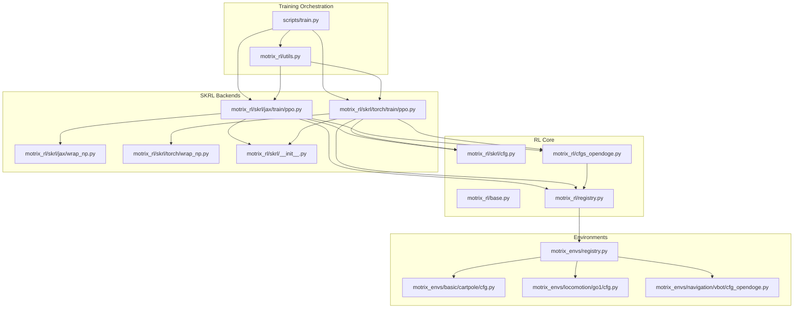
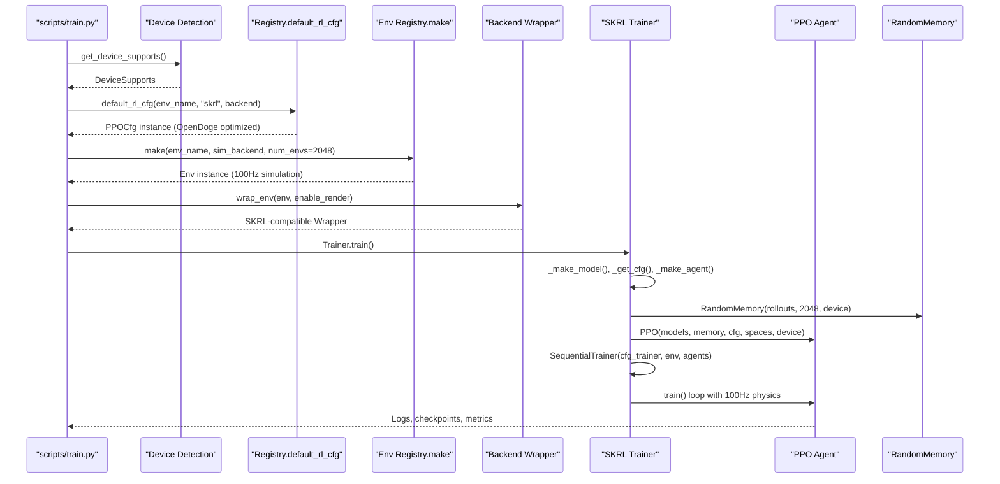
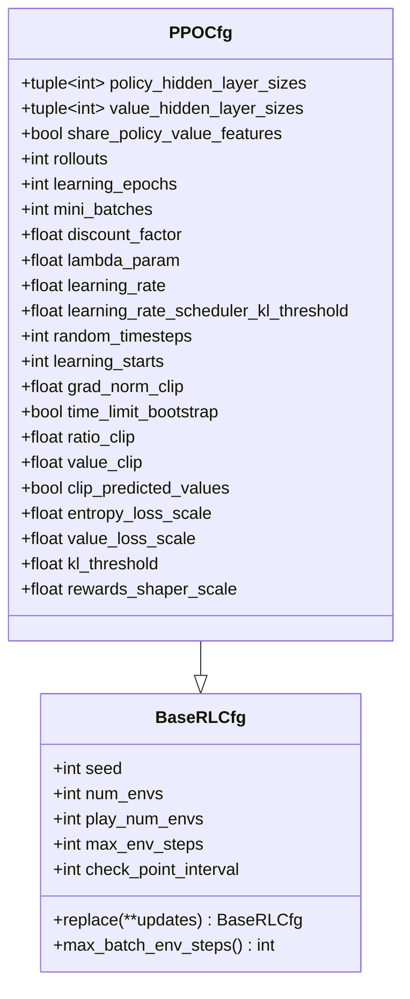
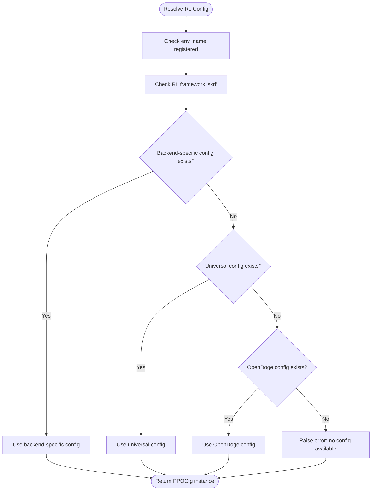
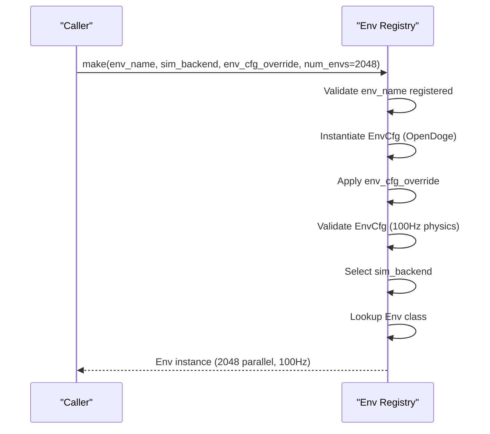
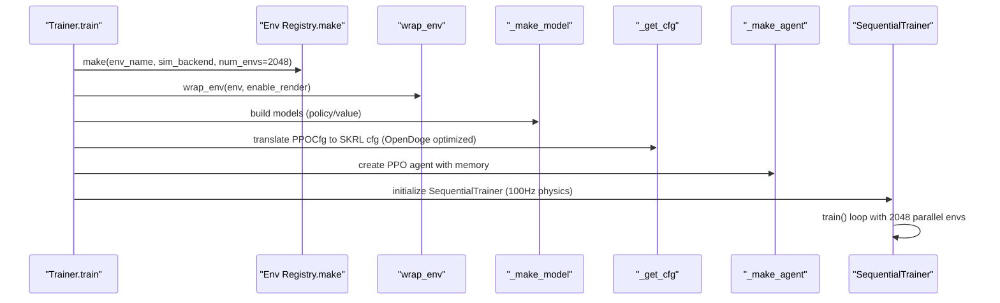
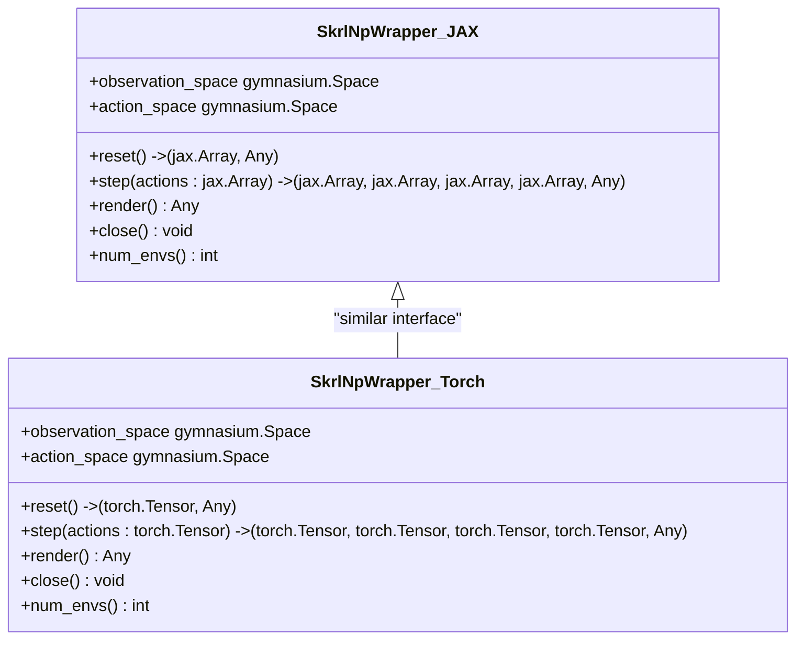
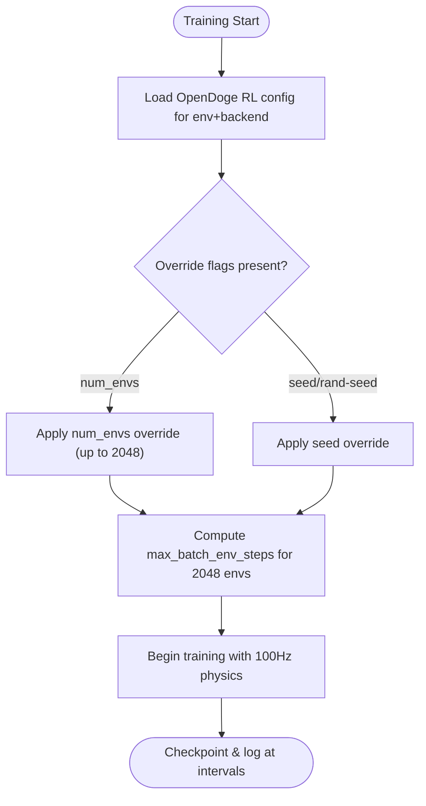
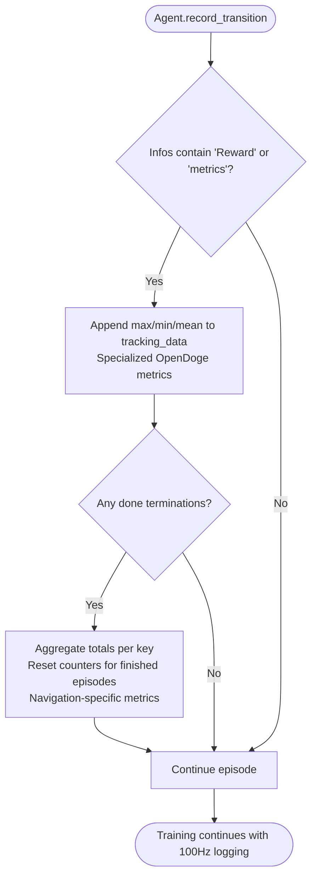
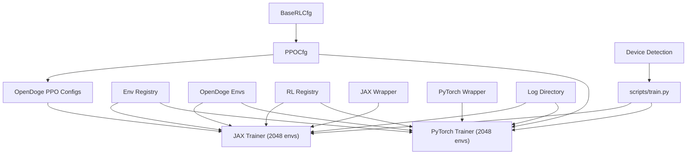

# Training Framework Integration

<cite>
**Referenced Files in This Document**
- [base.py](file://motrix_rl/src/motrix_rl/base.py)
- [cfg.py](file://motrix_rl/src/motrix_rl/skrl/cfg.py)
- [registry.py](file://motrix_rl/src/motrix_rl/registry.py)
- [cfgs_opendoge.py](file://motrix_rl/src/motrix_rl/cfgs_opendoge.py)
- [jax/ppo.py](file://motrix_rl/src/motrix_rl/skrl/jax/train/ppo.py)
- [torch/ppo.py](file://motrix_rl/src/motrix_rl/skrl/torch/train/ppo.py)
- [jax/wrap_np.py](file://motrix_rl/src/motrix_rl/skrl/jax/wrap_np.py)
- [torch/wrap_np.py](file://motrix_rl/src/motrix_rl/skrl/torch/wrap_np.py)
- [skrl/__init__.py](file://motrix_rl/src/motrix_rl/skrl/__init__.py)
- [utils.py](file://motrix_rl/src/motrix_rl/utils.py)
- [train.py](file://scripts/train.py)
- [registry.py](file://motrix_envs/src/motrix_envs/registry.py)
- [cartpole/cfg.py](file://motrix_envs/src/motrix_envs/basic/cartpole/cfg.py)
- [go1/cfg.py](file://motrix_envs/src/motrix_envs/locomotion/go1/cfg.py)
- [vbot/cfg_opendoge.py](file://motrix_envs/src/motrix_envs/navigation/vbot/cfg_opendoge.py)
</cite>

## Update Summary
**Changes Made**
- Added comprehensive OpenDoge implementation documentation with 2048 parallel environments
- Updated training configuration system with specialized PPO configurations for navigation tasks
- Enhanced environment registry with OpenDoge-specific configurations
- Expanded performance optimization guidelines for high-throughput training
- Added practical examples for large-scale parallel training scenarios

## Table of Contents
1. [Introduction](#introduction)
2. [Project Structure](#project-structure)
3. [Core Components](#core-components)
4. [Architecture Overview](#architecture-overview)
5. [Detailed Component Analysis](#detailed-component-analysis)
6. [Dependency Analysis](#dependency-analysis)
7. [Performance Considerations](#performance-considerations)
8. [Troubleshooting Guide](#troubleshooting-guide)
9. [Conclusion](#conclusion)
10. [Appendices](#appendices)

## Introduction
This document explains the training framework integration built around the SKRL reinforcement learning library, with comprehensive support for the OpenDoge implementation featuring scalable training across 2048 parallel environments at 100Hz simulation speed. The framework covers PPO algorithm implementation, advanced training configuration management, multi-backend support for JAX and PyTorch, and specialized configurations for complex navigation tasks. It documents the registry system that maps environments to training configurations, base RL configuration classes, and hyperparameter management optimized for high-performance parallel training scenarios.

## Project Structure
The training integration spans several modules with enhanced support for OpenDoge:
- RL configuration base and SKRL-specific PPO configuration with OpenDoge optimizations
- Comprehensive registry system for mapping environments to RL configurations including OpenDoge-specific settings
- Backend-specific trainers and model definitions (JAX and PyTorch) optimized for large-scale parallel execution
- Environment wrappers for SKRL compatibility with high-frequency simulation support
- Advanced utilities for device detection and training script orchestration with automatic backend selection
- Specialized environment registry and OpenDoge configurations supporting complex navigation scenarios

```mermaid
graph TB
subgraph "Training Orchestration"
TrainScript["scripts/train.py"]
Utils["motrix_rl/utils.py"]
end
subgraph "RL Core"
BaseCfg["motrix_rl/base.py"]
SkrlCfg["motrix_rl/skrl/cfg.py"]
Registry["motrix_rl/registry.py"]
OpenDogeCfgs["motrix_rl/cfgs_opendoge.py"]
end
subgraph "SKRL Backends"
JaxTrainer["motrix_rl/skrl/jax/train/ppo.py"]
TorchTrainer["motrix_rl/skrl/torch/train/ppo.py"]
JaxWrap["motrix_rl/skrl/jax/wrap_np.py"]
TorchWrap["motrix_rl/skrl/torch/wrap_np.py"]
LogDir["motrix_rl/skrl/__init__.py"]
end
subgraph "Environments"
EnvRegistry["motrix_envs/registry.py"]
CartCfg["motrix_envs/basic/cartpole/cfg.py"]
Go1Cfg["motrix_envs/locomotion/go1/cfg.py"]
OpenDogeCfg["motrix_envs/navigation/vbot/cfg_opendoge.py"]
end
TrainScript --> Utils
TrainScript --> JaxTrainer
TrainScript --> TorchTrainer
Utils --> JaxTrainer
Utils --> TorchTrainer
JaxTrainer --> SkrlCfg
TorchTrainer --> SkrlCfg
JaxTrainer --> Registry
TorchTrainer --> Registry
JaxTrainer --> OpenDogeCfgs
TorchTrainer --> OpenDogeCfgs
JaxTrainer --> JaxWrap
TorchTrainer --> TorchWrap
JaxTrainer --> LogDir
TorchTrainer --> LogDir
Registry --> EnvRegistry
OpenDogeCfgs --> Registry
EnvRegistry --> CartCfg
EnvRegistry --> Go1Cfg
EnvRegistry --> OpenDogeCfg
```

**Diagram sources**
- [train.py](file://scripts/train.py#L52-L91)
- [utils.py](file://motrix_rl/src/motrix_rl/utils.py#L39-L61)
- [base.py](file://motrix_rl/src/motrix_rl/base.py#L20-L43)
- [cfg.py](file://motrix_rl/src/motrix_rl/skrl/cfg.py#L28-L74)
- [registry.py](file://motrix_rl/src/motrix_rl/registry.py#L81-L115)
- [cfgs_opendoge.py](file://motrix_rl/src/motrix_rl/cfgs_opendoge.py#L1-L500)
- [jax/ppo.py](file://motrix_rl/src/motrix_rl/skrl/jax/train/ppo.py#L145-L296)
- [torch/ppo.py](file://motrix_rl/src/motrix_rl/skrl/torch/train/ppo.py#L145-L356)
- [jax/wrap_np.py](file://motrix_rl/src/motrix_rl/skrl/jax/wrap_np.py#L27-L81)
- [torch/wrap_np.py](file://motrix_rl/src/motrix_rl/skrl/torch/wrap_np.py#L26-L80)
- [skrl/__init__.py](file://motrix_rl/src/motrix_rl/skrl/__init__.py#L19-L22)
- [registry.py](file://motrix_envs/src/motrix_envs/registry.py#L114-L161)
- [cartpole/cfg.py](file://motrix_envs/src/motrix_envs/basic/cartpole/cfg.py#L25-L32)
- [go1/cfg.py](file://motrix_envs/src/motrix_envs/locomotion/go1/cfg.py#L122-L188)
- [vbot/cfg_opendoge.py](file://motrix_envs/src/motrix_envs/navigation/vbot/cfg_opendoge.py#L118-L137)

**Section sources**
- [train.py](file://scripts/train.py#L52-L91)
- [utils.py](file://motrix_rl/src/motrix_rl/utils.py#L39-L61)
- [registry.py](file://motrix_rl/src/motrix_rl/registry.py#L81-L115)
- [cfgs_opendoge.py](file://motrix_rl/src/motrix_rl/cfgs_opendoge.py#L1-L500)
- [jax/ppo.py](file://motrix_rl/src/motrix_rl/skrl/jax/train/ppo.py#L145-L296)
- [torch/ppo.py](file://motrix_rl/src/motrix_rl/skrl/torch/train/ppo.py#L145-L356)
- [jax/wrap_np.py](file://motrix_rl/src/motrix_rl/skrl/jax/wrap_np.py#L27-L81)
- [torch/wrap_np.py](file://motrix_rl/src/motrix_rl/skrl/torch/wrap_np.py#L26-L80)
- [skrl/__init__.py](file://motrix_rl/src/motrix_rl/skrl/__init__.py#L19-L22)
- [registry.py](file://motrix_envs/src/motrix_envs/registry.py#L114-L161)
- [cartpole/cfg.py](file://motrix_envs/src/motrix_envs/basic/cartpole/cfg.py#L25-L32)
- [go1/cfg.py](file://motrix_envs/src/motrix_envs/locomotion/go1/cfg.py#L122-L188)
- [vbot/cfg_opendoge.py](file://motrix_envs/src/motrix_envs/navigation/vbot/cfg_opendoge.py#L118-L137)

## Core Components
- Base RL configuration class: Defines common training parameters including seeds, number of environments, checkpoint intervals, and derived batch sizes optimized for large-scale parallel training.
- SKRL PPO configuration: Extends the base configuration with PPO-specific hyperparameters including policy/value network sizes, rollout length, epochs, mini-batches, discount factors, clipping, loss scaling, and reward shaping optimized for 2048+ parallel environments.
- Enhanced registry system: Maps environment names to RL configuration classes per RL framework and backend, with specialized OpenDoge configurations supporting complex navigation scenarios and high-frequency simulation.
- Advanced environment registry: Manages environment configurations including OpenDoge-specific terrain navigation, waypoint tracking, and multi-section course configurations with specialized reward functions.
- Backend trainers: Provide JAX and PyTorch implementations of PPO training optimized for large-scale parallel execution, including model construction, memory management, agent configuration, and experiment logging.
- Specialized wrappers: Bridge NumPy-based environments to SKRL-compatible wrappers for both JAX and PyTorch backends with support for high-frequency simulation (100Hz).
- Advanced utilities: Detect device capabilities (CPU/GPU) for JAX and PyTorch and select optimal training backend automatically with performance optimization for large-scale training.

**Section sources**
- [base.py](file://motrix_rl/src/motrix_rl/base.py#L20-L43)
- [cfg.py](file://motrix_rl/src/motrix_rl/skrl/cfg.py#L28-L74)
- [registry.py](file://motrix_rl/src/motrix_rl/registry.py#L28-L115)
- [cfgs_opendoge.py](file://motrix_rl/src/motrix_rl/cfgs_opendoge.py#L333-L360)
- [registry.py](file://motrix_envs/src/motrix_envs/registry.py#L24-L161)
- [jax/ppo.py](file://motrix_rl/src/motrix_rl/skrl/jax/train/ppo.py#L145-L296)
- [torch/ppo.py](file://motrix_rl/src/motrix_rl/skrl/torch/train/ppo.py#L145-L356)
- [jax/wrap_np.py](file://motrix_rl/src/motrix_rl/skrl/jax/wrap_np.py#L27-L81)
- [torch/wrap_np.py](file://motrix_rl/src/motrix_rl/skrl/torch/wrap_np.py#L26-L80)
- [utils.py](file://motrix_rl/src/motrix_rl/utils.py#L39-L61)

## Architecture Overview
The training pipeline integrates environment selection, configuration resolution, backend selection, model creation, agent setup, and execution via SKRL's SequentialTrainer. The system now supports OpenDoge's specialized navigation configurations with 2048 parallel environments at 100Hz simulation speed, featuring advanced terrain adaptation, waypoint tracking, and multi-section course navigation.

```mermaid
sequenceDiagram
participant CLI as "scripts/train.py"
participant Utils as "Device Detection"
participant Reg as "Registry.default_rl_cfg"
participant EnvReg as "Env Registry.make"
participant Wrap as "Backend Wrapper"
participant Trainer as "SKRL Trainer"
participant Agent as "PPO Agent"
participant Mem as "RandomMemory"
CLI->>Utils : get_device_supports()
Utils-->>CLI : DeviceSupports
CLI->>Reg : default_rl_cfg(env_name, "skrl", backend)
Reg-->>CLI : PPOCfg instance (OpenDoge optimized)
CLI->>EnvReg : make(env_name, sim_backend, num_envs=2048)
EnvReg-->>CLI : Env instance (100Hz simulation)
CLI->>Wrap : wrap_env(env, enable_render)
Wrap-->>CLI : SKRL-compatible Wrapper
CLI->>Trainer : Trainer.train()
Trainer->>Trainer : _make_model(), _get_cfg(), _make_agent()
Trainer->>Mem : RandomMemory(rollouts, 2048, device)
Trainer->>Agent : PPO(models, memory, cfg, spaces, device)
Trainer->>Trainer : SequentialTrainer(cfg_trainer, env, agents)
Trainer->>Agent : train() loop with 100Hz physics
Agent-->>CLI : Logs, checkpoints, metrics
```

**Diagram sources**
- [train.py](file://scripts/train.py#L52-L91)
- [utils.py](file://motrix_rl/src/motrix_rl/utils.py#L39-L61)
- [registry.py](file://motrix_rl/src/motrix_rl/registry.py#L81-L115)
- [registry.py](file://motrix_envs/src/motrix_envs/registry.py#L114-L161)
- [jax/ppo.py](file://motrix_rl/src/motrix_rl/skrl/jax/train/ppo.py#L167-L184)
- [torch/ppo.py](file://motrix_rl/src/motrix_rl/skrl/torch/train/ppo.py#L167-L183)
- [jax/wrap_np.py](file://motrix_rl/src/motrix_rl/skrl/jax/wrap_np.py#L27-L81)
- [torch/wrap_np.py](file://motrix_rl/src/motrix_rl/skrl/torch/wrap_np.py#L26-L80)
- [vbot/cfg_opendoge.py](file://motrix_envs/src/motrix_envs/navigation/vbot/cfg_opendoge.py#L352-L363)

## Detailed Component Analysis

### Base RL Configuration Classes
- BaseRLCfg: Provides foundational training parameters and a derived property to compute batched environment steps aligned to checkpoint intervals, optimized for large-scale training scenarios.
- PPOCfg: Extends BaseRLCfg with PPO-specific hyperparameters including policy/value network sizes, rollout length, learning epochs, mini-batch count, discount factor, lambda for GAE, learning rate scheduling, gradient norm clipping, ratio/value clipping, entropy/value loss scaling, KL threshold, reward shaper scale, and time-limit bootstrap.

```mermaid
classDiagram
class BaseRLCfg {
+int seed
+int num_envs
+int play_num_envs
+int max_env_steps
+int check_point_interval
+replace(**updates) BaseRLCfg
+max_batch_env_steps() int
}
class PPOCfg {
+tuple~int~ policy_hidden_layer_sizes
+tuple~int~ value_hidden_layer_sizes
+bool share_policy_value_features
+int rollouts
+int learning_epochs
+int mini_batches
+float discount_factor
+float lambda_param
+float learning_rate
+float learning_rate_scheduler_kl_threshold
+int random_timesteps
+int learning_starts
+float grad_norm_clip
+bool time_limit_bootstrap
+float ratio_clip
+float value_clip
+bool clip_predicted_values
+float entropy_loss_scale
+float value_loss_scale
+float kl_threshold
+float rewards_shaper_scale
}
PPOCfg --|> BaseRLCfg
```

**Diagram sources**
- [base.py](file://motrix_rl/src/motrix_rl/base.py#L20-L43)
- [cfg.py](file://motrix_rl/src/motrix_rl/skrl/cfg.py#L28-L74)

**Section sources**
- [base.py](file://motrix_rl/src/motrix_rl/base.py#L20-L43)
- [cfg.py](file://motrix_rl/src/motrix_rl/skrl/cfg.py#L28-L74)

### Enhanced Registry System: Environment-to-Training Configuration Mapping
- EnvRlCfgs: Stores per-environment RL configuration classes organized by RL framework and backend, including specialized OpenDoge configurations.
- Registration decorators: Register RL configuration classes for specific environments and backends, supporting universal fallback when backend-specific configs are absent.
- Resolution: default_rl_cfg selects backend-specific configs first, then falls back to universal configs, with OpenDoge-specific optimizations for navigation tasks.

```mermaid
flowchart TD
Start(["Resolve RL Config"]) --> CheckEnv["Check env_name registered"]
CheckEnv --> CheckFramework["Check RL framework 'skrl'"]
CheckFramework --> BackendSpecific{"Backend-specific config exists?"}
BackendSpecific --> |Yes| UseBackend["Use backend-specific config"]
BackendSpecific --> |No| Universal{"Universal config exists?"}
Universal --> |Yes| UseUniversal["Use universal config"]
Universal --> |No| OpenDoge{"OpenDoge config exists?"}
OpenDoge --> |Yes| UseOpenDoge["Use OpenDoge config"]
OpenDoge --> |No| Error["Raise error: no config available"]
UseBackend --> End(["Return PPOCfg instance"])
UseUniversal --> End
UseOpenDoge --> End
Error --> End
```

**Diagram sources**
- [registry.py](file://motrix_rl/src/motrix_rl/registry.py#L81-L115)

**Section sources**
- [registry.py](file://motrix_rl/src/motrix_rl/registry.py#L28-L115)

### Advanced Environment Registry and Selection
- EnvMeta: Holds environment configuration class and available simulation backends.
- Registration decorators: Register environment configurations and environment classes per backend, including OpenDoge-specific navigation environments.
- make: Creates environment instances with optional overrides and validates configuration, supporting 100Hz simulation speed and specialized navigation scenarios.

```mermaid
sequenceDiagram
participant Caller as "Caller"
participant EnvReg as "Env Registry"
Caller->>EnvReg : make(env_name, sim_backend, env_cfg_override, num_envs=2048)
EnvReg->>EnvReg : Validate env_name registered
EnvReg->>EnvReg : Instantiate EnvCfg (OpenDoge)
EnvReg->>EnvReg : Apply env_cfg_override
EnvReg->>EnvReg : Validate EnvCfg (100Hz physics)
EnvReg->>EnvReg : Select sim_backend
EnvReg->>EnvReg : Lookup Env class
EnvReg-->>Caller : Env instance (2048 parallel, 100Hz)
```

**Diagram sources**
- [registry.py](file://motrix_envs/src/motrix_envs/registry.py#L114-L161)

**Section sources**
- [registry.py](file://motrix_envs/src/motrix_envs/registry.py#L24-L161)

### PPO Training Pipeline (JAX and PyTorch) with OpenDoge Optimization
- Trainer.train: Orchestrates environment creation, seeding, wrapping, model construction, agent configuration, and execution via SequentialTrainer with support for 2048 parallel environments.
- Model construction: Builds policy/value models with configurable hidden layers and optional shared features (PyTorch), optimized for large-scale parallel execution.
- Memory: Uses RandomMemory sized by rollouts and num_envs=2048 for high-throughput training.
- Agent configuration: Translates PPOCfg into SKRL's PPO_DEFAULT_CONFIG, including schedulers, preprocessors, and logging optimized for OpenDoge navigation tasks.
- Experiment logging: Writes TensorBoard logs and checkpoints at configured intervals with specialized reward tracking for navigation metrics.

```mermaid
sequenceDiagram
participant T as "Trainer.train"
participant E as "Env Registry.make"
participant W as "wrap_env"
participant M as "_make_model"
participant C as "_get_cfg"
participant A as "_make_agent"
participant ST as "SequentialTrainer"
T->>E : make(env_name, sim_backend, num_envs=2048)
T->>W : wrap_env(env, enable_render)
T->>M : build models (policy/value)
T->>C : translate PPOCfg to SKRL cfg (OpenDoge optimized)
T->>A : create PPO agent with memory
T->>ST : initialize SequentialTrainer (100Hz physics)
ST->>ST : train() loop with 2048 parallel envs
```

**Diagram sources**
- [jax/ppo.py](file://motrix_rl/src/motrix_rl/skrl/jax/train/ppo.py#L167-L184)
- [torch/ppo.py](file://motrix_rl/src/motrix_rl/skrl/torch/train/ppo.py#L167-L183)

**Section sources**
- [jax/ppo.py](file://motrix_rl/src/motrix_rl/skrl/jax/train/ppo.py#L145-L296)
- [torch/ppo.py](file://motrix_rl/src/motrix_rl/skrl/torch/train/ppo.py#L145-L356)

### Backend-Specific Optimizations and Wrappers
- JAX wrapper: Converts NumPy arrays to JAX arrays, ensures device alignment, and maintains SKRL-compatible interface optimized for large-scale parallel execution.
- PyTorch wrapper: Converts tensors to NumPy for stepping and back to tensors for observations, preserving device placement with support for shared feature extraction across policy and value networks.
- Device detection: Determines availability of JAX/PyTorch and GPU backends to select optimal training backend automatically, with performance optimization for 2048+ parallel environments.

```mermaid
classDiagram
class SkrlNpWrapper_JAX {
+reset() -> (jax.Array, Any)
+step(actions : jax.Array) -> (jax.Array, jax.Array, jax.Array, jax.Array, Any)
+render() Any
+close() void
+num_envs() int
+observation_space gymnasium.Space
+action_space gymnasium.Space
}
class SkrlNpWrapper_Torch {
+reset() -> (torch.Tensor, Any)
+step(actions : torch.Tensor) -> (torch.Tensor, torch.Tensor, torch.Tensor, torch.Tensor, Any)
+render() Any
+close() void
+num_envs() int
+observation_space gymnasium.Space
+action_space gymnasium.Space
}
SkrlNpWrapper_JAX <|-- SkrlNpWrapper_Torch : "similar interface"
```

**Diagram sources**
- [jax/wrap_np.py](file://motrix_rl/src/motrix_rl/skrl/jax/wrap_np.py#L27-L81)
- [torch/wrap_np.py](file://motrix_rl/src/motrix_rl/skrl/torch/wrap_np.py#L26-L80)

**Section sources**
- [jax/wrap_np.py](file://motrix_rl/src/motrix_rl/skrl/jax/wrap_np.py#L27-L81)
- [torch/wrap_np.py](file://motrix_rl/src/motrix_rl/skrl/torch/wrap_np.py#L26-L80)
- [utils.py](file://motrix_rl/src/motrix_rl/utils.py#L39-L61)

### Advanced Hyperparameter Management and Configuration Customization
- Environment-specific configurations: Centralized in cfgs_opendoge.py with decorators registering PPO configurations for specific OpenDoge environments and backends, optimized for 2048 parallel environments.
- OpenDoge-specific configurations: Specialized navigation tasks including section001, section01, section011, section012, section013, and section002 with terrain adaptation, waypoint tracking, and multi-section course navigation.
- Overrides: Command-line flags allow overriding num_envs and seed/rand-seed during training, with automatic scaling for large-scale parallel execution.
- Derived batch computation: BaseRLCfg ensures max_batch_env_steps aligns with checkpoint intervals for efficient logging and saving across 2048+ parallel environments.

```mermaid
flowchart TD
Start(["Training Start"]) --> LoadCfg["Load OpenDoge RL config for env+backend"]
LoadCfg --> Override{"Override flags present?"}
Override --> |num_envs| ApplyNum["Apply num_envs override (up to 2048)"]
Override --> |seed/rand-seed| ApplySeed["Apply seed override"]
ApplyNum --> ComputeBatch["Compute max_batch_env_steps for 2048 envs"]
ApplySeed --> ComputeBatch
ComputeBatch --> Train["Begin training with 100Hz physics"]
Train --> End(["Checkpoint & log at intervals"])
```

**Diagram sources**
- [cfgs_opendoge.py](file://motrix_rl/src/motrix_rl/cfgs_opendoge.py#L333-L360)
- [train.py](file://scripts/train.py#L58-L67)
- [base.py](file://motrix_rl/src/motrix_rl/base.py#L36-L43)

**Section sources**
- [cfgs_opendoge.py](file://motrix_rl/src/motrix_rl/cfgs_opendoge.py#L333-L360)
- [train.py](file://scripts/train.py#L58-L67)
- [base.py](file://motrix_rl/src/motrix_rl/base.py#L36-L43)

### Advanced Experiment Tracking and Results Analysis
- Logging directory: Centralized under a runs prefix with environment-specific subdirectories optimized for large-scale training scenarios.
- Metrics tracking: Custom reward and metric tracking integrated into PPO agent record_transition for instant and total statistics, with specialized navigation metrics for OpenDoge tasks.
- Checkpointing: Automatic periodic checkpoints and TensorBoard writes controlled by configuration, optimized for 2048+ parallel environments with high-frequency logging.
- Navigation-specific tracking: Advanced reward decomposition including position tracking, fine position tracking, heading tracking, forward velocity, and terrain adaptation metrics.

```mermaid
flowchart TD
Start(["Agent.record_transition"]) --> CheckInfos{"Infos contain 'Reward' or 'metrics'?"}
CheckInfos --> |Yes| Track["Append max/min/mean to tracking_data<br/>Specialized OpenDoge metrics"]
Track --> DoneCheck{"Any done terminations?"}
DoneCheck --> |Yes| Aggregate["Aggregate totals per key<br/>Reset counters for finished episodes<br/>Navigation-specific metrics"]
DoneCheck --> |No| Continue["Continue episode"]
CheckInfos --> |No| Continue
Aggregate --> Continue
Continue --> End(["Training continues with 100Hz logging"])
```

**Diagram sources**
- [jax/ppo.py](file://motrix_rl/src/motrix_rl/skrl/jax/train/ppo.py#L89-L143)
- [torch/ppo.py](file://motrix_rl/src/motrix_rl/skrl/torch/train/ppo.py#L89-L143)
- [skrl/__init__.py](file://motrix_rl/src/motrix_rl/skrl/__init__.py#L19-L22)

**Section sources**
- [skrl/__init__.py](file://motrix_rl/src/motrix_rl/skrl/__init__.py#L19-L22)
- [jax/ppo.py](file://motrix_rl/src/motrix_rl/skrl/jax/train/ppo.py#L89-L143)
- [torch/ppo.py](file://motrix_rl/src/motrix_rl/skrl/torch/train/ppo.py#L89-L143)

## Dependency Analysis
The training integration exhibits clear separation of concerns with enhanced OpenDoge support:
- Configuration layer: Base and SKRL PPO configs define hyperparameters including OpenDoge-specific optimizations for large-scale parallel training.
- Registry layer: Maps environments to RL configurations and backends, with specialized OpenDoge configurations for navigation tasks.
- Environment layer: Provides environment creation and configuration with 100Hz simulation support and terrain adaptation.
- Backend layer: Implements PPO training, model construction, and wrappers optimized for 2048+ parallel environments.
- Orchestration: Scripts coordinate device detection, backend selection, and training execution with automatic optimization for large-scale scenarios.

```mermaid
graph TB
Base["BaseRLCfg"] --> PPO["PPOCfg"]
PPO --> OpenDoge["OpenDoge PPO Configs"]
OpenDoge --> JaxTrainer["JAX Trainer (2048 envs)"]
PPO --> TorchTrainer["PyTorch Trainer (2048 envs)"]
EnvReg["Env Registry"] --> JaxTrainer
EnvReg --> TorchTrainer
OpenDogeEnv["OpenDoge Envs"] --> JaxTrainer
OpenDogeEnv --> TorchTrainer
Registry["RL Registry"] --> JaxTrainer
Registry --> TorchTrainer
JaxWrap["JAX Wrapper"] --> JaxTrainer
TorchWrap["PyTorch Wrapper"] --> TorchTrainer
LogDir["Log Directory"] --> JaxTrainer
LogDir --> TorchTrainer
Utils["Device Detection"] --> TrainScript["scripts/train.py"]
TrainScript --> JaxTrainer
TrainScript --> TorchTrainer
```

**Diagram sources**
- [base.py](file://motrix_rl/src/motrix_rl/base.py#L20-L43)
- [cfg.py](file://motrix_rl/src/motrix_rl/skrl/cfg.py#L28-L74)
- [registry.py](file://motrix_rl/src/motrix_rl/registry.py#L81-L115)
- [cfgs_opendoge.py](file://motrix_rl/src/motrix_rl/cfgs_opendoge.py#L333-L360)
- [registry.py](file://motrix_envs/src/motrix_envs/registry.py#L114-L161)
- [jax/ppo.py](file://motrix_rl/src/motrix_rl/skrl/jax/train/ppo.py#L145-L296)
- [torch/ppo.py](file://motrix_rl/src/motrix_rl/skrl/torch/train/ppo.py#L145-L356)
- [jax/wrap_np.py](file://motrix_rl/src/motrix_rl/skrl/jax/wrap_np.py#L27-L81)
- [torch/wrap_np.py](file://motrix_rl/src/motrix_rl/skrl/torch/wrap_np.py#L26-L80)
- [skrl/__init__.py](file://motrix_rl/src/motrix_rl/skrl/__init__.py#L19-L22)
- [utils.py](file://motrix_rl/src/motrix_rl/utils.py#L39-L61)
- [train.py](file://scripts/train.py#L52-L91)

**Section sources**
- [base.py](file://motrix_rl/src/motrix_rl/base.py#L20-L43)
- [cfg.py](file://motrix_rl/src/motrix_rl/skrl/cfg.py#L28-L74)
- [registry.py](file://motrix_rl/src/motrix_rl/registry.py#L81-L115)
- [cfgs_opendoge.py](file://motrix_rl/src/motrix_rl/cfgs_opendoge.py#L333-L360)
- [registry.py](file://motrix_envs/src/motrix_envs/registry.py#L114-L161)
- [jax/ppo.py](file://motrix_rl/src/motrix_rl/skrl/jax/train/ppo.py#L145-L296)
- [torch/ppo.py](file://motrix_rl/src/motrix_rl/skrl/torch/train/ppo.py#L145-L356)
- [jax/wrap_np.py](file://motrix_rl/src/motrix_rl/skrl/jax/wrap_np.py#L27-L81)
- [torch/wrap_np.py](file://motrix_rl/src/motrix_rl/skrl/torch/wrap_np.py#L26-L80)
- [skrl/__init__.py](file://motrix_rl/src/motrix_rl/skrl/__init__.py#L19-L22)
- [utils.py](file://motrix_rl/src/motrix_rl/utils.py#L39-L61)
- [train.py](file://scripts/train.py#L52-L91)

## Performance Considerations
- **Parallel environments scaling**: num_envs controls the degree of parallelism up to 2048 environments; larger values increase throughput but require substantial CPU/GPU resources and memory optimization.
- **High-frequency simulation**: 100Hz simulation speed requires optimized memory management and reduced communication overhead between environments.
- **Rollout sizing optimization**: rollouts determines memory capacity and batch composition; balance against mini_batches to maintain effective learning signal across 2048+ environments.
- **Learning rate scheduling**: KL-adaptive scheduler adjusts learning rate based on KL divergence threshold to stabilize training across large-scale parallel environments.
- **Preprocessing optimization**: Running standard scalers for state and value improve convergence stability with minimal overhead in distributed training scenarios.
- **Device utilization**: Automatic backend selection prefers GPU-capable backends when available; ensure drivers and libraries are installed for optimal performance with 2048+ parallel environments.
- **Checkpoint intervals**: Align with computational budget and desired frequency of evaluation/checkpointing; consider reduced frequency for very large-scale training.
- **Memory management**: Optimize RandomMemory usage with appropriate rollouts and mini_batch sizes to handle 2048+ parallel environments efficiently.
- **Network architecture**: Use smaller, more efficient network architectures for large-scale training to reduce memory footprint and computation requirements.

## Troubleshooting Guide
- **No configuration found**: Ensure the environment is registered and a matching RL configuration exists for the selected backend or a universal fallback is available, particularly important for OpenDoge environments.
- **Unsupported simulation backend**: Verify the environment supports the requested backend and that the environment configuration is registered, especially for 100Hz simulation requirements.
- **Device/backend mismatch**: Confirm JAX/PyTorch availability and GPU capability; the training script will auto-select based on device_supports, with special consideration for large-scale parallel execution.
- **Training stalls or low throughput**: Reduce num_envs below 2048 or adjust rollout/epoch/batch parameters; verify memory allocation and preprocessor device placement for optimal performance.
- **Memory issues with 2048+ environments**: Monitor memory usage and consider reducing network complexity or increasing system RAM for large-scale parallel training.
- **100Hz simulation problems**: Ensure physics engine supports high-frequency simulation and that reward functions are appropriately scaled for fast-paced training.
- **OpenDoge navigation failures**: Verify terrain configuration matches expected geometry and that waypoint tracking is properly configured for the specific navigation section.

**Section sources**
- [registry.py](file://motrix_rl/src/motrix_rl/registry.py#L94-L115)
- [registry.py](file://motrix_envs/src/motrix_envs/registry.py#L132-L157)
- [utils.py](file://motrix_rl/src/motrix_rl/utils.py#L39-L61)
- [train.py](file://scripts/train.py#L39-L49)
- [cfgs_opendoge.py](file://motrix_rl/src/motrix_rl/cfgs_opendoge.py#L333-L360)

## Conclusion
The training framework integration leverages SKRL to deliver a robust, multi-backend PPO implementation optimized for the OpenDoge challenge featuring scalable training across 2048 parallel environments at 100Hz simulation speed. The enhanced registry system enables flexible environment-to-configuration mapping with specialized OpenDoge configurations, while base and SKRL-specific configuration classes provide comprehensive hyperparameter control optimized for large-scale parallel execution. Backend-specific trainers and wrappers ensure seamless integration with NumPy environments, and automatic device detection streamlines deployment for high-performance scenarios. The training pipeline supports scalable parallel execution, efficient memory management, and structured experiment tracking with specialized navigation metrics, making it suitable for complex robotics and simulation tasks including multi-section terrain navigation and waypoint tracking.

## Appendices

### Practical Examples

- **Customizing OpenDoge training configuration**:
  - Override environment-specific defaults by passing overrides to the Trainer constructor or command-line flags.
  - Adjust network sizes, rollout length, learning rate, and scheduling thresholds to fit task complexity and hardware constraints for 2048+ parallel environments.
  - Use OpenDoge-specific configurations for terrain adaptation and waypoint tracking.

- **Experiment tracking with OpenDoge metrics**:
  - Monitor training progress via TensorBoard logs stored under the centralized log directory with specialized navigation metrics.
  - Inspect reward and metric tracking aggregated per episode and per timestep, including position tracking, heading tracking, and terrain adaptation metrics.
  - Track waypoint completion rates and navigation success rates for OpenDoge tasks.

- **Result analysis for large-scale training**:
  - Use saved checkpoints to evaluate policies in playback mode with reduced parallelism for visualization.
  - Compare results across backends and environment variants using standardized metrics and logs from 2048+ parallel training scenarios.
  - Analyze training curves for different navigation sections and terrain types.

- **Optimizing for 2048+ parallel environments**:
  - Monitor system resources and adjust num_envs based on available CPU/GPU memory.
  - Use smaller network architectures and optimized hyperparameters for large-scale training.
  - Implement appropriate checkpointing strategies to handle frequent saving with high-frequency simulation.

**Section sources**
- [train.py](file://scripts/train.py#L58-L67)
- [skrl/__init__.py](file://motrix_rl/src/motrix_rl/skrl/__init__.py#L19-L22)
- [jax/ppo.py](file://motrix_rl/src/motrix_rl/skrl/jax/train/ppo.py#L186-L210)
- [torch/ppo.py](file://motrix_rl/src/motrix_rl/skrl/torch/train/ppo.py#L185-L208)
- [cfgs_opendoge.py](file://motrix_rl/src/motrix_rl/cfgs_opendoge.py#L333-L360)
- [vbot/cfg_opendoge.py](file://motrix_envs/src/motrix_envs/navigation/vbot/cfg_opendoge.py#L352-L363)