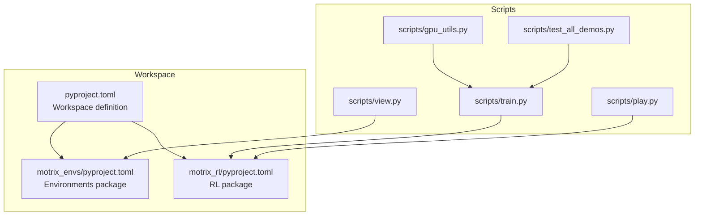
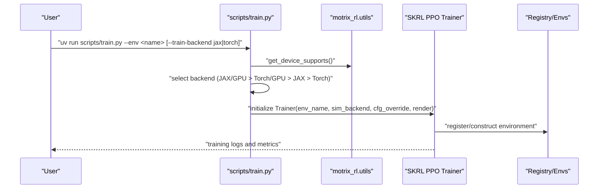
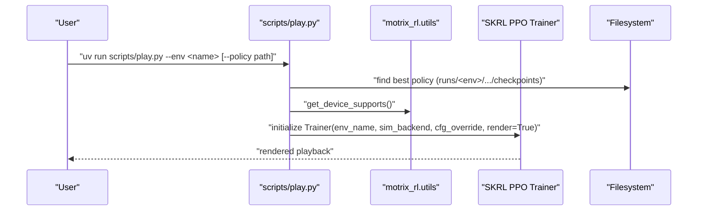
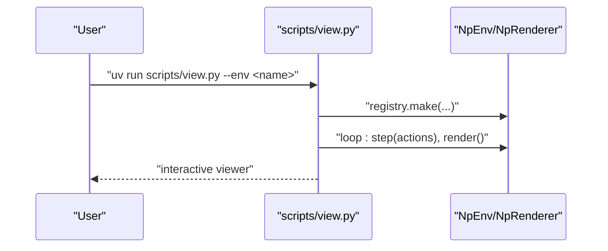
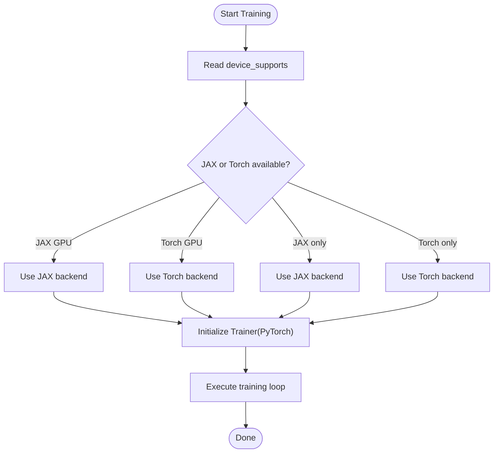
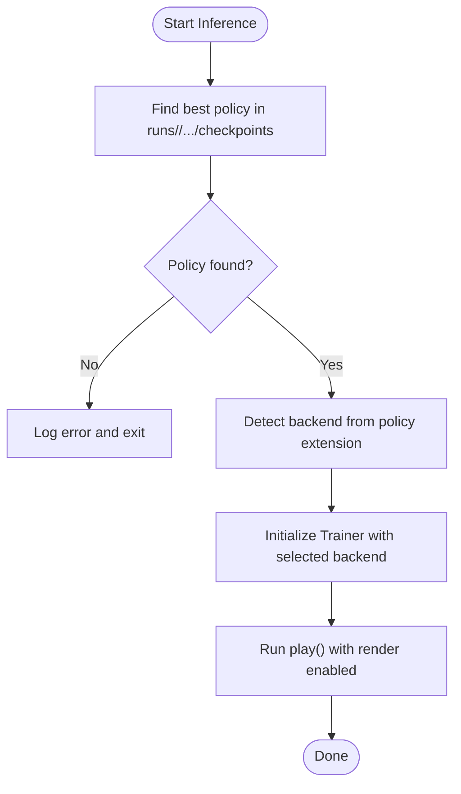
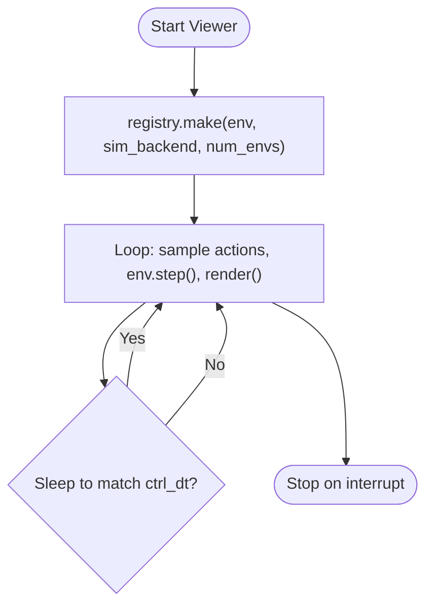
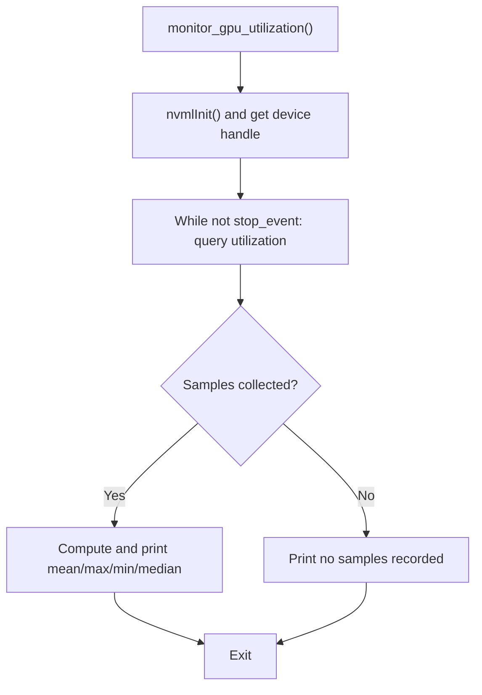
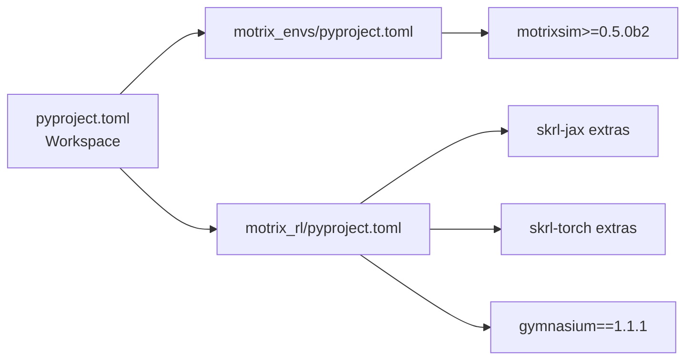

# Troubleshooting and FAQ

<cite>
**Referenced Files in This Document**
- [README.md](file://README.md)
- [installation.md](file://docs/source/en/user_guide/getting_started/installation.md)
- [pyproject.toml](file://pyproject.toml)
- [motrix_envs/pyproject.toml](file://motrix_envs/pyproject.toml)
- [motrix_rl/pyproject.toml](file://motrix_rl/pyproject.toml)
- [scripts/train.py](file://scripts/train.py)
- [scripts/view.py](file://scripts/view.py)
- [scripts/play.py](file://scripts/play.py)
- [scripts/gpu_utils.py](file://scripts/gpu_utils.py)
- [scripts/test_all_demos.py](file://scripts/test_all_demos.py)
</cite>

## Table of Contents
1. [Introduction](#introduction)
2. [Project Structure](#project-structure)
3. [Core Components](#core-components)
4. [Architecture Overview](#architecture-overview)
5. [Detailed Component Analysis](#detailed-component-analysis)
6. [Dependency Analysis](#dependency-analysis)
7. [Performance Considerations](#performance-considerations)
8. [Troubleshooting Guide](#troubleshooting-guide)
9. [Conclusion](#conclusion)
10. [Appendices](#appendices)

## Introduction
This document provides a comprehensive troubleshooting and FAQ guide for MotrixLab. It focuses on diagnosing and resolving installation issues, environment setup errors, runtime problems (including GPU utilization, memory constraints, and performance bottlenecks), debugging configuration and training instabilities, visualization issues, parameter tuning pitfalls, convergence concerns, and reproducibility challenges. It also outlines systematic diagnostic workflows, logging strategies, and error resolution steps grounded in the repository’s scripts and configuration.

## Project Structure
MotrixLab is organized into:
- Workspace-managed packages for environments and RL training
- Scripts for training, inference, visualization, and diagnostics
- Documentation covering installation and usage

**Diagram sources**
- [pyproject.toml](file://pyproject.toml#L21-L22)
- [motrix_envs/pyproject.toml](file://motrix_envs/pyproject.toml#L1-L16)
- [motrix_rl/pyproject.toml](file://motrix_rl/pyproject.toml#L1-L32)
- [scripts/train.py](file://scripts/train.py#L1-L95)
- [scripts/play.py](file://scripts/play.py#L1-L162)
- [scripts/view.py](file://scripts/view.py#L1-L83)
- [scripts/gpu_utils.py](file://scripts/gpu_utils.py#L1-L41)
- [scripts/test_all_demos.py](file://scripts/test_all_demos.py#L1-L159)

**Section sources**
- [pyproject.toml](file://pyproject.toml#L1-L29)
- [motrix_envs/pyproject.toml](file://motrix_envs/pyproject.toml#L1-L16)
- [motrix_rl/pyproject.toml](file://motrix_rl/pyproject.toml#L1-L32)

## Core Components
- Training pipeline: selects a backend (JAX or PyTorch) based on device capabilities and runs PPO training via SKRL.
- Inference pipeline: loads the best or specified policy and runs evaluation/rendering.
- Visualization pipeline: runs a headless loop stepping the environment and rendering frames.
- Diagnostics: GPU monitoring utility and a comprehensive demo tester.

Key behaviors impacting troubleshooting:
- Automatic backend selection with fallback logic.
- Logging of device support status.
- Policy discovery and format detection.
- Rendering loop timing and control dt.

**Section sources**
- [scripts/train.py](file://scripts/train.py#L39-L89)
- [scripts/play.py](file://scripts/play.py#L39-L157)
- [scripts/view.py](file://scripts/view.py#L29-L78)
- [scripts/gpu_utils.py](file://scripts/gpu_utils.py#L20-L40)

## Architecture Overview
End-to-end flows for training, inference, and visualization.

**Diagram sources**
- [scripts/train.py](file://scripts/train.py#L52-L90)
- [motrix_rl/pyproject.toml](file://motrix_rl/pyproject.toml#L15-L27)

**Diagram sources**
- [scripts/play.py](file://scripts/play.py#L110-L157)
- [motrix_rl/pyproject.toml](file://motrix_rl/pyproject.toml#L15-L27)

**Diagram sources**
- [scripts/view.py](file://scripts/view.py#L71-L78)

## Detailed Component Analysis

### Training Pipeline Troubleshooting
Common issues:
- Backend selection failures or unsupported devices
- Environment registration errors
- Excessive memory usage during training
- Rendering-related slowdowns

Diagnostic steps:
- Verify device support logging printed at startup.
- Confirm environment name exists in the registry.
- Reduce num-envs or disable render to isolate memory/CPU pressure.
- Switch train-backend explicitly if automatic selection is incorrect.

**Diagram sources**
- [scripts/train.py](file://scripts/train.py#L39-L89)

**Section sources**
- [scripts/train.py](file://scripts/train.py#L52-L90)

### Inference Pipeline Troubleshooting
Common issues:
- No policies found for an environment
- Policy format mismatch
- Device capability mismatch for loaded policy

Diagnostic steps:
- Use explicit policy path if auto-discovery fails.
- Ensure policy suffix matches backend (.pt for Torch, .pickle for JAX).
- Confirm device supports the chosen backend before loading.

**Diagram sources**
- [scripts/play.py](file://scripts/play.py#L48-L157)

**Section sources**
- [scripts/play.py](file://scripts/play.py#L110-L157)

### Visualization Pipeline Troubleshooting
Common issues:
- Rendering lag or inconsistent frame pacing
- Unsupported action spaces
- Environment initialization failures

Diagnostic steps:
- Adjust environment control dt and loop timing.
- Limit num-envs to reduce rendering overhead.
- Verify action space is Box; random actions are sampled accordingly.

**Diagram sources**
- [scripts/view.py](file://scripts/view.py#L56-L78)

**Section sources**
- [scripts/view.py](file://scripts/view.py#L29-L78)

### GPU Monitoring Utility
Useful for diagnosing GPU utilization during training or inference.

**Diagram sources**
- [scripts/gpu_utils.py](file://scripts/gpu_utils.py#L20-L40)

**Section sources**
- [scripts/gpu_utils.py](file://scripts/gpu_utils.py#L20-L40)

## Dependency Analysis
- Python version pinned to 3.10.* across packages.
- Workspace members define cross-package relationships.
- Optional extras select JAX or Torch backends with platform-specific constraints.
- Environment package depends on MotrixSim.

**Diagram sources**
- [pyproject.toml](file://pyproject.toml#L21-L22)
- [motrix_envs/pyproject.toml](file://motrix_envs/pyproject.toml#L13-L15)
- [motrix_rl/pyproject.toml](file://motrix_rl/pyproject.toml#L15-L27)

**Section sources**
- [pyproject.toml](file://pyproject.toml#L6-L6)
- [motrix_envs/pyproject.toml](file://motrix_envs/pyproject.toml#L10-L10)
- [motrix_rl/pyproject.toml](file://motrix_rl/pyproject.toml#L10-L10)

## Performance Considerations
- Memory and throughput: reduce num-envs or disable render to lower GPU/CPU pressure.
- Rendering pacing: environment control dt drives the viewer loop; tune to balance fidelity and speed.
- Backend choice: prefer GPU-capable backend if available; otherwise fall back to CPU-only.
- Platform specifics: GPU simulation features are marked as in development; expect differences across platforms.

Practical tips:
- Start with minimal environments and gradually increase scale.
- Use the demo tester to validate end-to-end flows across backends.
- Monitor GPU utilization to confirm acceleration.

**Section sources**
- [scripts/train.py](file://scripts/train.py#L32-L36)
- [scripts/view.py](file://scripts/view.py#L59-L68)
- [installation.md](file://docs/source/en/user_guide/getting_started/installation.md#L15-L27)

## Troubleshooting Guide

### Installation Problems
Symptoms:
- Dependency conflicts or incompatible Python version
- Package manager not installed or misconfigured
- Platform/architecture not supported

Resolutions:
- Use the documented package manager and Python version.
- Ensure platform matches supported systems.
- Install all packages or choose a specific backend extra.

References:
- Python version requirement and package manager note
- Supported platforms and feature matrix
- Installation commands and extras

**Section sources**
- [installation.md](file://docs/source/en/user_guide/getting_started/installation.md#L5-L11)
- [installation.md](file://docs/source/en/user_guide/getting_started/installation.md#L13-L27)
- [installation.md](file://docs/source/en/user_guide/getting_started/installation.md#L40-L55)
- [README.md](file://README.md#L37-L71)

### Runtime Issues
Symptoms:
- GPU utilization unexpectedly low
- Out-of-memory errors during training
- Slow rendering or frame pacing issues

Resolutions:
- Confirm backend selection and device support logging.
- Reduce num-envs or disable render to mitigate memory/CPU pressure.
- Use GPU monitoring utility to validate utilization.
- Verify environment control dt and rendering loop timing.

References:
- Backend selection and device support logging
- GPU monitoring utility
- Viewer loop timing and control dt

**Section sources**
- [scripts/train.py](file://scripts/train.py#L52-L54)
- [scripts/train.py](file://scripts/train.py#L32-L36)
- [scripts/gpu_utils.py](file://scripts/gpu_utils.py#L20-L40)
- [scripts/view.py](file://scripts/view.py#L59-L68)

### Debugging Environment Configuration Errors
Symptoms:
- Unknown environment name
- Registry or import errors
- Action space mismatches in viewer

Resolutions:
- Verify environment name against registry entries.
- Ensure environment module is importable.
- Confirm action space is Box for viewer random actions.

References:
- Environment construction and registry usage
- Viewer action sampling logic

**Section sources**
- [scripts/view.py](file://scripts/view.py#L75-L78)
- [scripts/view.py](file://scripts/view.py#L36-L50)

### Training Instability and Convergence Problems
Symptoms:
- Non-converged or unstable policies
- Poor reward dynamics
- Reproducibility issues

Resolutions:
- Set explicit seeds for reproducibility.
- Reduce num-envs temporarily to stabilize early training.
- Use the demo tester to validate baseline behavior across backends.
- Inspect training logs and adjust hyperparameters incrementally.

References:
- Seed handling and overrides
- Demo tester for regression checks

**Section sources**
- [scripts/train.py](file://scripts/train.py#L63-L66)
- [scripts/test_all_demos.py](file://scripts/test_all_demos.py#L77-L154)

### Visualization Problems
Symptoms:
- Blank or missing viewer window
- Unresponsive viewer after launch
- Rendering artifacts

Resolutions:
- Run viewer with minimal environments and num_envs=1.
- Disable render during initial debugging.
- Confirm environment control dt and loop timing.

References:
- Viewer runner and renderer usage
- Control dt and sleep logic

**Section sources**
- [scripts/view.py](file://scripts/view.py#L56-L78)

### Parameter Tuning and Experiment Reproducibility
Common pitfalls:
- Random seeds not set consistently
- Environment scaling not controlled
- Mixed backend usage across experiments

Recommendations:
- Always set a fixed seed for reproducibility.
- Keep environment scale constant when comparing configurations.
- Standardize backend selection per experiment.

References:
- Seed override logic in training and play scripts
- Backend selection and device support checks

**Section sources**
- [scripts/train.py](file://scripts/train.py#L63-L66)
- [scripts/play.py](file://scripts/play.py#L121-L124)
- [scripts/train.py](file://scripts/train.py#L39-L49)

### Systematic Diagnosis and Error Resolution Workflow
1. Verify environment and backend prerequisites
   - Check Python version and package manager.
   - Confirm platform support and extras selection.

2. Initialize and log device support
   - Review backend selection and device availability.

3. Isolate resource usage
   - Reduce num-envs and disable render.
   - Monitor GPU utilization.

4. Validate configuration and data
   - Confirm environment name and registry availability.
   - Auto-discover or explicitly specify policy for inference.

5. Reproduce and compare
   - Use the demo tester to run a subset of environments and backends.
   - Compare logs and metrics across runs.

6. Iterate and refine
   - Adjust seeds, environment scale, and hyperparameters incrementally.
   - Document changes and outcomes for reproducibility.

References:
- Installation requirements and extras
- Device support logging and backend selection
- GPU monitoring utility
- Demo tester for batch validation

**Section sources**
- [installation.md](file://docs/source/en/user_guide/getting_started/installation.md#L5-L11)
- [installation.md](file://docs/source/en/user_guide/getting_started/installation.md#L40-L55)
- [scripts/train.py](file://scripts/train.py#L52-L54)
- [scripts/gpu_utils.py](file://scripts/gpu_utils.py#L20-L40)
- [scripts/test_all_demos.py](file://scripts/test_all_demos.py#L77-L154)

## Conclusion
This guide consolidates practical troubleshooting steps and diagnostic workflows for MotrixLab. By aligning environment setup with supported configurations, validating device capabilities, controlling resource usage, and leveraging the provided scripts for monitoring and batch testing, most installation and runtime issues can be systematically resolved. For ongoing support, consult the documentation site and community channels referenced in the repository.

## Appendices

### Frequently Asked Questions
- What Python version and package manager should I use?
  - Use the specified Python version and the recommended package manager as documented.

- Which platforms are supported?
  - Refer to the supported platforms and feature matrix in the installation guide.

- How do I choose between JAX and PyTorch backends?
  - The training script auto-selects based on device capabilities; you can also specify explicitly.

- How do I run a quick smoke test?
  - Use the demo tester to run a small subset of environments and backends.

- Where are training results stored?
  - Results are saved under the runs directory named after the environment.

- How do I visualize environments without training?
  - Use the viewer script to step and render environments interactively.

- How do I run inference with a trained policy?
  - Use the play script; it can auto-discover the best policy or accept an explicit path.

- How do I check GPU utilization?
  - Use the GPU monitoring utility to collect and summarize utilization statistics.

**Section sources**
- [installation.md](file://docs/source/en/user_guide/getting_started/installation.md#L5-L11)
- [installation.md](file://docs/source/en/user_guide/getting_started/installation.md#L15-L27)
- [installation.md](file://docs/source/en/user_guide/getting_started/installation.md#L40-L55)
- [scripts/test_all_demos.py](file://scripts/test_all_demos.py#L77-L154)
- [README.md](file://README.md#L92-L100)
- [scripts/view.py](file://scripts/view.py#L71-L78)
- [scripts/play.py](file://scripts/play.py#L110-L157)
- [scripts/gpu_utils.py](file://scripts/gpu_utils.py#L20-L40)